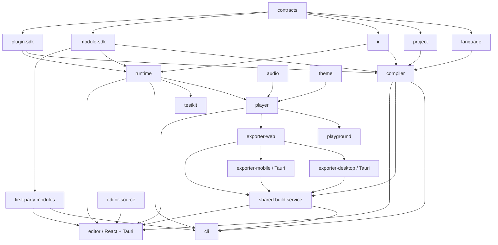
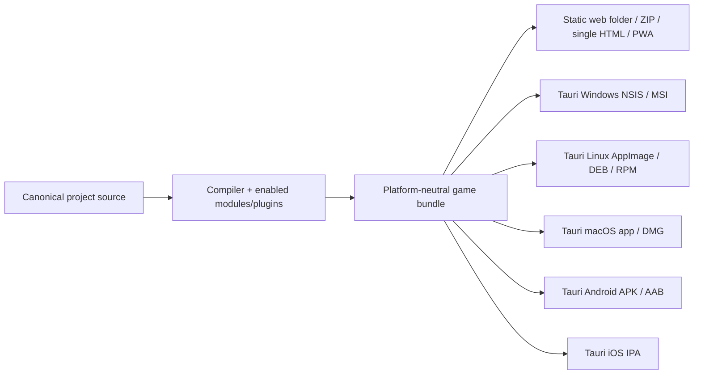

# RPGNarrativeEngine Build Plan

**Status:** Active implementation plan  
**Product specification:** `RPGNarrativeEngine-research-and-spec.md`  
**Purpose:** Convert the product specification into a dependency-ordered, feature-complete engineering plan without treating prototypes, market validation, release ceremonies, sprint size, or pull-request size as product gates.

---

## 1. Project intent

RPGNarrativeEngine will be built as the complete free and open-source passion project described in the product specification.

This plan exists to prevent accidental architectural drift and undocumented decisions. Its ordering reflects technical dependencies only. It does not impose commercial product-management practices, staffing assumptions, calendar estimates, artificial scope cuts, or a maximum change size.

The following statements are absolute:

1. The project is being built. User research and prototypes may improve the design, but they are not go/no-go gates and will not redirect the work into a theme or plugin for another engine.
2. The product name is **RPGNarrativeEngine**.
3. **Electron is prohibited.** It is not a fallback, contingency, temporary shell, packaging option, or supported downstream target.
4. Desktop authoring uses **Tauri 2**. If a desktop-specific capability is temporarily unavailable, the affected feature remains web/local-development capable until it works in Tauri; it is not reimplemented in Electron.
5. The implementation will not assume or adopt an unrelated game engine unless the owner explicitly changes the product specification.
6. Source files, public schemas, deterministic behavior, text-first presentation, and the absence of player-facing maps are enduring product contracts.

---

## 2. Authority and ambiguity rules

When two documents disagree, use this precedence:

1. The owner's latest explicit decision.
2. Confirmed decisions and invariants in the product specification.
3. This build plan.
4. An accepted architectural decision record under `docs/adr/`.
5. Existing implementation behavior and tests.

When a higher authority changes, update all affected lower-authority documents and tests in the same change so stale guidance does not remain in the repository.

Ambiguities are handled as follows:

- A choice that changes player behavior, creator workflow, project source syntax, licensing, or a public compatibility promise is recorded in `BUILD_PLAN.md` or the product specification before implementation.
- A technical choice that preserves specified behavior may be decided by the implementer, but it must be recorded in an ADR when it affects package boundaries, public APIs, persistence, security, determinism, or replaceability.
- No implementation may silently invent a user-facing feature to work around an unclear requirement.
- If a public contract is not yet defined, write its contract document and executable fixture before depending on it.
- Tests are part of each feature, not a later cleanup phase.

---

## 3. Locked product invariants

These constraints apply throughout the build:

- The player is a semantic HTML/CSS conversation and text-RPG interface, not a canvas game.
- Styled voice boxes carry speaker identity; portraits and sprites are never required.
- Player-facing grids, tile maps, minimaps, compass graphics, world graphs, coordinates, position markers, and spatial avatars do not exist in first-party player surfaces.
- The creator-only Story Map and World Graph never become player features and their layout metadata is never exported.
- Exploration is communicated through location headings, prose, route choices, blocked-route explanations, discoveries, audio, and bounded transitions.
- Combat supports no more than four active allies and four active enemies. Command lanes are semantic groups, not battlefield positions.
- Enemy health is descriptive text by default. Exact and hidden modes remain textual; first-party life bars do not exist.
- Story-only projects can omit all RPG modules. Disabled modules contribute no game runtime code, commands, state, save namespace, player UI, or export data.
- Project source remains ordinary UTF-8 text. The editor modifies canonical source rather than maintaining an opaque database.
- The compiler and runtime are independent of React, Tauri, the DOM, and direct filesystem APIs.
- Release players do not parse `.story` source.
- Story source cannot execute arbitrary HTML or JavaScript.
- Core and first-party module behavior is deterministic for the same compiled inputs, choices, state, and RNG state.
- Player accessibility settings override conforming themes. WCAG requirements are not waivable; only nonessential aesthetic diagnostics may be waived.
- Games require no account, hosted service, telemetry, analytics, remote font, CDN, or network request by default.
- Web/PWA export is first-party. Windows, macOS, and Linux desktop packaging uses Tauri only.
- Creators can compile one canonical game bundle and package it as a static web folder/ZIP, optional single-file HTML, Tauri desktop application, and later Tauri Android/iOS application without changing story or module semantics.
- Creators retain ownership of their projects and games and owe no royalty or mandatory attribution to the engine beyond licenses of bundled third-party material.

---

## 4. Resolved implementation defaults

These defaults remove the open-ended alternatives in the research specification. They remain changeable only through an explicit owner decision or ADR at the appropriate authority level.

| Area | Decision |
|---|---|
| Source extension | `.story` is the canonical story source extension. |
| Story identity | Stable lowercase IDs are canonical. Display-name dialogue aliases are editor conveniences that resolve to one stable voice ID or produce an ambiguity error. |
| Project configuration | TOML for manifests and RPG data, DTCG-compatible JSON for design tokens, JSON for generated IR/catalogs/saves. |
| Internal paths | Project-relative POSIX-style `/` paths; absolute paths and traversal outside the project are rejected. |
| Language/runtime | Strict TypeScript, ESM, finite IEEE-754 numbers, no implicit type coercion. |
| Workspace | pnpm workspaces using pnpm recursive scripts; no additional monorepo orchestrator unless an ADR demonstrates a concrete need. |
| Parser/editor grammar | Lezer is the shared concrete grammar. Compiler semantics use a normalized AST rather than depending directly on Lezer node shapes. |
| Player components | Standards-based Web Components implemented with Lit. React is restricted to the editor application. |
| Desktop shell | Tauri 2 only. Electron packages and Electron-specific code are forbidden by repository policy. |
| Audio | An engine-owned audio port with a native web adapter: `HTMLMediaElement` for streamed long tracks and Web Audio for mixing and short effects. Howler is not the default dependency. |
| Public validation | JSON Schema 2020-12 validated with a pinned Ajv release. Generated or hand-authored TypeScript types must have schema/type conformance tests. |
| RNG | A versioned `xoshiro128**` implementation using unsigned 32-bit operations, four-word serializable state, published test vectors, and independently derived named streams. Changing the algorithm is a compatibility event. |
| RPG RNG streams | At minimum: `story`, `world`, `encounters`, `combat`, and one stream per deterministic plugin namespace. Cosmetic effects cannot consume mechanical streams. |
| Combat timing | Collect and review one intent for every able ally, then select enemy intents and resolve all intents by deterministic initiative. |
| Currency | Multiple arbitrary textual currencies are supported from the initial economy implementation. |
| Enemy information | `descriptive` is the default; `exact` and `hidden` are supported textual project modes; no life-bar mode exists. |
| Localization | Stable content/entity IDs and locale-ready schemas are foundational. Full translation management UI is implemented after the core authoring surfaces. |
| Story Map editing | Generated and structurally read-only first; guided source-edit actions follow. Freeform rewiring is allowed only if exact source round-tripping is demonstrated. |
| World Graph editing | Guided graph/form/table edits produce previewed, minimal canonical TOML edits. Nested exits infer `from` from the containing location. |
| Decorative media | Declared theme frames/textures, packaged fonts, transition stills/small frame sequences, and optional nonessential icons are supported. Character art, semantic scene imagery, video, and graphical maps are not core requirements and cannot carry required information. |
| Plugin installation | Initial plugins are local or vendored build-time packages. There is no remote executable-plugin installation or marketplace in the foundational implementation. |
| Plugin trust | Declarative themes are data. Executable compiler/runtime/player/editor plugins are explicitly labeled trusted code unless an enforceable isolation boundary exists. |
| License default | MIT for engine/editor/CLI/SDK/code templates; CC0 for reusable sample prose/assets where legally available; documentation license remains an owner-confirmation item below. |
| CLI executable | `rpgne`. Its public commands are `create`, `dev`, `lint`, `test`, and `build`. |
| Package scope | Use `@rpgnarrativeengine/*` as the internal workspace scope. External publication uses it only after availability and ownership are confirmed. |
| Build output | Every project builds into an ignored project-local `build/` directory with a canonical game bundle, target artifacts, checksums, notices, and a machine-readable artifact manifest. |
| Web targets | Static HTML/CSS/JavaScript folder and ZIP are required. PWA is optional per project. A single-file HTML target is supported when its declared limitations and size policy are satisfied. |
| Desktop targets | Tauri-only Windows NSIS/MSI, Linux AppImage/DEB/RPM, and macOS app/DMG artifacts. |
| Mobile targets | Tauri Android APK/AAB and Tauri iOS IPA are planned first-party targets after desktop packaging is complete. |
| Native build hosts | Native distributables are built on the matching operating system by default. Cross-compilation is not the primary or required path. |
| Signing | Unsigned artifacts may be produced where the platform permits testing. Signing/notarization credentials are creator-supplied secrets and never enter project source, lockfiles, logs, or exported game content. |
| Creator packaging workflow | The editor Build workspace is the primary workflow. The CLI provides feature-equivalent automation over the same build service; creators are never required to use a terminal to package a game. |
| Public showcase | `examples/showcase/` is an ordinary engine project that also serves as the complete reference game. Its release web build is continuously validated and deployed to GitHub Pages from the default branch. |

---

## 5. Remaining owner inputs

None of these prevents repository scaffolding, compiler/runtime development, or local builds. They must be resolved before the named external artifact is published.

### OWNER-001: Public identity and package ownership

Needed before publishing packages or signed desktop applications:

- The npm organization/scope that will own public packages.
- The reverse-domain desktop application identifier to use instead of examples such as `org.example.*`.
- The public repository/organization URL to embed in package metadata.

**Working default:** internal packages use `@rpgnarrativeengine/*`; local Tauri development uses a clearly marked non-production bundle identifier.

### OWNER-002: Documentation license

Choose one before the public documentation is licensed:

- MIT for operational simplicity, or
- CC BY 4.0 for documentation-specific reuse and attribution terms.

**Working default:** MIT until explicitly changed.

### OWNER-003: Missing visual reference

The specification references `references/opposing-rpg-conversation-boxes-reference.png`, but the file is not present. It is needed only when visual fidelity work begins.

**Working default:** use the written cues in the specification until the image is restored.

No other owner decision is required to begin implementation. Branding art, store listings, code signing, update hosting, and release distribution channels can be supplied when their corresponding packaging work begins. The showcase's standard GitHub Pages URL and repository subpath are derived from the eventual GitHub remote; a custom domain is optional and is not required to build or publish the demo.

---

## 6. Repository structure

The repository will use this structure:

```text
.github/
  workflows/
    showcase-pages.yml    # validates, builds, and deploys the public web showcase
apps/
  editor/                 # React editor and src-tauri Tauri 2 shell
  playground/             # Browser development playground and component laboratory
packages/
  contracts/              # Stable IDs, diagnostics, source spans, shared public schemas
  language/               # Lezer grammar, CST helpers, AST, formatter, language services
  project/                # Project/lockfile schemas, loaders, migrations, asset paths
  ir/                     # Versioned IR schemas, types, readers, writers, migrations
  compiler/               # Resolution, type checking, CFG, analysis, lowering
  module-sdk/             # First-party module lifecycle, transactions, events, capabilities
  runtime/                # Deterministic scheduler, state machine, effects, saves
  player/                 # Lit Web Components, input, history, settings, module surfaces
  audio/                  # Audio port, web adapter, snapshot intent
  theme/                  # Tokens, inheritance, CSS generation, validation
  plugin-sdk/             # Plugin manifests, APIs, broker contracts, conformance harness
  editor-source/          # Minimal source-edit transactions and conflict detection
  build/                  # Shared build graph, target orchestration, progress, artifacts
  cli/                    # rpgne create/dev/lint/test/build
  exporter-web/           # Static web and PWA output
  exporter-desktop/       # Tauri-only Windows/macOS/Linux game wrappers
  exporter-mobile/        # Tauri Android/iOS wrappers and mobile packaging
  accessibility/          # Shared checks, player adaptations, test utilities
  testkit/                # Fixtures, deterministic traces, story/combat runners
modules/
  world/
  party/
  inventory/
  economy/
  progression/
  combat/
  encounters/
  quests/
templates/
  first-story/
  kinetic-story/
  conversation-mystery/
  text-rpg-expedition/
  tauri-game-shell/       # Generated wrapper shared by desktop/mobile exporters
examples/
  showcase/               # public GitHub Pages demo and complete reference game
schemas/                  # Published JSON Schemas and compatibility fixtures
docs/
  adr/
  contracts/
  language/
  plugins/
  modules/
  accessibility/
  authoring/
tests/
  fixtures/
  conformance/
  e2e/
  accessibility/
```

Do not create a generic `utils` or `shared` package. A reusable concept belongs in the narrowest package that owns its semantics; public primitives shared across several packages belong in `contracts`.

---

## 7. Dependency architecture



Dependency rules:

- `contracts`, `language`, `project`, `ir`, `compiler`, `module-sdk`, and `runtime` cannot import the DOM, React, Lit, Tauri, browser storage, or Node filesystem modules.
- `runtime` does not statically import first-party modules. Applications compose enabled modules through public module descriptors.
- First-party modules do not import another module's private state or implementation. Synchronous collaboration uses declared capability/query/transaction interfaces; notifications use domain events.
- `player` consumes runtime public APIs and effects but runtime never imports player.
- `apps/editor` and CLI adapters may access platform APIs through narrow package interfaces.
- Only documented package exports may cross package boundaries. CI rejects internal-path imports and dependency cycles.
- Electron dependencies, imports, configuration, and documentation fail repository policy checks.
- All native game exporters wrap the same compiled web player/game bundle; they do not implement alternate story runtimes.
- The CLI and editor Build workspace call the same typed build-service API. Neither surface owns separate packaging semantics.

---

## 8. Contracts that must exist before dependent implementation

Each contract is written under `docs/contracts/`, represented by types or schemas, and exercised by fixtures. Code may be developed alongside its contract, but dependent packages cannot treat an undocumented behavior as stable.

### C-01: Identifier and namespace contract

Define:

- Project, scene, content, voice, variant, asset, transition, entity, module, plugin, event, effect, and localization IDs.
- Case sensitivity, allowed characters, normalization, namespace ownership, duplicate rules, and rename/migration mapping.
- Display labels are never identity.
- Core commands and namespaces reserved against plugin collision.

Required fixtures: valid/invalid IDs, case collisions, duplicate cross-file IDs, alias ambiguity, migration mappings.

### C-02: Story grammar contract

Define the complete `.story` lexical and syntactic grammar:

- Newlines, indentation, comments, escapes, quoted strings, durations, numeric literals, booleans, identifiers, and interpolation.
- Scenes, narration paragraphs, dialogue, variants, choices, choice bodies, conditions, calls, returns, jumps, endings, commands, stable-ID suffixes, and safe markup.
- Multiline narration/dialogue and line-continuation rules.
- File inclusion and namespace rules. Project manifests enumerate story globs in deterministic normalized path order; files do not execute runtime imports.
- Scene fallthrough is forbidden unless expressed through an explicit terminal instruction.
- Choice bodies must terminate explicitly.
- Display aliases compile only when exactly one stable voice matches.

Required fixtures: every valid construct, malformed recovery cases, formatter idempotence, CST-to-AST normalization, and source ranges.

### C-03: Expression contract

Define:

- Literal syntax and operator precedence/associativity.
- Strict type rules, short-circuit behavior, string concatenation policy, division/modulo behavior, finite-number enforcement, and rounding functions.
- Read-only namespaces exposed by each enabled module.
- Pure standard functions and deterministic random calls.
- Plugin function signatures and determinism metadata.

Required fixtures: precedence table, boundary numbers, divide by zero, invalid coercion, short-circuit tests, module namespaces, deterministic function vectors.

### C-04: Diagnostic contract

Define stable diagnostic code ranges by package/module, severity, source span, related locations, suggested fixes, and release-lint escalation policy.

Required fixtures: serialized diagnostics and snapshot-stable plain-language messages.

### C-05: IR contract

Define:

- Version envelope, opcode registry, operands, source map, feature/module requirements, catalog references, and forward-compatibility failure behavior.
- Canonical JSON serialization and content hashing.
- Reader rejects unknown major versions and reports unsupported optional/required features distinctly.

Required fixtures: representative story IR, malformed IR, old-version migrations, canonical hashes, and no-source release bundle.

### C-06: Runtime effect and suspension contract

Define:

- Step loop inputs/outputs.
- Suspension points for line acknowledgement, choice input, timers, transitions, audio policy, module input, and plugin effects.
- Unique effect and resume-token IDs, acknowledgement rules, duplicate acknowledgement behavior, cancellation, skip behavior, and error recovery.
- State commits occur before externally visible committed effects; uncommitted atomic operations never suspend.
- Presentation effects carry semantic layout roles and source order, not platform geometry.

Required fixtures: effect ordering, duplicate resume rejection, save at every safe suspension point, skip/auto behavior, and replay equality.

### C-07: State, transaction, and event contract

Define:

- Immutable definitions versus mutable runtime state.
- Namespaced stores and capability-scoped access.
- Transaction begin/validate/commit/rollback behavior.
- Deterministic ordering for module operations, hooks, domain events, follow-up effects, and nested/re-entrant hooks.
- Cross-module operations such as item consumption plus combat effects, rewards across inventory/currency/XP, and shop transactions.
- Cycle and maximum-step diagnostics.

Required fixtures: successful cross-module commit, rollback on failure, event order, re-entrancy bound, and reload without double application.

### C-08: RNG contract

Define the exact `xoshiro128**` operations, seed representation, named-stream derivation, state serialization, integer/range/weighted-choice helpers, draw-count behavior, and version tag.

Required fixtures: published input/output vectors, state round-trip, stream independence, encounter replay, combat replay, and cosmetic-stream isolation.

### C-09: Project, lockfile, asset, and build contract

Define:

- `project.toml`, feature dependencies, story file globs, theme, locales, build targets, and player settings.
- Lockfile canonicalization, exact engine/module/plugin/theme versions, source/integrity/license metadata, and absence of machine paths/secrets.
- Asset IDs, project containment, supported categories, fingerprints, media metadata, and copy/link behavior.
- Canonical file ordering, normalized newlines for hashing, deterministic JSON output, and reproducible build metadata.

Required fixtures: minimal story project, full RPG project, malicious paths, missing features, lock reproducibility, and identical content hashes across Windows/macOS/Linux.

### C-10: First-party module contract

Define:

- Module descriptors, dependency/capability declarations, compiler contributions, schemas, state namespaces, effects, player/editor registrations, migrations, and bundle entrypoints.
- Hard dependencies versus optional integrations.
- No automatic module enabling.
- Disabled-module compiler errors and release elision.

Required fixtures: every valid feature combination, missing dependency, optional integration, disabled reference, migration, and bundle-elision proof.

### C-11: Save and migration contract

Define:

- Save envelope, version fields, story build identity, checkpoint/content location, state, transcript policy, RNG, semantic stage state, audio intent, modules, and plugins.
- Manual, auto, quick, and imported-save slots as player UX policies over one format.
- Exact-hash load, mapped content-ID/checkpoint migration, variable migrations, module/plugin migrations, failure backup, and unsupported-version messages.
- Environment-derived geometry is not saved. Semantic layout/preset/role/retention state is saved and reflowed on load.

Required fixtures: exact load, migrated load, failed migration, module removal, plugin migration, save during ally intent collection, and hostile imported JSON.

### C-12: Player and theme API contract

Define:

- Web Component hosts, stable attributes, public parts, component slots, custom properties, cascade layers within each Shadow Root, and adopted stylesheet behavior.
- Chronological DOM order and responsive visual placement.
- Theme token groups, inheritance, allowed units/ranges, asset declarations, transition recipes, advanced CSS selector/property/resource allowlists, and player-preference override rules.
- How nested component Shadow Roots receive theme/project/player-preference layers; do not rely on document-level selectors reaching through a parent Shadow Root.

Required fixtures: every stable part/state, theme inheritance, advanced CSS rejection, nested Shadow DOM styling, 200% scale, RTL, high contrast, reduced motion, no transparency, and missing assets.

### C-13: Plugin contract

Define:

- Manifest, local package resolution, integrity, engine/API range, capabilities, entrypoints, command/effect schemas, state, migrations, and notices.
- Command names are namespaced unless explicitly registered through a unique alias.
- Compiler/runtime execution is synchronous or explicitly deterministic; network and clock access are unavailable by default.
- Plugin failure, timeout where isolation permits it, incompatible version, nondeterminism, and unavailable capability behavior.
- Declarative themes never execute JavaScript.

Required fixtures: theme plugin, command plugin, state migration, collision, capability expansion, deterministic replay, incompatible version, and build notices.

### C-14: Localization contract

Define stable message IDs, source hashes, fallback strings, BCP 47 locale metadata, direction, interpolation placeholders, entity/context metadata, stale/missing states, and JSON/CSV interchange.

Required fixtures: source extraction, stale translation, missing fallback, plural/number/list formatting, RTL, mixed direction, and renamed content ID.

### C-15: Source-edit transaction contract

Define:

- Every editor action produces a set of expected-version text edits against canonical source.
- Changes preview as a diff, apply atomically, join one undo transaction, reparse/revalidate, and roll back on failure.
- Untouched bytes, comments, ordering, and hand formatting are preserved.
- TOML is never wholesale reserialized merely to change one field.
- If a document construct cannot be safely edited structurally, the editor opens the exact source location instead of rewriting it.
- External-change conflicts compare the expected file version/hash and require an explicit resolution.

Required fixtures: comments/order preservation, CRLF/LF, concurrent external edit, multi-file rename, failed validation rollback, and undo/redo.

### C-16: Build, artifact, and packaging contract

Define:

- One platform-neutral compiled game bundle consumed unchanged by web, desktop, and mobile wrappers.
- A typed shared build-service API used directly by both the editor GUI and CLI, including validation, target discovery, execution, cancellation, progress events, logs, artifact results, and structured failures.
- GUI and CLI option parity: every project-affecting target/profile/format/architecture setting maps to canonical project configuration, while one-run overrides remain explicit and do not silently rewrite source.
- Build profiles (`development` and `release`), target IDs, platform/architecture IDs, target-specific metadata, icon requirements, and deterministic artifact naming.
- The canonical `build/` directory layout, staging behavior, artifact manifest, checksums, notices, SBOM references, signing status, and build logs.
- Web folder, web ZIP, optional PWA, and optional single-file HTML semantics.
- Tauri desktop wrapper generation for Windows, Linux, and macOS.
- Tauri mobile wrapper generation for Android and iOS without changing game/runtime semantics.
- Native-host requirements, supported architectures, signing/notarization inputs, unsigned-development behavior, and actionable unavailable-target diagnostics.
- Secrets are referenced through environment variables, OS key stores, or explicit external paths and are never copied into the project, lockfile, build cache, logs, or artifact manifest.
- A failed target build cannot corrupt or replace the last successful artifact. Each target builds in an isolated staging directory and is promoted atomically after verification.
- Store upload is separate from artifact creation. Exporters create validated packages and instructions; they do not require a store account or upload without an explicit future action.

Required fixtures: GUI/CLI parity for the same build request, progress/cancellation events, deterministic web folder/ZIP, single-file HTML with and without supported assets, unsigned native artifact metadata, signed-artifact metadata redaction, unavailable host target, failed staging rollback, Windows/Linux/macOS artifact collection, Android APK/AAB collection, iOS IPA collection, and cross-target canonical game-bundle hash equality.

### C-17: Public showcase and GitHub Pages deployment contract

Define:

- `examples/showcase/` is a normal, self-contained RPG Narrative Engine project. It receives no private runtime hooks, hard-coded content paths, or demo-only engine behavior.
- The same shared build service used by creators produces its release web folder. The deployment source is `examples/showcase/build/web/folder/`; generated output is never committed as source.
- The web export works both at a domain root and beneath a repository path such as `/<repository>/`. Asset URLs, navigation, storage, service-worker scope when enabled, and refresh behavior must not assume `/` hosting.
- A clean local checkout can reproduce the exact deployable folder using documented commands, the pinned toolchain, and the frozen lockfile. GitHub Pages is only a host for that already-valid static artifact.
- Pull requests and ordinary CI validate, lint, test, and build the showcase without publishing it. Deployment occurs only from the repository's default branch after those checks succeed, or through an explicitly invoked manual workflow.
- `.github/workflows/showcase-pages.yml` uses GitHub's Pages artifact/deployment flow: configure Pages, upload the built static folder as the Pages artifact, then deploy it in a separate job targeting the `github-pages` environment.
- Workflow permissions remain minimal: source checkout is read-only; only the deployment job receives `pages: write` and `id-token: write`.
- Deployment concurrency prevents two Pages releases from racing. A failed build or deployment leaves the prior successful Pages release intact.
- The showcase has no required account, backend, API key, analytics, telemetry, remote asset, or network dependency after its files are loaded. It remains usable if optional audio is unavailable.
- No pull-request preview deployment, custom domain, release download link, or PWA behavior is promised until that capability is separately implemented and tested. Their absence cannot block the main Pages demo.

Required fixtures: release build from a clean checkout, simulated root and repository-subpath hosting, internal navigation and reload, asset/link integrity, browser storage save/load, keyboard and touch smoke paths, accessibility smoke tests, absence of secrets/source-only editor data, deterministic canonical bundle hash, default-branch deployment gating, manual dispatch, least-privilege workflow permissions, and failed-deployment preservation of the last successful release.

---

## 9. Dependency-ordered build stages

These stages specify technical construction order. They are not schedule gates and do not limit how work is committed or reviewed.

### Build Stage 1: Repository and toolchain foundation

Create:

- pnpm workspace, exact package-manager version, and pinned active Node LTS used by CI.
- Strict base TypeScript configuration and package-specific configs.
- ESLint flat configuration, Prettier, Vitest, Playwright, and type-check scripts.
- Vite library/application build configurations.
- Package-boundary and cycle checks.
- Cross-platform CI for Windows, macOS, and Linux package builds/tests.
- Root `README.md`, `AI.md`, `CONTRIBUTING.md`, `CODE_OF_CONDUCT.md`, `SECURITY.md`, `LICENSE`, `THIRD_PARTY_NOTICES.md`, and ADR template.
- Dependency license inventory, SBOM command, and bundle-size reporting.
- Repository policy test that rejects Electron dependencies/imports/configuration.
- Initial empty packages and applications matching section 6 without fake implementations.

Root scripts must exist from this stage:

```text
pnpm format
pnpm format:check
pnpm lint
pnpm typecheck
pnpm test
pnpm test:unit
pnpm test:integration
pnpm test:e2e
pnpm test:a11y
pnpm test:determinism
pnpm test:conformance
pnpm build
pnpm build:reference
pnpm size
pnpm run licenses
pnpm run sbom
```

Completion evidence:

- Clean install and all root commands run on every CI platform.
- Workspace packages cannot import undocumented internal paths.
- An intentionally added dependency cycle fails CI.
- An intentionally added Electron import fails policy checks.
- `README.md` and `AI.md` accurately describe the initially empty implementation state.

### Build Stage 2: Contract corpus and executable fixtures

Implement the contracts in section 8 as schemas, TypeScript types, Markdown specifications, and failing-first fixtures.

Work order:

1. IDs, source spans, diagnostics, and semantic versions.
2. Story grammar and expression semantics.
3. Project manifest, features, paths, lockfile, and asset schemas.
4. IR, effect, state, RNG, save, module, and transaction contracts.
5. Player/theme, plugin, localization, source-edit, and build/packaging contracts.

Completion evidence:

- Every contract has at least one valid fixture and one invalid fixture.
- Schema fixtures validate identically in Node and browsers.
- RNG test vectors are checked in before encounter/combat randomness exists.
- Representative `.story`, project, IR, save, theme, plugin, location, actor, skill, enemy, item, currency, and test fixtures exist.

### Build Stage 3: Language services and compiler

Implement `contracts`, `language`, `project`, `ir`, and `compiler`:

- Lezer grammar with error recovery and incremental parsing.
- CST helpers and normalized AST with source spans.
- Formatter with idempotence and project newline preference.
- Outline, folding, completion metadata, hover metadata, rename references, and semantic tokens.
- Project discovery, manifest parsing, feature validation, deterministic story-file ordering, and asset containment.
- Symbol tables for scenes, content IDs, voices, variables, assets, transitions, entities, modules, and plugins.
- Expression parser/type checker/evaluator plan shared with runtime through typed expression IR.
- Core command schemas and validation.
- Module/plugin compiler-contribution registry.
- Control-flow graph, calls/returns, known endings, reachability, state read/write index, and Story Map projection.
- Separate world graph projection from location/exit data.
- IR lowering, source maps, catalogs, build metadata, and canonical content hash.
- Structured diagnostics and safe automatic fixes.

Completion evidence:

- The complete representative story compiles to versioned IR.
- Malformed sources return stable diagnostics without crashing.
- Formatter output parses to equivalent AST and is idempotent.
- Cross-file duplicate and broken references are rejected.
- Story Map and World Graph projections have stable node/edge IDs.
- Release bundles contain no `.story` source or editor metadata.

### Build Stage 4: Deterministic runtime and saves

Implement `runtime` and the core portions of `testkit`:

- Versioned IR loader and compatibility errors.
- Serializable runtime state and deterministic scheduler.
- Step-until-suspension loop and typed effect stream.
- Core variables, expressions, set/goto/call/return/if/ending/checkpoint commands.
- Dialogue/narration/choice effects with stable IDs.
- Semantic stage layout, voice placement, retained conversation stack, clear/restage behavior, and transcript state.
- Named RNG streams and serialized RNG state.
- Timers, transitions, and audio intent effects without browser dependencies.
- Transaction/event scheduler and cycle bounds.
- Save envelope, safe suspension points, exact load, migrations, and import validation.
- Headless runner, trace serializer, story test runner, replay, and bounded-step protection.

Completion evidence:

- Identical inputs produce byte-equivalent canonical traces.
- Save/load at every core suspension point resumes without duplicate effects.
- Story, encounter, combat, and cosmetic RNG streams are provably isolated.
- Runtime package passes in a non-DOM test environment.
- The reference conversation can reach both endings headlessly.

### Build Stage 5: First-party module host

Implement `module-sdk` and integrate it with compiler/runtime/project/build:

- Module descriptor and version negotiation.
- Feature flags, hard dependencies, optional capabilities, compiler registrations, runtime factory, player/editor metadata, schemas, and migrations.
- Namespaced state and RNG.
- Typed query, command, transaction, event, and effect channels.
- Deterministic registration and hook ordering.
- Bundle entrypoint selection and disabled-module elision reporting.
- Direct diagnostics for references to disabled modules.

Completion evidence:

- A fixture module can add data, a command, runtime state, an effect, and a migration.
- Missing dependencies fail before story compilation.
- Disabled fixture modules leave no runtime import, command, state, save data, or player registration in the reference build.
- Cross-module transaction fixtures commit and roll back atomically.

### Build Stage 6: First-party RPG modules

Build modules in the following dependency order. Each module includes public schema, compiler validation, runtime state/operations, effects, saves/migrations, testkit builders, editor metadata, documentation, and disabled-module conformance.

#### 6.1 World

- Locations, nested exits, route prose, visibility/traversal conditions, blocked policies, one-way/reverse references, tags/groups, entry/revisit/departure hooks, discoveries, exploration actions, audio/transition intent, and current location state.
- Deterministic entry/traversal sequence and route selection revalidation.
- Story hooks with bounded suspension/re-entry behavior.
- World Graph projection, reachability, accidental one-way, hidden-only, terminal, circular-lock, and missing-prose diagnostics.

#### 6.2 Party

- Actor definitions, persistent actor instances, roster, active-party cap, stats, canonical HP, default mana, custom resources, visible-resource policy, skills, tags, initial statuses, and actor voice/theme references.
- Atomic roster/resource changes and knockout state.

#### 6.3 Inventory

- Item definitions, categories/tags, stack limits, key/consumable behavior, use occasions, targets, conditions, typed effects, consume phase, and atomic quantities.
- Optional icons remain nonessential decoration.

#### 6.4 Economy

- Multiple currency definitions, precision/bounds, singular/plural formatting metadata, starting balances, atomic add/spend/compare/reward/multi-line transactions, and insufficient-funds branches.

#### 6.5 Progression

- XP, deterministic level thresholds/curves, stat/resource growth, learned skills, fixed-actor mode, and level/skill events.

#### 6.6 Combat

- Resource/stat/skill/enemy/encounter-group/status/AI/reward schemas.
- Maximum 4v4 validation.
- Ally intent collection, action/skill/item/guard/flee commands, targets, review/edit/confirm.
- Enemy weighted conditional AI and explicit fallback.
- Initiative, costs, hit/evasion, typed formula/effect evaluation, modifier order, variance, criticals, rounding/clamping, atomic state commit, status processing, condition updates, outcome, rewards, and stall detection.
- Versioned formula vocabulary and modifier-order contract.
- Descriptive enemy-health profiles, exact/hidden text modes, overrides, localization IDs, and one-time threshold announcements.
- Safe saves during intent collection and after committed effects.
- Optional inventory/economy/progression integrations through module transactions.

#### 6.7 Encounters

- Location/exit/tag/exploration/story triggers.
- Chance or threat-meter policy, positive weighted entries, explicit no-encounter outcome, conditions, grace, cooldown, safe areas, and immediate-repeat prevention.
- Namespaced encounter RNG and recorded table/check/draw trace.
- Pre-encounter and victory/defeat/flee continuations.

#### 6.8 Classes and equipment

- Class growth/learned skills, class changes/respec rules, equipment slots, requirements, modifiers, traits, and equipment-provided skills.
- Inventory/party/progression/combat capability integrations.

#### 6.9 Shops

- Conditional stock, currencies, buy/sell prices, quantities, restock rules, discounts, restrictions, and story hooks.
- Atomic inventory/currency transactions and text-first shop projection.

#### 6.10 Quests

- Quest/objective definitions, hidden/revealed objectives, active/completed/failed/custom outcomes, dynamic descriptions, journal state, explicit story commands, and typed event subscriptions.
- No leakage of hidden World Graph knowledge into the player journal.

Completion evidence for Stage 6:

- Full world fixture, 2v2 tutorial, maximum 4v4 fixture, every condition band, every target policy, stall detection, encounter grace/cooldown/replay, item atomicity, currency atomicity, XP/level/skill events, equipment changes, shop rollback, and quest transitions pass.
- The same module traces match in headless, editor-preview, and release-player composition.
- Every module can be disabled in an appropriate fixture without residual game code or data.

### Build Stage 7: Theme compiler, audio, and player

#### 7.1 Theme compiler

- Theme manifest and DTCG-compatible token schemas.
- Inheritance/alias resolution, cycles, units/ranges, assets, variants, accessible fallbacks, and deterministic generated CSS.
- Engine-owned adapter around a pinned Style Dictionary transformer.
- Versioned custom properties, public parts, attributes, cascade layers, scoped advanced CSS parser/allowlist, and build report.
- Real nested Shadow DOM stylesheet propagation and player-preference final layer.

#### 7.2 Audio

- Music, ambience, SFX, UI, and voice-blip channels.
- Master/channel/asset/command volumes, mute, loops, fades, crossfade, streaming/preload policy, user-gesture initialization, pause policy, and serializable audio intent.
- Asset metadata and format diagnostics.

#### 7.3 Core player

- Runtime driver and effect acknowledgements.
- Conversation, monologue, ensemble, system, exploration, and combat layout hosts.
- Chronological DOM, opposing wide layout, single-column reflow, retained stack, current/receded/interrupted states, decision region, transcript, menus, title, settings, saves, loads, auto, and skip-read.
- Keyboard, pointer, touch, and gamepad where practical without weakening keyboard semantics.

#### 7.4 RPG player surfaces

- Location heading/descriptions/routes/blocked routes/discoveries/exploration actions.
- Party resource/status text.
- Four separate ally command groups, target selection, intent review, confirm round, enemy descriptors/conditions/tells/statuses, and combat log.
- Inventory, currency, rewards, progression, equipment, shops, and quest journal as semantic text interfaces.

#### 7.5 Accessibility and localization behavior

- Complete-line announcements without per-character screen-reader output.
- Speaker/line association, labeled choice groups, focus restoration, modal behavior, one-time condition announcements, and searchable logs.
- 200% text, high contrast, reduced motion, instant text, no transparency, system font, RTL, mixed direction, long localization, and constrained embeds.

Completion evidence:

- The showcase/reference game is fully playable without images, audio, pointer input, or spatial UI.
- Full 4v4 interaction works in wide and chronological narrow layouts.
- Player preferences reliably override every official theme.
- Automated axe checks and manual NVDA/VoiceOver scripts have no blocking issue in the declared matrix.
- Default story-only and full-RPG bundle sizes are reported separately.

### Build Stage 8: Shared build service, CLI, development server, and exporters

Implement the typed shared build service first, including project validation, target/format discovery, build planning, execution, cancellation, progress events, structured logs, artifact collection, and failure results. The editor Build workspace and `rpgne` CLI are adapters over this service.

Implement the `rpgne` CLI for automation, CI, and terminal users:

- `rpgne create`: instantiate any official template with validated IDs and no hidden network dependency.
- `rpgne dev`: watch project files, compile incrementally, serve the player, report hot-reload classification, and preserve state only when safe.
- `rpgne lint`: compiler, project, assets, themes, modules, plugins, localization, accessibility, story/world reachability, combat, and release checks.
- `rpgne test`: story tests, combat tests, deterministic traces, bounded path exploration when requested, and coverage reports.
- `rpgne build`: compile the canonical game bundle and create one or more selected artifacts under the project `build/` directory.

The build command accepts:

- `--profile development|release`.
- Repeatable `--target bundle|web|web-single|windows|linux|macos|android|ios`.
- Repeatable target-appropriate `--format` values.
- Repeatable `--arch` values validated against the selected target.
- `--output <project-relative-path>` overriding the default `build/` directory.
- `--clean` to remove only outputs owned by the selected project/targets after verifying the resolved path remains inside the project.
- `--unsigned` where the selected platform permits an unsigned development artifact.
- `--report json|text|both`.

`rpgne build --target all` means all configured targets available on the current host. It does not pretend to cross-build unavailable native targets. It succeeds for completed targets, returns a distinct partial-build status when configured targets require other hosts, and writes exact follow-up commands for those hosts.

No creator-facing packaging feature is CLI-only. Every stable build option exposed here has a labeled control, validation message, progress state, and result action in the editor Build workspace.

#### 8.1 Canonical game bundle

Compile once into a platform-neutral payload containing:

- Versioned story/module/plugin data.
- Player JavaScript and CSS.
- Resolved theme and declared assets.
- Locale catalogs.
- Runtime configuration and enabled feature manifest.
- Third-party notices and content/build identity.

Every exporter consumes this payload without recompiling story semantics. The payload's canonical content hash must match across target hosts for the same source and lockfile.

#### 8.2 Web and HTML

- `web`: static relative-path HTML/CSS/JavaScript/assets directory that runs from ordinary static HTTP hosting.
- `web-zip`: deterministic ZIP of the static web directory, suitable for itch.io and generic static hosts.
- Optional PWA manifest/service worker with explicit offline cache, version, update, stale-cache, and save-preservation behavior.
- `web-single`: one self-contained `.html` file with inline player, story, styles, catalogs, and eligible assets. It has no service worker and cannot silently omit an asset.
- Single-file export reports its encoded size before writing. Assets are inlined only through documented MIME-safe encoding. If an asset or configured size ceiling makes the target invalid, the build fails that target with a recommendation to use `web`/`web-zip`; it never emits a partially functioning file.
- Web artifacts must work at `/`, under a subpath, and with relative asset URLs. Direct `file://` execution is tested for `web-single`; static-folder builds require HTTP unless an explicit compatibility fixture proves otherwise.

#### 8.3 Desktop applications through Tauri

Use a generated Tauri game shell that embeds the canonical game bundle and grants only the storage/window capabilities required by the player.

- Windows: NSIS setup `.exe` is the default; MSI is optional. Architectures begin with x64 and add ARM64 after the Tauri/WebView2 fixture passes. A portable ZIP may be offered only after its WebView2/runtime requirements are documented and tested.
- Linux: AppImage is the default portable artifact; DEB and RPM are first-party formats. Architectures begin with x64 and add ARM64 using a native ARM build host. The Linux build image is pinned to the oldest supported glibc/WebKitGTK baseline.
- macOS: `.app` bundle plus DMG. Produce Apple Silicon and Intel builds; offer a universal artifact after both architecture builds and bundling are verified.
- The native wrapper receives project title, version, unique application identifier, icons, copyright, window policy, save namespace, and optional protocol/file associations from validated project distribution metadata.
- Windows, Linux, and macOS packages are built on matching hosts in the supported build matrix. Cross-compilation may be researched but is never required for the official pipeline.

#### 8.4 Android and iOS through Tauri mobile

Mobile packaging uses the same player/game bundle and input/accessibility semantics with platform-specific safe-area, lifecycle, storage, back-navigation, audio-interruption, and touch handling.

- Android: universal or split APK for direct testing/distribution and AAB for store submission. Release signing uses creator-supplied keystore credentials outside project source.
- iOS: IPA generated through Tauri/Xcode. Device/App Store distribution requires a creator-owned Apple bundle identifier, developer membership, signing certificate, and provisioning profile.
- iOS builds run only on macOS with Xcode. The build UI/CLI reports this as a platform requirement, not an engine failure.
- Mobile store upload is not automatic. RPGNarrativeEngine creates the package, validation report, and instructions; store submission remains an explicit creator action unless a future opt-in exporter is added.
- Mobile targets are enabled only after the relevant player surfaces pass phone safe-area, virtual keyboard, background/resume, touch, screen-reader, and audio lifecycle fixtures.

#### 8.5 Multi-platform artifact assembly

- A local build creates web and current-host artifacts directly.
- The repository ships an optional CI build matrix for Windows, Linux, macOS, Android, and iOS-capable runners. It is a convenience, not a mandatory hosted service.
- Each target job receives the same source/lockfile, verifies the canonical game-bundle hash, and uploads only final artifacts plus its redacted target report.
- An aggregation job places downloaded artifacts into the canonical `build/` layout, verifies checksums and matching content hashes, and creates an optional complete distribution ZIP.
- Creators may perform the same assembly manually from multiple local machines; artifact collection is deterministic and does not require GitHub-specific metadata.

Completion evidence:

- Editor and CLI compile the same project/lockfile to identical canonical story/module bundles.
- Static web export works at `/`, a subpath, and the intended relative-hosting fixture.
- Web ZIP is deterministic; single-file HTML either passes its direct-open fixture or fails before publishing an invalid file.
- PWA works offline after initial installation without stale-save loss.
- Windows NSIS/MSI, Linux AppImage/DEB/RPM, and macOS app/DMG fixtures are collected into the documented output layout.
- Android APK/AAB and iOS IPA fixtures are collected after their mobile build support is implemented.
- All target reports cite the same canonical game-bundle hash.
- Failed or unavailable target builds leave prior successful artifacts intact and produce actionable host/signing diagnostics.
- Export contains no editor dependencies, editor graph metadata, source files, disabled modules, signing secrets, Electron code, or unapproved network requests.

### Build Stage 9: Plugin SDK and reference plugins

- Local/vendored plugin resolver, manifests, integrity, lockfile entries, licenses, capabilities, compatibility, and build-time composition.
- Command/expression/compiler/effect/player/editor/importer/exporter APIs at documented phases.
- Plugin state, save schemas, migrations, deterministic test harness, failure reporting, and trusted-code disclosure.
- Sandboxed editor panels/message broker where enforceable; no false security claim where it is not.
- Theme packs remain declarative and JavaScript-free.

Required reference plugins:

1. High-contrast theme pack.
2. Deterministic custom command with an effect and saved plugin state.
3. CSV localization importer/exporter.
4. Debug editor panel for plugin-owned state.

Completion evidence:

- Reference plugins install from local packages, validate, lock, build, run, migrate, and appear in notices without core edits.
- Capability expansion requires explicit creator approval.
- Conflicts and incompatible versions fail with actionable diagnostics.

### Build Stage 10: Tauri editor platform and source transactions

- React application shell and Tauri 2 backend.
- Capability-scoped Tauri filesystem, dialog, watcher, and packaging commands; no general shell or filesystem escape exposed to frontend/plugins.
- Project create/open/rename/recent workflow.
- Atomic writes, recovery copies, external-change hashes, conflict UI, undo/redo, and minimal source-edit transactions.
- Semantic TOML parsing plus span-based surgical edits. Unsupported edits fall back to exact raw-source navigation rather than whole-file rewriting.
- Production player embedded for preview; editor does not implement a second approximation.
- Shared compiler worker/service and cancellation for stale results.

Completion evidence:

- Comments and formatting survive form/graph edits.
- Concurrent external edits are never silently overwritten.
- Crash/restart recovery preserves the newest valid content.
- Tauri capability audit shows no Electron or unrestricted native bridge.

### Build Stage 11: Editor workspaces

#### 11.1 Writer

- Project/file tree, CodeMirror language support, diagnostics, outline, completion, hover, folding, rename, Insert palette, exact source navigation, live preview, play from here, replay scene, variables, call stack, events, RNG, modules, and audio inspectors.

#### 11.2 Story Map

- Compiler-generated stable graph, semantic zoom, clusters, deterministic layout, search, filters, reachability, calls/returns, choices, endings, source navigation, current playthrough, state reads/writes, test coverage, route/outcome traces, comparisons, saved editor-only view metadata, and full structured-list parity.
- Guided edits operate through source transactions. No opaque graph semantics.

#### 11.3 World Graph

- Location/exit graph, form and table views, create/connect/reverse/rename/refactor, route conditions, blocked prose, hooks, encounter references, deterministic layout, filters, simulation, validation, Story Map cross-links, and keyboard/assistive parity.
- Coordinates remain editor-only metadata and are excluded from every game build.

#### 11.4 RPG Database and Combat Lab

- Schema-driven raw/form views for all module entities, reference search, find uses, rename, duplicate, help, diagnostics, and source jumps.
- Combat setup, exact debug values, chosen seed, manual/scripted actions, traces, formula stages, AI eligibility, condition changes, rewards, saves, batch runs, stall detection, and version-controlled fixtures.

#### 11.5 Voice Studio

- Full-stage real-player preview; tokens, variants, inheritance, component/state matrix, direct manipulation only for exactly round-trippable properties, responsive presets, real scenes, adversarial samples, accessibility comparisons, transition replay, advanced CSS editor, generated CSS, source diff, and undoable source transactions.

#### 11.6 Assets

- Import/copy/link, stable IDs, rename, tags, preview, metadata, formats, declared licenses, missing/unused references, fallback checks, and removal safety.

#### 11.7 Build

- **Overview:** project readiness, last successful build, canonical content hash, enabled modules/plugins, target summary, and a prominent Build button using saved defaults.
- **Project identity:** title, version, reverse-domain ID, slug, publisher, copyright, license, homepage, and target-specific validation.
- **Icons:** source icon selection, generated-size preview, missing-size diagnostics, regeneration, and platform previews without modifying the creator's source image.
- **Targets:** cards for Web, Single HTML, Windows, Linux, macOS, Android, and iOS with enable controls, formats, architectures, availability, estimated output, and plain-language purpose.
- **Web options:** folder/ZIP, PWA, base path, single-HTML size estimate/ceiling, cache policy, and local preview.
- **Desktop options:** NSIS/MSI, AppImage/DEB/RPM, app/DMG, architectures, window/storage options, and portable-output status where supported.
- **Mobile options:** APK/AAB/IPA, Android ABIs, safe-area/mobile validation, host prerequisites, signing/provisioning readiness, and store-package explanation.
- **Signing:** signed/unsigned selection where legal, credential-source selection through native secure dialogs/environment/key stores, readiness checks, and redacted diagnostics. Secret values are never displayed after entry or written to project files.
- **Build queue:** lint/test prerequisites, per-target queued/running/succeeded/failed/cancelled/unavailable states, aggregate and target progress, cancellation, structured live logs, and preservation of completed artifacts when another target fails.
- **Results:** artifact cards showing format, platform, architecture, size, checksum, signing state, build hash, and actions to run/preview, open containing folder, copy path, inspect report/notices, or assemble a distribution ZIP.
- **Other-host workflow:** copy exact CLI command, export a redacted build request, or generate/update an optional multi-platform CI workflow for targets unavailable locally.
- **Reports:** module/plugin composition, sizes, assets, accessibility issues, notices, SBOM, reproducibility metadata, warnings/waivers, target logs, and artifact manifest.
- All persistent choices edit the canonical build/distribution TOML through source-edit transactions. Temporary one-run overrides are visually labeled and do not silently modify the project.

Completion evidence:

- Every workspace edits or inspects the same canonical project consumed by CLI builds.
- Every graph/drag action has a keyboard/form/menu equivalent.
- A project edited externally and in the editor remains round-trippable.
- The reference 1,000-scene fixture opens in a useful clustered Story Map.
- A creator can configure metadata/icons, choose targets/formats, build web and the current native platform, inspect failures, and run/open successful artifacts without opening a terminal.
- Equivalent GUI and CLI build requests produce the same shared-service plan, canonical game-bundle hash, artifacts, and reports.

### Build Stage 12: Complete localization, imports, and advanced analysis

- Stable string extraction/import, JSON/CSV catalogs, source hashes, notes/context, missing/stale status, locale switching, RTL, and pseudo-localization.
- Bounded deterministic path exploration, loop/step limits, coverage by scene/line/choice/command/ending, counterexample traces, route comparison, and explicit dynamically-unknown results.
- Documented safe subset importers for ink and Twine with ordinary output source and untranslatable-construct reports.

Completion evidence:

- Locale round-trip never changes story logic or stable IDs.
- Bounded analysis never claims exhaustive proof for dynamic/unbounded behavior.
- Importers never silently discard or reinterpret unsupported constructs.

### Build Stage 13: Templates, public showcase, documentation, and release completeness

Build and maintain:

- First Story.
- Kinetic Story.
- Conversation Mystery.
- Text RPG Expedition.
- `examples/showcase/`, one complete public showcase that is also the reference game and conformance fixture for the full first-party stack.

#### 13.1 Showcase game design

The showcase is a small, coherent game rather than a disconnected test menu. Its primary route should take roughly 15–20 minutes on a first playthrough, reach a real ending, and demonstrate the engine without requiring prior documentation. An optional Systems Gallery from the title screen exposes advanced states that would make the main story feel forced or overstuffed.

The primary route includes:

- A title screen with New Game, Continue, Settings, Systems Gallery, Credits, and an accessible first-launch explanation of controls.
- A three-voice conversation using opposing character stacks, centered narration, voice variants, retained/receded boxes, a timed presentation effect with a reduced-motion fallback, conditional choices, and visibly different outcomes.
- Four prose-first locations connected by ordinary, blocked, conditional, hidden, one-way, and return routes, with at least one discovery that changes later dialogue.
- One deterministic seeded encounter and one guided 2v2 combat teaching attack, skill, item, guard, target review, enemy intent, descriptive condition prose, victory rewards, and return to exploration.
- Inventory use, one named custom currency, an equipment or shop interaction, experience gain, a level or skill unlock, and a quest state that changes the ending.
- Save, load, autosave, history, auto advance, skip-read, settings persistence, and a save made before a consequential branch so visitors can compare outcomes.
- A complete credit screen identifying the engine, demo/content licenses, repository, documentation, and—only after they exist—release downloads.

The optional Systems Gallery includes:

- A full 4v4 combat scenario covering statuses, resistance, weakness, enemy AI conditions, flee, defeat/retry, and combat-log accessibility without making the guided story battle excessively long.
- Theme and voice-variant comparisons, wide and narrow conversation layouts, long/RTL text fixtures, 200% text, high contrast, reduced motion, instant text, no transparency, and system-font modes.
- Focused examples of transitions, audio channels, localization, quests, shops, equipment, and any other first-party surface not naturally reached during the primary route.

All showcase prose, code, fonts, images, and audio must have documented redistribution terms. Images and audio enrich the demo but cannot carry information required to play or complete it. The game must remain complete with muted audio, failed optional media, keyboard-only input, touch input, or narrow-screen chronological layout.

#### 13.2 GitHub Pages build and deployment

Add `.github/workflows/showcase-pages.yml` only when the Stage 8 static web exporter can produce the deployable folder. The workflow will:

1. Trigger on a push to the default branch that changes the showcase, engine/player dependencies, lockfile/toolchain inputs, or the workflow itself; also support `workflow_dispatch` for an explicit rebuild.
2. Check out a clean tree, install the exact pinned Node and pnpm versions with a frozen lockfile, then run showcase validation, lint, deterministic tests, accessibility smoke tests, and the release web build.
3. Configure the build for the Pages-provided base path so the same project works for both organization/user sites and repository sites. No repository name or root path is hard-coded into game source.
4. Verify `examples/showcase/build/web/folder/index.html`, asset and internal-link integrity, absence of source-only/editor-only files and secrets, and a browser smoke path under a simulated repository subdirectory.
5. Use the official GitHub Pages Actions artifact flow to upload only `examples/showcase/build/web/folder/`.
6. Run a separate deployment job only after the build job passes. That job targets the protected `github-pages` environment, uses only `pages: write` and `id-token: write`, serializes Pages deployments, and reports the deployed URL from the deployment result.

The implementation pins every third-party Action to a reviewed immutable commit and records the corresponding release in a comment or dependency policy. Pull requests build and test the artifact but never replace the public site. Generated `build/` content is ignored and is not committed or maintained on a publication branch.

Repository setup at that point consists only of enabling GitHub Pages with **GitHub Actions** as its source and, if desired later, configuring a custom domain. The normal `github.io` URL is the default and requires no branding/domain decision.

Documentation includes:

- Installation, quick start, language reference, project format, modules, theming, accessibility, localization, plugins, CLI, editor, exports, saves/migrations, troubleshooting, and architecture.
- `AI.md` with current implementation status, invariants, contracts, package map, commands, and known incomplete work.
- Generated API/schema references and third-party notices.

Completion evidence:

- Every template builds and its declared tests pass.
- Clean-machine instructions work on supported systems.
- The showcase exercises every public core command, module family, major player surface, save migration path, and accessibility mode across its main route, Systems Gallery, and automated fixtures.
- A clean local release build and the Pages workflow produce the same canonical game-bundle hash and equivalent deployable static content.
- The deployed Pages URL starts and completes the main route in every supported evergreen browser at desktop and narrow mobile widths, with no account, backend, console error, broken asset, or root-path assumption.
- Direct navigation/reload, save/load, keyboard-only use, touch use, 200% text, reduced motion, and muted/failed optional audio all pass against the hosted form.
- `README.md` links the live demo after its first successful deployment, while `AI.md` records its implementation coverage and any intentionally pending gallery fixtures.
- Documentation examples compile as tests.

### Build Stage 14: Optional ecosystem expansion

After the local desktop/web toolchain is complete, continue with specification-compatible expansion:

- Browser-hosted editor using explicit directory access/import/export and no account.
- Additional importers/exporters.
- Optional nonessential background-media/player plugins.
- Runtime adapters for other engines without changing canonical project semantics.
- Optional store-submission automation layered over the first-party desktop/mobile artifacts, always requiring explicit creator action.
- A community package registry only if it can provide integrity, reproducibility, moderation, and clear trust disclosures.

Cloud collaboration, mandatory accounts, DRM, telemetry by default, and Electron remain outside the project.

---

## 10. Creator build and packaging model

### 10.1 One compilation, many outputs



Story, RPG mechanics, saves, plugins, themes, and accessibility semantics are compiled once. Target wrappers provide platform lifecycle, storage, window/mobile integration, and packaging only. No target may fork or reinterpret game logic.

### 10.2 Project distribution metadata

Native/mobile builds require validated creator-supplied metadata in `project.toml`:

```toml
[distribution]
slug = "last-station"
publisher = "Example Creator"
copyright = "Copyright 2026 Example Creator"
homepage = "https://example.org/last-station"
license = "All-Rights-Reserved"
icons = "assets/app-icons"

[build]
output = "build"
targets = ["web", "windows", "linux", "macos"]
profile = "release"

[build.web]
pwa = true
zip = true
single_html = false
base_path = "./"

[build.windows]
formats = ["nsis", "msi"]
architectures = ["x86_64"]

[build.linux]
formats = ["appimage", "deb", "rpm"]
architectures = ["x86_64"]

[build.macos]
formats = ["app", "dmg"]
architectures = ["aarch64", "x86_64"]

[build.android]
formats = ["apk", "aab"]

[build.ios]
formats = ["ipa"]
```

Rules:

- `project.id` is the globally unique reverse-domain application identifier owned or deliberately selected by the creator. Placeholder example IDs are accepted in development but rejected for signed/release native builds.
- `distribution.slug` is filesystem/URL safe and controls artifact filenames; `project.title` remains the player-facing name.
- `project.version` is the game version, is independent from the engine version, and is embedded consistently into every target.
- Target-specific metadata may extend the shared distribution section without duplicating story semantics.
- Icons are ordinary creator-owned project assets. The editor validates required sizes and can generate platform renditions from a suitable source image without modifying the source asset.
- Store-specific descriptions/screenshots/listings are not required to create runnable artifacts and remain separate from engine project semantics.

### 10.3 Canonical output directory

The default output is `<project>/build/`. It is generated, ignored by Git, and contains only artifacts from successful builds:

```text
build/
  artifact-manifest.json
  build-report.json
  checksums.sha256
  notices/
    THIRD_PARTY_NOTICES.txt
    sbom.spdx.json
  bundle/
    game-bundle.json
    player/
    assets/
    locales/
  web/
    folder/
      index.html
      assets/
      manifest.webmanifest       # when PWA is enabled
      service-worker.js          # when PWA is enabled
    last-station-0.1.0-web.zip
    last-station-0.1.0.html      # when web-single is selected
  desktop/
    windows-x86_64/
      last-station-0.1.0-windows-x86_64-setup.exe
      last-station-0.1.0-windows-x86_64.msi
    linux-x86_64/
      last-station-0.1.0-linux-x86_64.AppImage
      last-station-0.1.0-linux-x86_64.deb
      last-station-0.1.0-linux-x86_64.rpm
    macos-aarch64/
      last-station-0.1.0-macos-aarch64-app.zip
      last-station-0.1.0-macos-aarch64.dmg
    macos-x86_64/
      last-station-0.1.0-macos-x86_64-app.zip
      last-station-0.1.0-macos-x86_64.dmg
    macos-universal/
      last-station-0.1.0-macos-universal-app.zip
      last-station-0.1.0-macos-universal.dmg
  mobile/
    android/
      last-station-0.1.0-universal.apk
      last-station-0.1.0.aab
      splits/                    # when per-ABI APKs are selected
    ios/
      last-station-0.1.0.ipa
  logs/
    web.txt
    windows-x86_64.txt
    linux-x86_64.txt
    macos-aarch64.txt
    android.txt
    ios.txt
```

Only requested and successfully produced targets appear. Native toolchain intermediate directories remain in tool caches/staging areas and are not mixed into the creator-facing output.

### 10.4 Artifact manifest

`artifact-manifest.json` is the machine-readable index of everything a creator can distribute. Each entry records:

- Artifact ID, relative path, target, format, platform, architecture, and MIME type.
- Project ID/version and engine version.
- Canonical game-bundle content hash and artifact SHA-256.
- Build profile and reproducibility metadata.
- Signed, unsigned, notarized, or not-applicable status without certificate/private identity data.
- Minimum platform/runtime assumptions.
- Included module/plugin/theme IDs and versions.
- Notices/SBOM references.
- Whether the artifact is directly runnable, an installer, a store-upload package, or a static-host package.

The manifest contains no absolute paths, usernames, machine names, secrets, certificate subjects unless explicitly public, or signing-environment details.

### 10.5 Supported target matrix

| Target | First-party outputs | Build host | Distribution notes |
|---|---|---|---|
| Web | Folder, ZIP, optional PWA | Windows/Linux/macOS | Upload to any ordinary static HTTP host; no server runtime required. |
| Single HTML | One `.html` file | Windows/Linux/macOS | Best for smaller projects; no PWA; build fails rather than omitting unsupported/oversized content. |
| Windows | NSIS `.exe`, MSI | Windows | Unsigned testing is possible; public releases may show OS warnings until creator signing is configured. |
| Linux | AppImage, DEB, RPM | Linux | AppImage is default portable form; build against the documented oldest supported base. |
| macOS | `.app` ZIP, DMG | macOS | Public distribution normally requires creator signing and Apple notarization. |
| Android | APK, AAB | Configured Android build host | APK supports direct install/testing; AAB is the store-oriented package. |
| iOS | IPA | macOS with Xcode | Device/store distribution requires Apple developer signing and provisioning. |

Snap, Flatpak, AUR, Microsoft Store, Mac App Store, Google Play upload, and Apple App Store upload can be added as opt-in exporter/publishing integrations. They do not replace the directly generated artifacts above.

### 10.6 Signing and credentials

- The editor presents signing as target configuration, never as a prerequisite for writing or web export.
- Credentials are read only at packaging time from environment variables, OS credential storage, hardware signing tools, or explicit external credential paths.
- The project may store public signing configuration such as expected team/bundle/key aliases, but never passwords, private keys, provisioning secrets, keystore files, API keys, or certificates containing private material.
- Logs redact credential values and sensitive paths.
- Unsigned builds are labeled visibly in the Build workspace, report, and artifact manifest.
- macOS notarization, iOS provisioning, Android release signing, and Windows signing failures do not corrupt unsigned/test artifacts already built.
- Reproducibility claims distinguish deterministic game content from platform signing timestamps and store transformations.

### 10.7 Build workspace experience

The editor Build workspace is the primary packaging interface. A creator can complete every ordinary build and packaging task without a terminal; the CLI is an automation and advanced-user interface over the same service.

The workspace allows a creator to:

1. Select development or release profile.
2. Select web, single HTML, Windows, Linux, macOS, Android, and iOS targets.
3. Select target formats and architectures.
4. Review required metadata, icons, toolchains, signing state, target availability, output size, and known platform limitations.
5. Build all locally available targets or copy the exact command for another host.
6. Watch structured progress per target without losing successful parallel/previous results when one target fails.
7. Open the output directory, run a locally runnable artifact, copy an artifact path, inspect checksums/notices, and export a complete distribution ZIP.
8. Generate or update an optional multi-platform CI workflow using the same `rpgne build` commands.
9. Save a preferred build preset and later rebuild it with one primary action after validation passes.

The editor never claims that a Windows machine can locally emit a valid iOS package. Unavailable targets remain visible with a precise explanation and required host/toolchain rather than disappearing.

### 10.8 Output safety and reproducibility

- Resolve and verify the output path remains inside the project unless the creator explicitly selects and confirms another writable directory through the desktop dialog.
- Build in `build/.staging/<build-id>/<target>/`; verify artifacts, then atomically promote them to their final target directory.
- Do not recursively delete an output directory until its ownership marker, resolved project path, and selected target have been verified.
- `--clean` removes only generated files listed by the prior artifact manifest/ownership marker.
- Preserve the last successful artifact when rebuilding another target or when a build fails.
- Canonical game-bundle content is identical across hosts. Platform wrappers may differ because of toolchains, signing, native metadata, and timestamps; target-specific reproducibility is measured and reported separately.

### 10.9 Official showcase publication

The project's own GitHub Pages demo is the first-party proof that creator web export is genuinely static-hostable. It is not a separate publisher or a special engine mode:

- The input is the committed `examples/showcase/` project.
- The output is the ordinary release-mode web folder at `examples/showcase/build/web/folder/`.
- The Pages workflow uploads that folder exactly as any creator could upload it to another static host.
- The deployed game shows its engine/demo version and source link on the Credits screen, but it does not expose editor graphs, raw project source, test fixtures, absolute paths, build logs, or repository secrets.
- A deployment is successful only after the hosted URL passes a post-deploy smoke check. If the check fails, the workflow reports failure and the problem is fixed through source/build changes; the workflow never patches generated site files in place.
- GitHub Pages availability is not a runtime dependency: anyone can build and serve the same folder locally or publish it on any standards-compliant static host.

---

## 11. Canonical implementation semantics

The following details are fixed to prevent divergent implementations.

### 11.1 Story file discovery

- `project.toml` declares one or more ordered project-relative story globs.
- Paths are normalized to `/`, deduplicated, and sorted by Unicode code point after normalization.
- Scene IDs are project-global; filenames do not silently namespace them.
- Includes/imports are compile-time organization only and do not execute at runtime.

### 11.2 Voice aliases

- Canonical dialogue identity is a stable voice ID.
- `Display Name: text` is accepted only when display alias matching yields exactly one voice.
- Zero matches produce an unknown-voice diagnostic; multiple matches produce an ambiguity diagnostic with explicit stable-ID fixes.
- Formatter settings may rewrite aliases to explicit stable IDs without changing semantics.

### 11.3 Location exits

- Nested `[[locations.exits]]` records infer their origin from the containing location and do not repeat `from`.
- A normalized compiled exit always contains explicit `from` and `to` IDs.
- If a future split-file flat form is supported, `from` is mandatory there.

### 11.4 Layout and saves

- Core state stores chronological boxes, stable content/voice/variant IDs, semantic layout preset, resolved role/lane decisions, retention groups, current state, and transcript.
- Pixel geometry, line wrapping, scroll offsets dependent on reflow, font metrics, and viewport dimensions are player state and are recomputed after load.
- Player-local preferences persist separately from story saves.

### 11.5 Transactions and effects

- Validation reads may occur before a transaction.
- Mechanical state changes across modules commit atomically.
- Committed domain events are appended in deterministic order after state commit.
- Presentation/audio effects are derived from committed results and cannot retroactively determine mechanics.
- A suspension may occur before a transaction starts or after it commits, never while it is partially applied.

### 11.6 Randomness

- Every random draw identifies its named stream and increments a serialized draw count.
- Weighted selection validates finite positive weights and uses stable candidate ordering by authored order plus stable ID tie-break rules where aggregation occurs.
- Saving/restoring preserves exact stream states and draw counts.
- Preview, headless, and release adapters cannot consume additional mechanical draws.

### 11.7 Accessibility waivers

- WCAG-required keyboard operation, focus, meaningful sequence, reflow, text scaling, contrast, non-color meaning, accessible names, and reduced-motion alternatives cannot be waived.
- Aesthetic warnings such as unusually dense ornament or a nonessential shadow/blur preference may be waived with a recorded reason.
- An accessible alternate mode does not excuse an inoperable default mode.

---

## 12. Verification strategy

### 12.1 Required test layers

- Unit tests for parsers, validators, state transitions, formulas, migrations, and utilities.
- Golden fixtures for grammar, formatting, IR, diagnostics, schemas, CSS, and catalogs.
- Property tests for parser/formatter stability, ID validation, numeric bounds, transaction invariants, and deterministic replay.
- Integration tests across compiler/runtime/modules/player/editor adapters.
- Story and combat fixture tests using stable IDs and exact ordered effects.
- Browser end-to-end tests for player and editor workflows.
- Accessibility automation plus manual keyboard, NVDA, VoiceOver, zoom, contrast, reduced-motion, RTL, touch, exploration, and 4v4 scripts.
- Cross-platform path, canonical hash, lockfile, and build reproducibility tests.
- Security tests for path traversal, raw markup, CSS resources/selectors, malicious project/plugin/save data, CSP, and Tauri capability scope.
- Bundle-elision tests for every module/plugin combination.
- Visual regressions for every stable player part/state and official theme.

### 12.2 Reference fixtures

Maintain at minimum:

- Minimal two-choice story.
- Complete representative language story.
- Malformed-language corpus.
- Three-location text world with visible, blocked, hidden, one-way, and reverse routes.
- Seeded encounter table with grace, cooldown, conditions, no encounter, and no-repeat behavior.
- 2v2 tutorial combat.
- Full 4v4 combat with attack, skill, item, guard, statuses, resistance, weakness, AI conditions, defeat, flee, rewards, and save/load.
- Every enemy condition boundary and override form.
- Inventory/currency/progression/class/equipment/shop/quest transaction corpus.
- Story-only disabled-module build.
- Theme inheritance and hostile advanced-CSS corpus.
- Plugin compatibility/capability/migration corpus.
- Packaging corpus covering web folder/ZIP/PWA/single HTML, Windows NSIS/MSI, Linux AppImage/DEB/RPM, macOS app/DMG, Android APK/AAB, iOS IPA, signing-state redaction, and failed-target preservation.
- The committed `examples/showcase/` project, its deterministic test saves/traces, root/subpath-hosting fixtures, and a clean release web build used unchanged by GitHub Pages.
- 100,000-word, 1,000-scene, 10,000-translatable-line scale project.
- RTL/mixed-direction/200%-text/long-string accessibility project.

### 12.3 Measured budgets

Record reference hardware and browser in `docs/performance.md` before asserting performance results.

Measure separately:

- Story-only release JavaScript gzip size.
- Full first-party RPG release JavaScript gzip size.
- Each enabled module's marginal size.
- Initial load, compile, incremental compile, runtime step, Story Map open/layout, save/load, and editor source-edit latency.

The specification's 250 KiB gzip target applies to the default story-only engine/player profile. Full-RPG and editor budgets are reported separately rather than hidden inside that number. Runtime-step timing excludes deliberate waits/animations and reports median, p95, and worst observed values on the declared reference fixture.

---

## 13. Requirement traceability

This table also includes `SHOWCASE-001`, the build-plan commitment added for the official hosted demo; it is not presented as a previously numbered specification requirement.

| Requirements/commitments | Primary build stage | Principal evidence |
|---|---:|---|
| FR-001–002 | 10–11 | Project I/O, external-change, atomic-write, and cross-platform CLI/editor tests |
| FR-003 | 2–3 | Grammar/compiler fixtures and versioned IR |
| FR-004–005 | 4, 8, 11 | Hot reload, play-from-source, fixture state, and preview tests |
| FR-006–007 | 7, 11 | Voice Studio and responsive conversation fixtures |
| FR-008 | 7 | Audio adapter/channel tests |
| FR-009–010 | 2–4 | Type checker, expression, and conditional-flow tests |
| FR-011 | 4, 7 | Save/load/history/auto/skip suspension tests |
| FR-012–013 | 8 | CLI and web/PWA export tests |
| FR-014 | 3 | Cross-reference and reachability diagnostics |
| FR-015 | 9 | Reference theme/command plugins and notices |
| FR-016–017 | 7 | Settings persistence and accessibility matrix |
| FR-018 | 3, 11 | Story Map projection/UI/structured-list tests |
| FR-019 | 12 | Localization extraction/import/runtime tests |
| FR-020–021 | 12 | Bounded exploration, coverage, outcome trace, and route comparison |
| FR-022–023 | 8–9 | Tauri desktop exporter and isolated editor-plugin tests |
| FR-024–026 | 12, 14 | Import reports and browser-editor tests |
| FR-027 | 4, 7, 11 | Transition effects, fallbacks, preview, and lint |
| FR-028 | 5–6 | Feature dependency and bundle-elision matrix |
| FR-029–031 | 6, 7, 11 | World Graph, textual traversal, and deterministic encounter fixtures |
| FR-032–034 | 6–7 | 4v4 lifecycle, data, condition prose, and accessibility fixtures |
| FR-035–037 | 6–7 | Inventory, currency, and progression transactions/player surfaces |
| FR-038–039 | 6–7, 11 | Class/equipment/shop/quest schemas, state, editor, and player tests |
| FR-040 | 6, 11 | Combat Lab single-seed and bounded-batch fixtures |
| FR-041 | 8, 10 | Canonical output tree, artifact manifest, checksums, atomic target promotion, and hash-equality fixtures |
| FR-042 | 8, 10 | Tauri Android APK/AAB and iOS IPA host/signing/artifact fixtures |
| FR-043 | 8, 10–11 | Editor Build-workspace no-terminal flow and GUI/CLI shared-service parity fixtures |
| SHOWCASE-001 | 7–8, 10, 13 | Ordinary-project release build, root/subpath browser fixtures, showcase conformance coverage, and default-branch GitHub Pages deployment |
| NFR-001–003 | 2–4, 8 | Path/source fixtures, deterministic traces, security corpus/CSP |
| NFR-004 | 7–9 | Network audit and offline reference builds |
| NFR-005–007 | All | Recorded performance, size, and scale fixtures |
| NFR-008 | 10 | Atomic write/recovery/external-change tests |
| NFR-009–012 | 1–5, 9 | Versioning, headless tests, hashes, package-boundary CI |
| NFR-013–015 | 5–8, 11 | No-map conformance, RPG replay equality, and module-elision reports |
| NFR-016–017 | 8, 10 | Artifact integrity, failed-target preservation, secret redaction, and signing-boundary tests |

---

## 14. Feature completion rule

A feature is implemented only when all applicable pieces exist:

1. Canonical source/schema representation.
2. Compiler validation and diagnostics.
3. Versioned IR or compiled data representation.
4. Deterministic runtime behavior.
5. Save/load and migration behavior where stateful.
6. Headless testkit support.
7. Player projection and accessibility behavior where player-facing.
8. Editor source/form/graph support where author-facing.
9. CLI lint/test/build integration.
10. Documentation and examples.
11. Unit, integration, conformance, and relevant end-to-end tests.
12. `README.md` and `AI.md` updated to reflect the actual state.

Temporary stubs must be named and documented as incomplete. They cannot satisfy a requirement or silently return success.

---

## 15. Immediate implementation order

The first implementation work proceeds in this exact dependency order:

1. Create repository governance/docs and the pnpm/TypeScript/Vitest/Vite workspace.
2. Pin exact tool versions and create cross-platform CI plus Electron prohibition checks.
3. Create package shells and enforce the dependency graph.
4. Write C-01 through C-04: identifiers, grammar, expressions, and diagnostics.
5. Check in representative valid/malformed story fixtures.
6. Implement Lezer grammar, CST-to-AST normalization, formatter, and language test suite.
7. Write C-09 project/manifest/path contract and implement project loading.
8. Write C-05 IR contract and representative canonical IR fixture.
9. Implement symbol resolution, type checking, CFG/Story Map projection, and IR lowering.
10. Write C-06 through C-08 and C-11: scheduler/effects, transactions/events, RNG, and saves.
11. Implement deterministic runtime, headless traces, and story tests.
12. Write and implement C-10 module host.
13. Build the first-party modules in Stage 6 order.
14. Build the theme/audio/player layers, CLI/exporters, plugin SDK, and editor according to their declared dependencies.

No additional product clarification is required before step 1. OWNER-001 through OWNER-003 can be resolved before their associated publication or visual-fidelity work.
