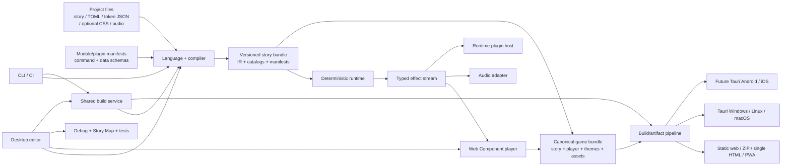

# RPGNarrativeEngine

## Product research and build-ready specification

**Status:** Approved for full implementation  
**Research date:** 2026-07-17  
**Last feature refinement:** 2026-07-17 - creator-only world graph, opt-in RPG modules, random exploration encounters, and 4v4 text combat  
**Project name:** RPGNarrativeEngine  
**Primary audience for this document:** Product owner, designers, contributors, and Codex or other implementation agents

---

## Executive decision

Build this as an **authoring-first, web-native narrative engine in which each narrative voice is expressed through a styled textbox instead of a character portrait**.

The default player is a staged conversation canvas rather than a picture with subtitles: multiple voice boxes may remain visible in left and right conversation lanes, while narration, internal monologue, and a lone speaker can occupy a centered composition.

The recommended implementation is:

- A strict TypeScript core split into compiler, deterministic runtime, player UI, audio, and plugin SDK packages.
- A Markdown-like `.story` language that remains pleasant in a normal text editor.
- A first-party desktop editor built with React, CodeMirror 6, and a thin Tauri 2 shell.
- A semantic HTML player made from Web Components and typed design tokens compiled to scoped CSS, with no dependency on the editor framework.
- Static web, ZIP, optional single-file HTML, and installable PWA export in the MVP; Tauri Windows/Linux/macOS game packages after the web pipeline, followed by Tauri Android APK/AAB and iOS IPA targets.
- An explicit capability-based plugin contract designed at the beginning, while keeping executable third-party plugins opt-in and clearly trusted.
- An MIT-licensed engine and SDK, with creators retaining full ownership and licensing choice over their games.

The project should **not** compete by becoming a general game engine. Narrat, Ren'Py, Monogatari, Twine, ink, Yarn Spinner, and Dialogic already cover much of that space. Its defensible product identity is the combination of:

1. **Voice-as-interface:** the textbox itself carries identity, emotion, rhythm, and staging.
2. **Writer-quality tooling:** live preview, diagnostics, variable inspection, a semantic Story Map, a creator-only World Graph, combat simulation, and automated path checks in one focused editor.
3. **Text-first portability:** readable local files, clean diffs, no mandatory cloud account, and no proprietary project database.
4. **A small, stable, modular core:** official RPG systems are enabled per project, and games can add commands, themes, editor tools, and exporters without forking the engine.
5. **Accessibility as a creative capability:** typography, contrast, pacing, keyboard control, reduced motion, and screen-reader behavior are core features rather than cleanup work.

The closest feature competitor is **Narrat**. RPG Maker MZ, Quest, Inform 7, Evennia, ChoiceScript, and Twine provide additional benchmarks for RPG data, text exploration, combat architecture, and graph tooling. Generic parity with any one of them is not the product goal. RPGNarrativeEngine will combine textbox performance, no-art text exploration, structured 4v4 combat, authoring ergonomics, story verification, and stable modular boundaries as one coherent engine and studio.

---

## 1. Product definition

### 1.1 One-sentence pitch

An open-source tool for making expressive, branching narrative RPGs where conversations, exploration, transitions, and combat are staged through beautifully styled text and voice boxes, supported by music and sound but requiring no character art or programming.

### 1.2 The core creative thesis

Most visual-novel engines treat the textbox as a utility beneath the art. This engine treats it as the stage.

A speaker is represented by a **voice profile**, not a sprite. A voice profile can control:

- Textbox fill, border, shape, depth, and texture.
- Nameplate style and placement.
- Typography, emphasis, letter spacing, and text reveal speed.
- Position, width, alignment, and entry/exit transition.
- Optional sound on line start or subtle per-letter voice blips.
- Variants such as calm, angry, whispering, distant, radio, memory, or system.
- Accessible fallbacks when the chosen colors, motion, or typeface do not meet player needs.

This makes dialogue visually legible without portraits while giving prose, internal monologue, chorus voices, narrators, machines, and unseen speakers equal expressive weight.

The intended art direction combines literary, psychologically expressive typography with ornate RPG dialogue framing. It should evoke the density and character of games such as Disco Elysium and classic Final Fantasy interfaces without copying their assets, exact layouts, or visual identity.


The reference contributes four product cues:

- Opposing speakers can be understood through spatial placement alone, before color or ornament is added.
- The dark negative space makes each box feel like the character's presence rather than a subtitle over an illustration.
- The engine should extend this horizontally paired idea into vertically accumulating left and right stacks.
- Character-specific styling should change frame, typography, rhythm, texture, and motion while keeping text as the only required content.

### 1.3 What “text-only” means

For this project, text-only means:

- A complete game never requires character sprites, portraits, illustrated backgrounds, or video.
- All story information is available as actual selectable text, never baked into an image.
- Color, typography, layout, minimal transitions, music, ambience, and sound effects can enrich the presentation.
- Theme backgrounds may use colors, gradients, CSS patterns, or optional decorative textures, but story logic may not depend on seeing them.
- Small still or frame-based assets may support bounded transitions such as a door opening, a light changing, weather passing, or an object being revealed; every story-critical change also has a textual representation.
- FMV, long-form video cutscenes, character animation pipelines, and cinematic scene cameras are outside the core product and may be added only through optional plugins.
- Core templates do not reserve a portrait, sprite, or character-art slot. Minimal decorative frame assets may be used by themes, but every official theme must work without them.

**Player-facing spatial presentation is an invariant, not a theme option:** RPGNarrativeEngine never renders a player grid, tile map, minimap, compass-rose graphic, world graph, position marker, or spatial avatar. Locations and routes are communicated in prose and text choices, such as “You see a path to the left and another to the right; the way forward is blocked.” A visual node-and-edge representation may exist inside the creator application to author and validate the underlying world data, but it is editor-only, is excluded from game exports, and has a structured nonvisual editor equivalent.

### 1.4 Product promise

A new creator should be able to:

1. Install the editor or use a future browser edition.
2. Create a project from a template.
3. Write a conversation in readable text.
4. Create distinct textbox voices without touching CSS.
5. Add a music loop and sound effect by dragging files into an asset library.
6. Preview every edit immediately.
7. Receive useful errors for broken links, unknown voices, invalid variables, and unreachable scenes.
8. Export a self-contained web folder or ZIP that can be uploaded to itch.io or any static host.

The first-success target is **under ten minutes from opening the app to playing a customized two-choice scene**.

---

## 2. Goals, non-goals, and principles

### 2.1 Product goals

- Make narrative-game creation approachable to writers who have never used a game engine.
- Make the visual creator application the primary authoring workflow; learning or editing story syntax is never required for ordinary scene construction.
- Make the default output feel intentional and polished without requiring visual assets.
- Preserve a text-file workflow for experienced authors, version control, and collaboration.
- Support branching, variables, conditions, reusable scenes, save/load, history, and endings.
- Support a standard text-led RPG loop: exploration, enemies, random encounters, resource pools such as HP and mana, skill choices, configurable currency, inventory, rewards, and progression.
- Treat transitions, audio, and textbox choreography as first-class script events.
- Ship games to the web with no server or account requirement.
- Make the player usable with mouse, keyboard, touch, gamepad where practical, and assistive technology.
- Make the internal architecture modular and publish a documented plugin SDK.
- Keep the engine, editor, templates, and documentation free and open source.
- Give creators unrestricted commercial and non-commercial use of their own work.

### 2.2 Explicit non-goals for the MVP

- Character sprites, portrait systems, general-purpose animation timelines, scene cameras, or FMV/video cutscenes.
- An opaque visual-authoring database that replaces portable project files or cannot round-trip through ordinary source control.
- Any player-facing grid, tile map, minimap, world graph, map cursor, or spatial avatar. The creator-only World Graph is authoring and validation tooling, not a game screen.
- Real-time multiplayer or cloud collaboration.
- An official plugin marketplace, remote plugin installation, or plugin payments.
- Native iOS, Android, or console export.
- Voice synthesis, generative writing, or mandatory AI features.
- Multiplayer analytics, accounts, hosted saves, DRM, or telemetry by default.
- Arbitrary raw HTML or arbitrary JavaScript inside story files.
- Compatibility with every older browser; target current evergreen browsers and test a declared support matrix.

### 2.3 Design principles

1. **The story remains readable outside the engine.** Source files are UTF-8 text and assets are normal files.
2. **Simple things are simple; advanced things remain possible.** Basic dialogue requires almost no syntax; commands are explicit and searchable.
3. **No invisible magic in released builds.** Compilation, state changes, randomness, and plugin behavior are inspectable and deterministic where possible.
4. **Preview is the primary loop.** Editing, diagnosing, and replaying from a line should feel immediate.
5. **The default is accessible.** Themes may become expressive without silently making games unreadable or inoperable.
6. **Core defines stable contracts; official RPG systems are opt-in.** Story execution, saves, accessibility, security, deterministic effects, and module contracts stay in core. World, encounters, party, combat, inventory, economy, progression, and quests ship as versioned first-party modules enabled per project and are omitted from runtime/editor surfaces when disabled. Unrelated genres and integrations remain optional plugins.
7. **World structure is authored visually only behind the curtain.** The creator may work with a World Graph, but the player experiences locations, routes, obstacles, and exploration entirely through prose, choices, sound, and transitions.
8. **The player does not depend on the editor.** A game bundle contains only the runtime, player, story, enabled first-party modules, selected plugins, and assets.
9. **No lock-in.** A project can be edited in VS Code, stored in Git, and built from a CLI.
10. **Errors teach.** Diagnostics describe the problem, identify the source location, and suggest a correction.
11. **Created games belong to their creators.** The engine license must not impose a revenue share or a particular publishing channel.

---

## 3. Target users and jobs to be done

### 3.1 Primary users

#### The solo writer

Wants to turn a branching story or text-led RPG into a playable work without sourcing character art or learning a general game engine. Values a clean editor, templates, immediate preview, standard RPG building blocks, and uncomplicated publishing.

#### The narrative designer

Already understands variables, branching, and state. Wants readable diffs, reusable scenes, diagnostics, test scripts, and a plugin surface for project-specific commands.

#### The small creative team

Has a writer, sound designer, and developer or technical designer. Wants separate source and asset files, stable IDs for localization, Git-friendly collaboration, and reproducible builds.

#### The educator or game-jam participant

Needs a low setup cost, fast visible results, permissive licensing, and exports that work from a simple URL.

### 3.2 Jobs to be done

- “When I have a dialogue-heavy story but no art budget, help me create a game that still has a strong visual identity.”
- “When my story branches, help me understand and test the paths without manually replaying from the beginning.”
- “When speakers have distinct personalities, help me communicate that through typography, color, motion, and sound.”
- “When I want to build an RPG without player-facing maps or character art, let me author a world graph behind the scenes and turn it into understandable location prose, route choices, encounters, enemies, combat choices, resources, items, rewards, and progression.”
- “When I collaborate with others, let us review normal files and avoid a fragile binary project format.”
- “When I need a feature the core does not provide, let a developer add it without editing engine internals.”
- “When I am ready to publish, give me a portable build with no royalties, hosted service, or required player account.”

---

## 4. Competitor landscape

### 4.1 Research method and caveat

The comparison below uses official product sites, documentation, and source repositories available on 2026-07-17. “Opportunity relative to this brief” is a product inference, not a claim that the competing product is defective. No user interviews or controlled usability tests were conducted for this document; feedback may be collected during implementation to refine the experience, but it is not a gate on building the engine.

### 4.2 Competitor matrix

| Product | What it does well | License / delivery | Opportunity relative to this brief |
|---|---|---|---|
| [Ren'Py](https://www.renpy.org/) | Mature visual-novel engine with an approachable script, Python escape hatch, save/load, rollback, audio, localization, linting, automated testing, and broad desktop/mobile export. Ren'Py 8.5.3 was current during this research; its web target was still identified as beta. | Open source and free for commercial use; its complete distribution has multiple component licenses. | Its mental model and tooling are optimized for conventional visual novels and increasingly capable general VN production. A new project can be narrower: textbox voices, web-native output, visual theme authoring, and a formal cross-surface plugin contract. Do not try to beat Ren'Py on breadth or maturity. |
| [Twine](https://www.twinery.org/) | Extremely approachable nonlinear-story editor, clear passage graph, browser and desktop use, direct single-file HTML publishing, and gradual access to variables, CSS, JavaScript, images, and audio. Version 2.12.0 was current during this research. | Twine editor is GPL-3.0; works created with it may be used commercially. Story behavior is supplied by a selected story format. | Story formats intentionally determine features and coding style, which makes the ecosystem flexible but less cohesive. There is room for an opinionated audio/textbox player, integrated asset handling, consistent runtime semantics, and deeper story diagnostics. |
| [ink + Inky](https://github.com/inkle/ink) | Excellent writer-oriented branching language, powerful flow and state, live play in Inky, a compiler, testing tools, and C# or JavaScript runtimes. Version 1.2.1 was current during this research. | MIT. | ink explicitly is not an end-to-end game engine. Authors still need a presentation layer, asset workflow, save UI, packaging, and integration. It is a strong language benchmark and a possible import target, but not a complete answer to this product brief. |
| [Yarn Spinner](https://github.com/YarnSpinnerTool/YarnSpinner) | Friendly screenplay-like dialogue language with a compiler, virtual machine, localization concepts, and maintained integrations for major game engines. The core was at 3.2.1 during this research. | Core compiler is MIT. Individual integrations and add-ons must be checked separately because terms can differ. | It is primarily dialogue middleware for another engine. This project can provide the complete player, authoring, theming, audio, save, and export experience without Unity, Godot, or Unreal. |
| [Monogatari](https://monogatari.io/) | Very close technically: a web-native, responsive, MIT-licensed VN engine with multimedia, save/load, rewind, auto-play, skipping, translation, components, CSS customization, PWA behavior, and desktop/mobile paths. Version 2.8.0 was advertised during this research. | MIT. | Its documentation is primarily a file/code workflow and its product language remains conventional visual novels, characters, images, actions, and components. Differentiation must come from a first-party authoring app, boxed-voice performance, verification tools, and a safer packaged plugin model—not merely from using web technology. |
| [Narrat](https://docs.narrat.dev/) | The closest narrative-RPG competitor: beginner-friendly scripting, hot reload, CSS themes, localization, audio, saves, inventories, usable items, HUD stats, skills with XP and dice checks, dynamic quest objectives/endings, screen transitions, and a TypeScript/Vue plugin API. | MIT. | Narrat proves that narrative authors value ready-made RPG utilities, so RPGNarrativeEngine should not position “inventory and stats” alone as differentiation. Its deeper [UI-customization workflow](https://docs.narrat.dev/guides/customising-ui.html) asks authors to inspect internal class names and sometimes use `!important`, while its selector list is explicitly a work in progress. RPGNarrativeEngine can improve on that with a visual token editor, a versioned styling API, and scoped expert overrides. Its other openings remain the no-player-map world model, structured 4v4 text combat, enemy condition prose, multi-box voice staging, a dedicated desktop authoring/database experience, static analysis, and deterministic simulation. |
| [RPG Maker MZ](https://rpgmakerofficial.com/product/MZ_help-en/) | A strong feature-parity benchmark for conventional RPG production: database forms for actors, classes, skills, items, equipment, enemies, troops, states, common events, encounters, shops, battle events, and a four-actor battle test. | Proprietary paid editor under an [EULA that permits distribution of user games subject to its terms](https://www.rpgmakerweb.com/eula). | Adopt the clarity and completeness of its data categories, conditional enemy actions, weighted encounter tables, and battle-test workflow. Do not adopt its tile-map player, battler images, map coordinates, animation dependency, or general visual-asset pipeline. |
| [Quest 5](https://docs.textadventures.co.uk/quest/) | Text-adventure authoring with rooms, directional or named exits, generated exit prose, visible/hidden/locked routes, objects, inventory, attributes, scripts, health, money, sound, and editor forms. | [MIT-licensed open source](https://textadventures.co.uk/quest); current and historical web/desktop components should be evaluated separately before reuse. | Quest directly validates a prose location-and-exit model. RPGNarrativeEngine can make that model typed, choice-first, source-controlled, and connected to first-party encounters/combat while rejecting Quest's optional player-facing compass/grid map. |
| [Inform 7](https://ganelson.github.io/inform-website/) | Deep semantic interactive-fiction world modeling, rooms and one-way connections, doors, objects, actions, rule-based behavior, automated test commands, and an author-only schematic World index. | [Core Inform is open source under Artistic-2.0](https://github.com/ganelson/inform); platform IDEs live in separate repositories. | Its creator-only world diagram is a particularly close precedent for the required boundary. Inform's parser-command model and natural-language rules are powerful but not the desired textbox-choice combat UX; RPGNarrativeEngine should use explicit typed data and approachable forms. |
| [Evennia](https://www.evennia.com/) | Extensible Python framework for persistent text games and MUDs. Its official turn-based combat examples layer initiative/HP, equipment, items and timed conditions, MP/spells, and abstract range. | BSD-3-Clause. | It is an architectural benchmark rather than a direct authoring competitor. Its layered combat examples support modular separation, but it expects developers, servers, commands, and multiplayer timing; RPGNarrativeEngine needs a local-first writer UI, deterministic single-player rounds, and no spatial range display. |
| [Dialogic 2](https://docs.dialogic.pro/) | Writer-friendly visual and text timeline editors inside Godot, conditions, variables, custom events, localization, styles/layouts, and direct access to the rest of a capable open-source game engine. | MIT; requires Godot 4.x. | It requires authors to adopt Godot and its project model. The official documentation still marked Dialogic 2 as alpha during this research. This project can offer a smaller standalone experience and avoid presenting general-engine concepts to writers. |
| [ChoiceScript](https://www.choiceofgames.com/make-your-own-games/choicescript-intro/) | Simple, proven syntax for choice-driven interactive novels; variables, conditions, random values, fairmath, text or percentage stat screens, testing, and easy HTML play make it a strong benchmark for stat-driven prose. | Source is publicly available under the custom ChoiceScript License, which limits commercial use unless separately licensed. | The custom commercial terms conflict with a fully open, royalty-free foundation. RPG systems are generally authored from generic variables and branches rather than a typed actor/enemy/skill database, and its default presentation is prose-page oriented rather than staged textboxes, audio transitions, or four-lane combat. |
| [TyranoBuilder](https://tyranobuilder.com/) | Commercial drag-and-drop authoring, no-code workflow, scripting escape hatch, multimedia, and exports to browsers and desktop/mobile wrappers. | Proprietary paid tool; games have no engine royalties. | It demonstrates demand for visual authoring, but cannot satisfy an open-source requirement. Its conventional image/video VN production is also broader and more asset-heavy than the proposed focus. |

### 4.3 What competitors establish

**Narrat-specific interpretation:** Narrat remains a close feature and architecture competitor, but not the same presentation product. Its official configuration separates a dialog panel, where text appears, from a viewport used for visual content, and its character system can use portraits and poses while allowing portraits to be hidden. This brief instead makes the entire stage a multi-box conversation composition: several speaker boxes may coexist, there is no required visual viewport, and portrait workflow is outside the core. See the [Narrat dialog-panel and viewport configuration](https://docs.narrat.dev/guides/config-files.html#dialog-panel) and [character portrait configuration](https://docs.narrat.dev/guides/config-files.html#characters).

The market already validates several expectations:

- A writer-friendly domain language is more approachable than requiring general programming.
- Live play while writing is table stakes among strong narrative tools.
- Direct HTML export is a major adoption advantage.
- Authors expect save/load, history or rollback, auto mode, skip behavior, audio controls, variables, choices, and localization.
- CSS is a powerful theming substrate for web-native engines, but raw selectors into engine internals are not an approachable or stable primary authoring workflow.
- A runtime-only narrative language leaves substantial integration work for creators.
- Visual graphs are useful for navigation, but large stories still need text-first organization and search.
- Mature engines win on ecosystem and stability; a new engine must win on focus and workflow.

### 4.4 RPG and text-world feature-parity findings

The useful comparison is **creator capability, not surface imitation**. RPGNarrativeEngine should let an author build the same broad loop as a conventional party RPG while translating every player-facing spatial or graphical convention into prose, structured text prompts, sound, and bounded transitions.

**Observed in official documentation:**

- Narrat already supplies [skills with levels/XP and configurable dice checks](https://docs.narrat.dev/features/skills.html), [inventory categories and usable items](https://docs.narrat.dev/features/inventory.html), [numeric HUD stats](https://docs.narrat.dev/features/hud-stats.html), [quests with dynamic objectives and endings](https://docs.narrat.dev/features/quests.html), and [CSS screen transitions](https://docs.narrat.dev/features/transitions.html). This establishes a higher baseline than “branching text plus variables.”
- [RPG Maker MZ's database](https://rpgmakerofficial.com/product/MZ_help-en/01_08.html) separates actors, classes, skills, items, equipment, enemies, troops, and states; [skills](https://rpgmakerofficial.com/product/MZ_help-en/01_08_03.html) define costs, targeting, speed, accuracy, formulas, criticals, and effects; [troops](https://rpgmakerofficial.com/product/MZ_help-en/01_08_07.html) support battle tests and HP-gated battle events; [map properties](https://rpgmakerofficial.com/product/MZ_help-en/01_07_03.html) define weighted encounter groups. This is the clearest conventional-RPG database benchmark.
- Quest models [exits with destinations, aliases, prose prefixes/suffixes, visibility, locks, conditions, and traversal scripts](https://docs.textadventures.co.uk/quest/exits.html). Inform 7 models [room connections and explicitly describes its schematic World index as author-only](https://ganelson.github.io/inform-website/book/WI_3_2.html). Together they validate a visual creator graph whose runtime output remains textual.
- [Evennia's official turn-based examples](https://www.evennia.com/docs/latest/Contribs/Contrib-Turnbattle.html) layer a basic HP/initiative loop, equipment, items and status effects, and MP-powered spells as separate customizations. This supports a modular design, although its server/MUD assumptions do not fit the desired author experience.
- ChoiceScript, Twine, ink, and Ren'Py can express many RPG mechanics with general variables or host-language code—for example, ChoiceScript provides [generic variables and conditions](https://www.choiceofgames.com/make-your-own-games/choicescript-intro/) and [random values](https://www.choiceofgames.com/make-your-own-games/choicescript-advanced/)—but their generality does not provide a consistent typed RPG database, balance tooling, or a standard four-party text-combat interface.

**Product inference:** no reviewed tool combines all of the following as one opinionated workflow: an author-only world topology, absolutely no player-facing map, persistent character-styled conversation boxes, built-in 4v4 text combat, descriptive enemy-health prose, static story analysis, and a local-first database/editor. That combination—not inventory or stats by themselves—is the meaningful opening.

| Capability | Strong benchmark | RPGNarrativeEngine parity decision | Target |
|---|---|---|---:|
| Branching narrative, variables, saves, history, audio | Ren'Py, Twine, ink, Narrat | First-class core behavior with deterministic effects and stable IDs. | P0 |
| Narrative outcome graph | Twine; Inform author indexes | Generated Story Map with source navigation, reachability, route explanations, and accessible list parity. | P0/P1 |
| Location topology | Quest exits; Inform rooms/connections | Typed locations and exits plus an editor-only World Graph. The graph is never exported as a player map. | P0 |
| Route prose and obstacles | Quest aliases, prefixes/suffixes, visibility, locks, scripts | Authored or templated available-route prose, visible/hidden exits, conditions, and explicit blocked text. | P0 |
| Random encounters | RPG Maker weighted troops by map/region | Seeded weighted tables attached to locations, exits, tags, or explicit exploration actions—never tiles or map coordinates. | P0 |
| Party and actors | RPG Maker actors/classes | Party roster with at most four active allies; textual HP/mana/status presentation. | P0 |
| Turn-based combat | RPG Maker commands/test; Evennia turnbattle | Up to 4v4, one textual command lane per active ally, review/confirm, deterministic resolution, victory/defeat/flee branches. | P0 |
| Skills and resources | RPG Maker skills; Evennia magic | Safe typed effects, target rules, costs, accuracy/critical/variance options, elements/tags, and HP/mana plus project-defined resources. | P0 |
| Enemies, groups, and AI | RPG Maker enemies/troops/action patterns | Enemy types, encounter groups, rewards, resistances, skills, and weighted conditional action rules. | P0 |
| Enemy health communication | RPG Maker exposes HP-percentage conditions but not a reusable prose-band model in the reviewed docs | No enemy health bar by default. Project profiles and per-enemy overrides map remaining-HP bands and states to localized descriptive text; exact numbers remain an opt-in project setting. | P0 |
| Status effects | RPG Maker states; Evennia item conditions | Duration, stacking, restrictions, periodic effects, removal rules, immunity, and narrated apply/persist/remove text. | P0 |
| Inventory and usable items | Narrat; RPG Maker; Evennia | Typed stackable/key/consumable items, use conditions, targets, and effects; icons are optional and never required. | P0 |
| Currency and shops | Narrat HUD stats; RPG Maker gold/shops; Quest money | One or more arbitrary currency IDs and display names with text formatting; transactions in P0, full shop authoring by 1.0. | P0/P1 |
| Levels, classes, and equipment | RPG Maker; Narrat skill XP; Evennia equipment | Basic XP/level hooks in P0; class curves, learnable skills, equipment slots, modifiers, and respec policy by 1.0. | P0/P1 |
| Quests and objectives | Narrat | Optional quest journal with objectives, hidden/revealed stages, success/failure or named endings, and event-driven progress. | P1 |
| Battle and encounter testing | RPG Maker battle test; Inform test commands | Combat Lab with fixtures, seeds, action traces, balance summaries, and a required 4v4 capacity test. | P0 |
| Extensibility | Narrat plugins; Evennia framework | Versioned first-party modules plus capability-scoped third-party extensions; no internal imports. | P0 |

The target deliberately omits visual battlers, tile movement, region painting, encounter sprites, enemy life bars, combat animation timelines, and player maps. Their **data roles** are retained where useful; their graphical presentation is not.

### 4.5 Unmet opportunity

The proposed engine should own this specific position:

> **A complete, open-source writing and publishing studio for art-light narrative games, where styled textboxes perform the role normally given to character art.**

The strongest differentiators are:

- A visual **Voice Studio** for building textbox identities, placement roles, emotional variants, and full-stage multi-box compositions.
- A unified authoring surface with source, live player, semantic Story Map, diagnostics, and state inspector.
- Outcome-aware visualization that can answer “how can this ending happen?”, “why is this choice locked?”, and “where did these routes diverge?”.
- A runtime whose presentation model is persistent voice boxes, conversation lanes, text, choices, sound, and timing—not sprites with dialogue attached.
- Deterministic execution, stable line IDs, release linting, and automated path coverage.
- A plugin SDK that spans compiler commands, runtime effects, editor panels, themes, and exporters without exposing engine internals.
- A first-class accessible presentation mode that can adapt expressive themes rather than simply disabling them.

### 4.6 Feedback to collect during implementation

Run five to eight moderated sessions with writers who have used at least two of Twine, Ren'Py, ink, Narrat, RPG Maker, Quest, or no engine at all. Use two short tasks. First, give each person 30 minutes to make two opposing speakers, one centered narration beat, two choices, one condition, one music loop, and a web build. Second, ask them to create three prose locations, one blocked route, a weighted encounter, two allies, two enemies, one mana skill, and two enemy-health descriptions. Test a clickable editor prototype and a minimal runtime prototype. Validate:

- Whether a staged conversation made only of voice boxes feels creatively useful rather than like a cosmetic chat layout.
- Whether authors prefer source-first editing, form-based event editing, or a hybrid.
- Whether the Story Map materially reduces confusion about branches, conditions, and endings.
- Whether the creator-only World Graph makes text exploration easier to author without implying that a map will appear to the player.
- Whether four ally command lanes remain understandable at desktop, narrow-screen, keyboard-only, and screen-reader settings.
- Whether descriptive enemy condition bands communicate combat progress without exact HP or a life bar.
- Which textbox controls are essential versus overwhelming.
- Whether a dedicated new engine is compelling enough compared with a Narrat theme or Ren'Py template.

**Owner decision:** RPGNarrativeEngine will be built as its own complete engine and authoring application. Feedback may change interaction details, defaults, documentation, or priorities, but it does not replace the project with a theme or plugin for another engine.

---

## 5. Product experience

### 5.1 Player experience

The default game has a conversation stage rather than a picture with a subtitle layer:

- An ambient background made from a solid color, gradient, or CSS pattern.
- Left and right conversation lanes that can hold several vertically stacked voice boxes at once on wide screens.
- A visible conversation stack in which recent boxes remain part of the composition instead of disappearing after every click.
- A clearly emphasized current box; older boxes may recede through opacity, scale, border weight, or depth without becoming unreadable.
- Centered compositions for narration, internal monologue, a lone speaker, chapter cards, and other single-voice moments.
- A clear speaker label and optional written descriptor when applicable.
- Choice boxes that inherit the scene theme while preserving focus and contrast.
- A minimal quick menu for history, save, load, auto, skip, settings, and return to title.
- Music, ambience, and sound-effect channels with independent volume controls.
- Bounded visual/audio transitions for events such as opening a door, entering combat, receiving an item, changing location, or revealing an enemy—never a requirement for long video or character animation.
- Location cards and prose beats that describe the current place, available routes, blocked routes, discoveries, and travel results. Navigation is performed through ordinary text choices; no grid, minimap, compass graphic, world graph, or moving avatar is present.
- A text-combat composition for up to four allies and four enemies. Each living ally receives an identifiable action prompt, while enemies are represented by names, written descriptors, status/tell text, and descriptive health conditions rather than required art or life bars.

The player can always:

- Advance, reveal the full line, choose, pause auto mode, and open settings with keyboard or pointer.
- Set text size, line height, typeface category, text speed, auto delay, contrast mode, motion level, and audio channel volumes.
- Turn typewriter animation off.
- Review a readable transcript/history, including the choices they selected.
- Follow dialogue in chronological reading order even when boxes are visually distributed across multiple lanes.
- Use a responsive single-column presentation on narrow screens without losing speaker identity or branch context.
- Save and load unless the author explicitly chooses a short no-save format and the build warns about the choice.

### 5.2 Voice profiles

A voice is the equivalent of a traditional VN character definition, but it contains no required portrait.

Each voice has:

- Stable ID, display name, and optional short written descriptor or epithet.
- Base textbox theme.
- Optional variants that override a subset of tokens.
- Default presentation role such as left participant, right participant, centered narrator, system, chorus, or automatic.
- Preferred lane, width, alignment, stack spacing, and maximum retained-box behavior within theme-approved limits.
- Entrance, active, receded, interruption, and exit states.
- Typography tokens.
- Text reveal behavior.
- Optional line-start sound and letter-blip set.
- Accessible fallback colors and motion.
- Optional player-facing pronoun and fuller description metadata for first entrance, transcript, and screen-reader context.

Example variants:

- `mara/default`
- `mara/angry`
- `mara/whisper`
- `mara/distant`
- `narrator/memory`
- `system/error`

Variants should change only declared overrides and inherit everything else. Authors can switch variants per line without duplicating a voice.

### 5.3 Conversation staging model

The core visible unit is a **voice box**: one authored utterance or narration block rendered with a voice profile, variant, placement role, and stable content ID. A **conversation stack** is the ordered set of voice boxes currently retained on the stage. A **beat** is an author-controlled retention boundary that can clear or restage that stack without requiring a new story scene.

#### Layout presets

P0 ships with a small set of responsive layout presets rather than arbitrary coordinates:

- **Conversation:** opposing left and right lanes, optimized for two-person exchanges and the reference image supplied for this brief.
- **Monologue:** one centered reading column with room for long narration, internal voices, journals, or a single speaker.
- **Ensemble:** left, right, and center roles with stronger clustering and shorter retained history for three or more active voices.
- **System:** full-width or edge-anchored notices for chapter titles, interface voices, warnings, and non-character narration.

A project may define additional presets through documented layout tokens or a layout plugin. Official templates must remain fully usable with the built-in presets.

#### Stacking and focus

- The authored line order is always the canonical conversation order. Visual placement never changes execution or transcript order.
- A new utterance is appended to its resolved lane. Recent boxes remain visible until the preset's retention limit, an explicit beat boundary, a stage clear, or a scene transition removes them.
- The current box receives the strongest emphasis and reveal animation. Previous boxes become quieter visual context but remain readable and selectable.
- Default desktop retention should show roughly four to eight recent boxes across the stage, adjusted by viewport size and text length rather than enforced as a fixed count.
- Overflow scrolls or recycles the oldest boxes gracefully; it must never shrink body text to keep all boxes visible.
- Choices appear in a dedicated decision region associated with the current beat. They must not be mistaken for another character's speech.
- Backlog/history remains a separate complete transcript even when the scenic stack retains only recent boxes.

#### Placement rules

- Voice profiles provide a preferred role and lane. Scene layout and current participants resolve `auto` placement deterministically.
- Authors may override a voice's lane for a scene or beat, but P0 does not expose arbitrary pixel positioning.
- Multiple voices may share a lane; shape, typography, label, pattern, and spacing must preserve identity without depending on color alone.
- A centered narrator can interrupt an opposing conversation, temporarily take focus, and then return to the prior layout without losing chronological order.
- Lane changes are presentation events only. Save files and deterministic replays preserve the resolved layout and visible stack so loading restores the same composition.

#### Responsive and accessible reflow

On narrow screens, large text settings, or constrained embeds, the stage becomes one chronological column. Left and right roles may remain as modest alignment or border cues, but reading and keyboard order follow source chronology. The DOM remains chronological at every viewport size; CSS layout may distribute boxes visually but may not reorder their accessible reading sequence.

### 5.4 Authoring application

The desktop editor has seven context-sensitive workspaces. Story-only projects do not see irrelevant RPG panels; enabling first-party modules in `project.toml` activates their schemas, commands, editors, diagnostics, and preview tools.

#### Writer

- Project and story-file navigator.
- A structured scene editor is the default workspace: ordered visual cards represent narration, dialogue, choices, conditions, state changes, calls, jumps, effects, and endings.
- Labeled forms and pickers let creators add, edit, reorder, duplicate, and remove supported content without writing `.story` syntax. Scene targets, speakers, variants, variables, and commands use project-aware selectors rather than requiring memorized IDs.
- Card operations preview and apply ordinary readable source edits through one undoable transaction. Unsupported plugin commands remain visible as preserved custom-command cards.
- An optional Advanced Source view uses CodeMirror with syntax highlighting, completion, hover documentation, folding, outline, rename, and diagnostics.
- Live player pane that updates without losing the current test position when a safe hot reload is possible.
- “Play from here” and “replay scene” actions.
- Variable, call-stack, event-log, and audio-channel inspectors.

#### Story Map

The Story Map is a first-class authoring workspace, not a decorative mind map. It lets a writer understand structure, trace outcomes, find mistakes, and move between visual and source views without maintaining a second representation of the story.

The map is always generated from the compiler's analyzed story graph. Source files remain canonical, so the map cannot silently drift away from the game that will actually run.

**Core visual model**

- Node types include chapter or file clusters, scenes, decisions, reusable called scenes, and endings. Individual dialogue lines are not nodes in the normal view.
- Edge types include choice, jump, sequential continuation, conditional transition, call, return, and ending. Edge labels show choice text or a short condition summary where useful.
- Broken targets, unreachable scenes, known loops, and transitions that depend on dynamic plugin behavior receive distinct, accessible markings rather than color alone.
- Each node can summarize speakers used, choices, state reads and writes, tags, test coverage, and known endings without forcing all detail onto the canvas at once.

**Semantic zoom**

| Zoom level | Primary content | Writer question answered |
|---|---|---|
| Story | Chapter, file, or author-defined clusters plus endings | “What is the overall shape of the story?” |
| Scene | Scenes and their incoming and outgoing transitions | “Where can the player go from here?” |
| Decision | Choices, conditions, state gates, and immediate effects | “Why does this branch appear, disappear, or lead elsewhere?” |

Zooming changes the amount of semantic detail; it does not merely make tiny nodes larger. Large clusters collapse by default, and expanding a scene reveals its decisions without permanently exploding the whole graph.

**Views and overlays**

- **Structure:** the default authored graph, with calls and reusable scenes visually separated from ordinary progression.
- **Reachability:** reachable, unreachable, broken, looped, and dynamically unknown areas.
- **Current playthrough:** the route taken in live preview, with the current node and prior choices highlighted.
- **Test coverage:** visited and unvisited scenes, decisions, commands, and endings from bounded test runs.
- **Outcome trace:** select an ending or target scene to show known routes toward it, the gates on each route, and reverse dependencies.
- **State:** show where a selected variable is read, written, incremented, or used to gate a choice.

**Navigation and investigation**

- Clicking a node, decision, condition, or edge navigates to the exact source range; source selection can reveal and focus the corresponding map item.
- Search and filters cover file, tag, speaker, variable, ending, reachability, coverage, and transition type.
- Writers can isolate ancestors, descendants, one route, all routes to an ending, or the difference between two bounded playthroughs.
- A route inspector explains why a known choice is available or locked and lists state changes between selected points.
- A mini-map, breadcrumbs, saved views, and “return to current playthrough” prevent loss of orientation.

**Layout and scaling**

- Automatic layout must be deterministic for unchanged structure so nodes do not jump around after every text edit.
- Chapter, file, tag, and author-defined group boundaries provide clustering options; cross-cluster edges are summarized until the cluster is expanded.
- Manual pinning and saved viewport positions are optional editor metadata stored separately from story semantics. Deleting that metadata must never change or break the story.
- The 1.0 scale fixture must demonstrate that a 1,000-scene project opens in a useful clustered view without attempting to render every decision at once.

**Editing model**

The Story Map is directly editable from its first creator release. Writers can create, connect, reconnect, rename, duplicate, and delete scenes and supported transitions, then open any scene or decision in the structured editor. Graph gestures, forms, menus, and keyboard actions all produce the same previewed source transaction; invalid or lossy operations are rejected before canonical source changes. Source remains the portable backing representation, but authors are not required to view or edit it.

#### World Graph — creator only

The World Graph is a topology editor for projects that enable the `world` module. It is separate from the Story Map: the Story Map explains narrative control flow; the World Graph explains which authored locations connect and under what conditions.

- Location nodes show ID, title, description status, tags, linked entry/revisit scenes, ambience, and encounter-table reference.
- Exit edges show direction or player-facing label, one-way/bidirectional status, availability condition, blocked-reason status, transition, and traversal hooks.
- Forms and graph gestures produce previewable edits to canonical TOML. Layout coordinates, collapsed groups, and author notes live in ignorable editor metadata.
- Diagnostics find missing destinations, accidental one-way links, unreachable locations, missing or duplicated reverse exits, circular locks, hidden-only regions, missing route prose, and unknown encounter references.
- Filters cover tags, region/group, reachability, lock state, encounter table, linked story scene, and test coverage.
- Every graph action has a keyboard/menu/form equivalent and every relationship is available in a structured location/exit table.

The World Graph is never a player screen, never bundled into a release, and never used as a source of runtime coordinates. The exported game receives only typed location/exit data and presents it as text. There is no player-map preview mode because there is no player map.

#### RPG Database and Combat Lab

Projects with RPG modules enabled receive schema-driven forms and raw-source access for actors, parties, resources, enemies, encounter groups, skills, states, items, equipment, currencies, shops, progression, and quests. Every field has plain-language help, validation, reference search, duplicate/rename support, and “find uses.” Forms apply precise edits to ordinary project files rather than storing an opaque database.

The Combat Lab can:

- Assemble up to four allies and four enemies at chosen levels, equipment, resources, and statuses.
- Select a fixed seed or run a bounded seed set.
- Play the exact text interface used by the game or resolve automatically from scripted action fixtures.
- Show initiative, selected intents, formulas/effect steps, random rolls, target resolution, condition-band changes, rewards, and emitted narrative/audio/transition effects.
- Compare average round count, damage/resource ranges, defeat/flee rate, item use, and stalled-battle detection without pretending those summaries alone establish good balance.
- Save any setup as a version-controlled test fixture and jump from a trace event to the responsible data or story source.

The default enemy preview uses descriptive health text and no life bar. A project may opt into exact numeric enemy HP, but the lab always exposes exact internal values in its creator-only debug trace.

#### Voice Studio

- A direct visual inspector for the selected stage, voice box, nameplate, body text, choice, combat prompt, or transition state. Controls edit typed theme data; they do not silently emit fragile selectors.
- Form controls for all supported design tokens, grouped into stage, frame, typography, spacing, states, choice treatment, motion, sound cues, and accessible fallback. Every visual control also has a labeled numeric, text, or select input.
- A component-and-state preview matrix containing opposing conversation stacks, centered narration, ensemble dialogue, choices, location/system notices, and the 4v4 combat composition. Authors can inspect default, entering, active, receded, interrupted, exiting, hover, focus, selected, disabled, low-resource, and enemy-condition states.
- Real-time preview with short, long, emphasized, unbroken, localized, RTL, mixed-direction, and 200%-scaled sample text. Viewport presets include wide desktop, narrow desktop, phone, and constrained embed, but the preview can also be resized freely.
- Variant creation and inheritance visualization with “inherited from,” token aliases, changed-only filtering, reset-to-inherited, and a resolved-value inspector. A voice variant stores only its overrides.
- A source-aware edit transaction: dragging a control updates the in-memory preview immediately, coalesces undo history, then previews the exact `tokens.json` or TOML change before saving. Source remains canonical and no opaque editor database is required.
- Side-by-side default, high-contrast, reduced-motion, and no-transparency previews, with contrast, focus-state, overflow, chronology, and reflow diagnostics tied to the affected control.
- Transition controls select bounded engine recipes and edit their typed parameters. The preview can replay entrance, exit, interruption, door/location, combat-start, reward, and reveal transitions alongside their reduced-motion fallback and optional sound cue.
- An advanced CSS panel for expert overrides, clearly separated from portable token controls. It offers completion only for documented custom properties, component parts, and semantic state attributes; it reports unsupported selectors and restricted resource loads before previewing.
- A generated CSS and source-diff inspector for debugging. Generated CSS is build output and never the canonical file an ordinary author must maintain.

#### Assets

- Import, rename, tag, preview, and remove music, ambience, and sound effects.
- Show file format, duration, size, channels, and whether a fallback format is needed.
- Find unused assets and missing references.
- Avoid rewriting source asset files unless the author requests conversion.

#### Build

- This is the primary creator-facing GUI for packaging; ordinary users never need a terminal. The CLI offers equivalent automation through the same build service.
- Run release lint and tests.
- Display project size and largest assets.
- Select development/release profile, output directory, targets, formats, and architectures.
- Export a static web folder/ZIP, optional PWA, and optional validated single-file HTML build.
- Package the same compiled game bundle for Windows, Linux, and macOS through Tauri, with future Android APK/AAB and iOS IPA targets through Tauri mobile.
- Validate per-game application identity, version, icons, required host toolchains, and signing/notarization readiness without storing creator secrets in the project.
- Show target-by-target progress, preserve successful artifacts when another target fails, and open or run locally available outputs.
- Present artifact result cards with platform, format, architecture, size, checksum, signing state, build hash, and actions to run/preview, open the containing folder, copy the path, or inspect reports.
- Generate attribution and third-party notices.
- Generate an artifact manifest, checksums, build report, SBOM reference, and actionable warnings for missing metadata, inaccessible theme combinations, unstable line IDs, incompatible plugins, unavailable build hosts, and unsigned packages.

### 5.5 New-project templates

Ship four templates:

1. **First Story:** two voices, one branch, one condition, music, and heavily annotated source.
2. **Kinetic Story:** linear reading with chapter navigation, history, and no choices.
3. **Conversation Mystery:** variables, conditional choices, reusable scenes, and a small test suite.
4. **Text RPG Expedition:** world, party, combat, encounters, inventory, economy, and progression enabled; three prose locations, one blocked route, a seeded random encounter table, two allies, two enemies, mana skills, descriptive enemy-health bands, a named currency, and Combat Lab fixtures.

Templates must be complete, buildable, and licensed for unrestricted reuse.

---

## 6. MVP scope and requirements

### 6.1 Priority definitions

- **P0:** required for the first public MVP.
- **P1:** required for a credible 1.0 but can follow the first MVP.
- **P2:** useful ecosystem or genre expansion.

### 6.2 Functional requirements

| ID | Priority | Requirement | Acceptance condition |
|---|---:|---|---|
| FR-001 | P0 | Create, open, rename, and validate a local project. | A project created by the editor is also buildable by the CLI on Windows, macOS, and Linux. |
| FR-002 | P0 | Edit UTF-8 `.story` files in the app or any external editor. | External changes are detected; the user is warned before conflicting unsaved edits are overwritten. |
| FR-003 | P0 | Parse and compile scenes, narration, dialogue, choices, variables, conditions, calls, jumps, returns, commands, and endings. | Valid source produces versioned IR; invalid source reports file, line, column, stable error code, explanation, and suggested correction where possible. |
| FR-004 | P0 | Preview the game live. | Saving a valid edit refreshes affected content without restarting from the title when runtime state remains compatible. |
| FR-005 | P0 | Play from a selected scene or line in debug mode. | The editor can start with default state or a named test-state fixture and stops at the chosen source location. |
| FR-006 | P0 | Define voice profiles, placement roles, and variants without writing CSS. | A creator can make three visibly distinct voices with written descriptors, lane preferences, variants, and accessible fallbacks entirely in Voice Studio. |
| FR-007 | P0 | Stage narration, dialogue, and choices through responsive conversation stacks. | Two speakers can alternate through retained left/right box stacks, narration can take a centered composition, and the same scene reflows into chronological single-column reading without requiring a character or background image. |
| FR-008 | P0 | Support music, ambience, UI, and SFX channels. | Each channel can play, pause, stop, loop where relevant, fade, and obey an independent user volume setting. |
| FR-009 | P0 | Support variables with declared types and defaults. | Boolean, number, and string values are statically checked; undeclared reads and invalid assignments fail release lint. |
| FR-010 | P0 | Support conditional flow and conditional choice visibility. | Conditions use a safe expression evaluator; story source cannot execute JavaScript. |
| FR-011 | P0 | Provide save/load, auto-save, transcript history, auto mode, and skip-read mode. | A save restores instruction location, variables, call stack, visible conversation stack, resolved layout, history, random state, selected plugin state, and reasonable audio state. |
| FR-012 | P0 | Export static web/HTML builds and an optional installable PWA. | The exporter creates a relative-path static folder and deterministic ZIP that run from a static HTTP host; an optional single-file HTML target succeeds only when all selected content can be embedded safely; PWA builds work offline after first load; no output contains authoring dependencies. |
| FR-013 | P0 | Provide CLI commands for create, dev, lint, test, and build. | CI can install dependencies and produce the same story bundle as the editor for the same lockfile and source. |
| FR-014 | P0 | Detect broken references and obvious unreachable scenes. | Release lint fails for missing scene, voice, asset, variable, or plugin command references and reports unreachable scenes unless explicitly annotated. |
| FR-015 | P0 | Establish a versioned plugin manifest and command/theme extension proof. | Two reference plugins—one theme pack and one custom command—install, validate, run, save state if needed, and appear in generated notices without core changes. |
| FR-016 | P0 | Provide player settings for text, motion, input, and audio. | Settings persist separately from story saves and can be reset to platform-derived defaults. |
| FR-017 | P0 | Meet the accessibility baseline in section 13. | Automated checks pass and manual keyboard/screen-reader test scripts have no blocking issue on the declared support matrix. |
| FR-018 | P0 | Show a generated, navigable Story Map. | Every statically known scene-level jump, call, continuation, choice fan-out, ending, broken target, and reachability result is represented and linked to source; the view supports clustering, collapse, search, filters, and deterministic automatic layout. |
| FR-019 | P1 | Support stable localization IDs and locale bundles. | The editor can stabilize IDs, export source strings, import a locale, report missing/stale strings, and switch locale at runtime. |
| FR-020 | P1 | Run bounded automated path exploration. | A configurable run explores branches deterministically, reports visited scenes/choices/endings, and stops loops with a clear bound rather than hanging. |
| FR-021 | P1 | Explain and compare routes and outcomes through Story Map overlays. | Given an ending, target scene, current playthrough, or test fixture, the editor shows known route requirements, relevant state gates and changes, visited versus unvisited branches, and a bounded comparison of two routes; behavior made unknowable by plugins is labeled rather than guessed. |
| FR-022 | P1 | Export desktop game packages through Tauri. | Matching native build hosts produce Windows NSIS/MSI, Linux AppImage/DEB/RPM, and macOS app/DMG artifacts from the same canonical game bundle; artifacts are signed-capable, indexed in the output manifest, and contain no Electron code. |
| FR-023 | P1 | Install editor-panel and exporter plugins. | UI plugins run in an isolated surface where possible and receive only declared brokered capabilities. |
| FR-024 | P1 | Import a documented subset of ink or Twine. | Import produces ordinary project files plus a report of constructs that could not be translated; it never silently changes story logic. |
| FR-025 | P2 | Support optional visual-media plugins. | Images or video can be added without changing the semantics of projects that do not install the plugin. |
| FR-026 | P2 | Provide a browser-hosted editor. | A project can be opened through user-selected local-directory access or an explicit import/export flow; no account is required. |
| FR-027 | P0 | Play declarative visual/audio transitions without an FMV pipeline. | An author can trigger, preview, skip, and test a transition such as a door opening using text, sound, stage tokens, and optional small assets; reduced-motion or asset-free presentation preserves the same story information and completion timing. |
| FR-028 | P0 | Enable official RPG modules independently per project. | World, party, combat, encounters, inventory, economy, progression, and quests have explicit manifest flags and validated dependencies; a disabled module contributes no editor navigation, script commands, runtime code, export data, or save namespace, and references to it produce an actionable compile error. |
| FR-029 | P0 | Author location topology in a creator-only World Graph without creating a player map. | A creator can add, connect, inspect, rename, and validate locations/exits through graph, form, and source views that round-trip canonical project data; release output contains no grid, tile map, minimap, compass graphic, world graph, map cursor, spatial avatar, or editor layout metadata. |
| FR-030 | P0 | Explore entirely through prose and text choices. | Entering a location emits its authored description and semantically ordered available/blocked-route text; choosing an exit evaluates visibility and traversal conditions, explains a failure, runs travel events/transitions, and enters the destination without map coordinates. |
| FR-031 | P0 | Trigger deterministic random encounters during textual exploration. | Weighted encounter tables can be attached to a location, exit, tag, or explicit exploration action with conditions, cooldown/grace rules, and safe areas; identical state, traversal/action sequence, and seed select the same encounter and never depend on hidden tile steps. |
| FR-032 | P0 | Run turn-based combat with up to four active allies and four active enemies. | Every living ally receives a separate textual action/skill/item/guard prompt and target selection, intents can be reviewed before round confirmation, and seeded initiative/AI resolves an ordered narrated round with victory, defeat, and optional flee branches; the same fight works in a chronological narrow-screen mode. |
| FR-033 | P0 | Define actors, resources, skills, enemy types, encounter groups, AI rules, rewards, and statuses as typed data. | Forms and source can define HP, mana and project resources; safe effect formulas; costs; targets; accuracy/critical/variance options; tags/elements; resistances; status duration/removal; conditional weighted enemy actions; and item/currency/XP rewards without arbitrary story JavaScript. |
| FR-034 | P0 | Communicate enemy health through configurable text by default. | The default player renders no enemy life bar or exact HP. Descending remaining-HP bands resolve to localized global profile text, with reusable profile and per-enemy overrides plus state-aware variants; an explicit project setting may reveal exact numbers, and screen readers announce a changed condition once rather than rereading the full roster. |
| FR-035 | P0 | Provide text-first inventory and usable items. | Projects can define stackable, key, and consumable items with categories, use occasion, target, conditions, and typed effects; add/remove/use operations are deterministic and all player information remains available without icons. |
| FR-036 | P0 | Provide configurable textual currencies and transactions. | A project can define one or more currency IDs with any display name, singular/plural forms, prefix/suffix, precision, bounds, starting value, and locale-aware format; rewards and purchases use stable currency IDs and never require an icon. |
| FR-037 | P0 | Support basic party progression. | Actors can gain deterministic XP, level according to a validated curve/table, change resource/stat values, and learn skills; projects that disable progression retain fixed actors without unused UI. |
| FR-038 | P1 | Add classes, equipment, and full shop authoring. | Classes can define growth and learned skills; equipment uses typed slots, requirements, modifiers, and traits; shops define stock, currencies, buy/sell rules, conditions, and story hooks through forms and source. |
| FR-039 | P1 | Track quests, objectives, and named outcomes. | An enabled quest module exposes a text journal and supports hidden/revealed objectives, active/completed/failed states, success/failure or custom ending IDs, dynamic descriptions, and event-driven progress with stable source links. |
| FR-040 | P0 | Test encounters and combat in a creator-only Combat Lab. | A creator can run, replay, and save a 4v4 fixture with a chosen seed; inspect intents, rolls, effect calculations, status and enemy-condition changes, rewards, and emitted text/audio/transition effects; and execute bounded batches that detect stalls and summarize results. |
| FR-041 | P0 | Produce a complete creator-facing build output directory. | The editor Build workspace and CLI use the same build service; a successful request writes the canonical game bundle, selected artifacts, checksums, notices, SBOM reference, target logs, and a machine-readable artifact manifest under project `build/`; failed targets do not corrupt prior successful artifacts, and every target reports the same canonical game-bundle hash. |
| FR-042 | P2 | Export Android and iOS game packages through Tauri mobile. | A configured Android host produces APK/AAB and a macOS/Xcode host produces IPA from the same canonical game bundle; the editor explains signing/provisioning requirements, keeps credentials outside project source, and never implies that an unavailable host can build the target locally. |
| FR-043 | P0 | Configure, build, and inspect game packages entirely through the editor GUI. | Without opening a terminal, a creator can edit distribution metadata and icons, select profiles/targets/formats/architectures, understand prerequisites and signing readiness, run or cancel builds, monitor target progress/logs, preserve successful artifacts when another target fails, and run/preview/open/copy completed outputs; equivalent GUI and CLI requests produce the same build plan and results. |

### 6.3 Non-functional requirements

| ID | Area | Requirement |
|---|---|---|
| NFR-001 | Portability | Projects use documented UTF-8 text formats and relative POSIX-style asset paths internally. |
| NFR-002 | Determinism | With identical compiled story, initial state, selected choices, and random seed, core execution emits the same ordered effect stream. |
| NFR-003 | Security | Story text is treated as untrusted content: no raw HTML, `eval`, dynamic function construction, or path traversal. Builds use a restrictive Content Security Policy. |
| NFR-004 | Privacy | No telemetry, crash upload, remote font, CDN, analytics, or network request is enabled by default. Any future telemetry is opt-in and documented. |
| NFR-005 | Performance | Advancing a compiled line should not perform parsing or filesystem work. Runtime steps excluding deliberate animation should normally complete within one animation frame on the reference test machine. |
| NFR-006 | Bundle size | The default web engine/player JavaScript budget is 250 KiB gzip or less, excluding story content, fonts, audio, source maps, and optional plugins. Budget changes require a recorded decision. |
| NFR-007 | Scale | The editor and compiler must be benchmarked with at least 100,000 words, 1,000 scenes, and 10,000 translatable lines before 1.0; the Story Map must open that fixture as a navigable clustered view without rendering every decision node at once. |
| NFR-008 | Reliability | Autosave is atomic, maintains recovery copies, and never silently replaces a newer external file. |
| NFR-009 | Compatibility | Public story IR, save format, plugin API, and project schema each carry independent semantic versions. |
| NFR-010 | Testability | Compiler and runtime do not depend on a browser UI and can run headlessly in tests. |
| NFR-011 | Reproducibility | Release builds record engine, plugin, schema, and dependency-lock versions plus a content hash. |
| NFR-012 | Maintainability | No plugin may import undocumented internal package paths; CI checks package-boundary rules. |
| NFR-013 | Presentation invariant | First-party player packages and official templates expose no player-facing grid, tile/map canvas, minimap, compass graphic, world graph, coordinate display, position marker, or spatial avatar. A conformance test inspects the reference build and exercises every exploration route using only text controls. |
| NFR-014 | RPG determinism | Given the same compiled data, save state, selected ally intents, encounter/traversal sequence, and RNG seed, encounter selection and combat resolution emit the same ordered effects and final state across headless, preview, and release runtimes. |
| NFR-015 | Modular cost | Disabled first-party modules are excluded from release bundles and do not create state, storage, UI, commands, or network activity; the build report attributes size to every enabled module. |
| NFR-016 | Artifact integrity | Every distributable artifact has a SHA-256 checksum and references the canonical game-bundle content hash; output promotion is atomic per target, and a failed/unavailable target never replaces the last successful artifact. |
| NFR-017 | Packaging security | Signing keys, passwords, provisioning profiles, private certificates, store API keys, and credential-bearing paths never enter project source, lockfiles, logs, caches intended for export, artifact manifests, or game bundles. |

---

## 7. Story language specification

### 7.1 Language goals

The language should be readable as a screenplay with lightweight commands, easy to parse incrementally, safe to execute, and expressive enough for substantial branching fiction.

It should not embed a general-purpose programming language. A small typed expression language is easier to diagnose, test, localize, and preserve across runtimes.

### 7.2 File conventions

- Source extension: `.story` as the recommended v1 format; change it only for a concrete compatibility or ownership reason.
- Encoding: UTF-8 without a required byte-order mark.
- Newlines: accept LF or CRLF; formatter writes the project preference.
- Identifiers: lowercase ASCII letters, digits, hyphens, underscores, and dots; dots express namespaces.
- Comments: `//` to end of line, except inside quoted strings.
- Indentation: two spaces recommended. It is significant only for long-form choice bodies and line continuations.
- Reserved line starts at column one: `::`, `@`, and `*`. Escape them with a leading backslash to write literal prose.
- Raw HTML and script tags are never accepted as markup.

### 7.3 Minimal example

```text
:: start

Rain writes silver lines down the station glass.

Mara: You came.

* Ask why she doubted you -> station.ask
* Say nothing -> station.silence
```

Rules:

- `:: start` declares a scene.
- A normal paragraph is narration using the project's narrator voice.
- `Mara: ...` is dialogue using voice ID `mara`; display-name matching in the editor is a convenience, but compiled source resolves stable IDs.
- Adjacent `*` lines form a choice group.
- `->` points to the target scene.

### 7.4 Complete representative example

```text
// story/chapter-01.story

:: station.arrival

@music night-train loop fade=2s
@ambient rain volume=0.45 fade=1s

The last train has already gone. ^arrival.narration.last-train

Mara[distant]: You came. ^arrival.mara.you-came

@if memory.mara_met
  Mara[warm]: I was beginning to think you'd forgotten me. ^arrival.mara.remembered
@else
  Mara[guarded]: Have we met? ^arrival.mara.stranger
@end

* Ask about the letter -> station.letter ^arrival.choice.letter
* Apologize -> station.apology [when courage >= 2] ^arrival.choice.apology
* Leave -> ending.departed ^arrival.choice.leave

:: station.letter

@set clues.letter = true
@sfx paper-unfold

Mara[whisper]: Don't read it here. ^letter.mara.warning

@call shared.train-rumble
@goto station.decision

:: station.apology

@set trust += 1

You try to find an apology that does not sound borrowed.

Mara[warm]: That will do. ^apology.mara.accepts

@goto station.decision

:: station.silence

@wait 800ms
@sfx distant-horn

The silence becomes a third person in the room.

@goto station.decision

:: station.decision

@if clues.letter && trust >= 1
  * Follow Mara -> chapter-02.alley
  * Stay at the station -> ending.waiting
@else
  @goto ending.waiting
@end

:: shared.train-rumble

@sfx train-rumble volume=0.7
@wait 350ms
@return

:: ending.departed

@music stop fade=2s

You leave before the rain can decide for you.

@ending departed "The Train You Missed"
```

### 7.5 Voice and variant syntax

`Mara[whisper]: Text` resolves:

- Voice ID from the case-insensitive display alias `Mara`, normalized by the editor to stable ID `mara`.
- Variant ID `whisper` within that voice.

The formatter can rewrite aliases to an explicit stable form if desired:

```text
@say mara/whisper "Don't read it here." ^letter.mara.warning
```

The dialogue form is preferred for writers; `@say` is useful for generated or highly dynamic source.

### 7.6 Choice syntax

Common shorthand:

```text
* Ask about the letter -> station.letter
* Apologize -> station.apology [when courage >= 2]
```

Long form, used when a choice needs immediate effects:

```text
* Take her hand
  @set trust += 1
  @sfx cloth
  @goto station.together
* Step away -> station.alone
```

Choice rules:

- Adjacent choices form one group.
- A choice must end in `@goto`, `@call` followed by `@goto`, `@ending`, or the shorthand arrow.
- Choice bodies cannot fall through into the next choice.
- `[when expression]` hides the choice when false by default. A project setting may instead show disabled choices, but the accessibility label must explain why only when the author supplies player-safe text.
- Choice text is translatable and receives a stable ID.

### 7.7 Variables and expressions

Variables are declared in `story/variables.toml`, not created implicitly:

```toml
[variables.courage]
type = "number"
default = 0
min = 0
max = 5

[variables.memory.mara_met]
type = "boolean"
default = false

[variables.player.name]
type = "string"
default = "Traveler"
```

MVP types:

- `boolean`
- `number` (finite IEEE-754 number; `NaN` and infinities prohibited)
- `string`

MVP operators:

- Logical: `&&`, `||`, `!`
- Equality: `==`, `!=`
- Comparison: `<`, `<=`, `>`, `>=`
- Arithmetic: `+`, `-`, `*`, `/`, `%`
- Parentheses

Rules:

- Equality does not coerce types.
- Division by zero is a runtime error in development and a release-lint failure when statically provable.
- String interpolation uses `{{ player.name }}` and HTML-escapes output.
- A small standard function library may include `min`, `max`, `clamp`, `round`, `length`, and seeded `random`, all versioned and deterministic.
- Plugin functions must publish type signatures and determinism metadata to the compiler.

### 7.8 Built-in commands for MVP

| Command | Purpose |
|---|---|
| `@set path = expression` | Assign a declared variable. Also support `+=`, `-=`, `*=`, and `/=` when types allow. |
| `@goto scene-id` | Replace the current scene with another. |
| `@call scene-id` | Push a return location and enter a reusable scene. |
| `@return` | Return from the most recent call. |
| `@if`, `@else`, `@end` | Conditional block. |
| `@music asset-id ...` | Play or stop the music channel with loop, volume, and fade options. |
| `@ambient asset-id ...` | Play or stop ambient audio. |
| `@sfx asset-id ...` | Play a one-shot sound effect. |
| `@transition transition-id ...` | Play a declared, bounded visual/audio transition with duration, wait, skip, and reduced-motion behavior. |
| `@wait duration` | Delay progression; skippable unless marked otherwise for a justified reason. |
| `@voice voice/variant` | Change the default voice for following narration or generated text. |
| `@layout preset-id` | Select a responsive conversation, monologue, ensemble, system, or project-defined layout preset. |
| `@place voice-id role` | Override a voice's resolved left, right, center, system, chorus, or automatic placement for the current scene or until changed. |
| `@clear [all|role]` | Clear retained scenic voice boxes globally or for one role without deleting transcript history. |
| `@ending id "Display name"` | End the run and record an ending. |
| `@checkpoint id` | Create an author-named safe save/migration location. |
| `@emit event-name payload` | Emit a schema-checked project/plugin event without direct JavaScript. |

Command arguments use `key=value`; quoted values are required only when whitespace or reserved characters are present.

Official first-party modules register additional schema-checked commands only when enabled. The exact surface should be finalized through language fixtures, but the v1 capability set is:

| Module command family | Purpose |
|---|---|
| `@travel location-id` | Evaluate an authored exit/travel rule and enter a location; it never accepts player coordinates. |
| `@explore action-id` | Run a named text exploration action and its optional encounter check. |
| `@battle encounter-id ...` | Start a typed encounter and branch to declared victory, defeat, or flee continuations. |
| `@party add|remove actor-id` | Change the roster while enforcing the project's active-party limit. |
| `@item give|take|use item-id ...` | Perform validated inventory operations. |
| `@currency add|spend currency-id amount` | Perform bounded transactions using stable currency IDs. |
| `@xp grant actor-id amount` | Apply progression rules and emit level/skill events. |
| `@quest start|advance|complete|fail quest-id ...` | Change quest/objective state through stable IDs. |

These commands lower to the same typed event/effect system as narrative commands. A story that calls a disabled module fails compilation with the feature name and manifest edit needed to enable it.

### 7.9 Text markup

Support a safe CommonMark-inspired subset:

- `*emphasis*`
- `**strong emphasis**`
- Explicit line breaks.
- Project-defined pronunciation hints and language spans through safe engine markup.

Do not support in MVP:

- Raw HTML.
- Inline images.
- Arbitrary links from story text. If links are later enabled, validate allowed schemes and show an external-navigation confirmation.
- Author-controlled ARIA roles.
- CSS embedded in story lines.

### 7.10 Stable content IDs

The suffix `^arrival.mara.you-came` is a stable content ID used by localization, read-history, transcript references, analytics plugins, and save migration.

Workflow:

- IDs are optional during early drafting.
- The editor maintains temporary internal source anchors for preview and diagnostics.
- “Stabilize content IDs” inserts explicit IDs into source before localization or release.
- Release lint requires explicit IDs for translatable lines and choices when localization is enabled.
- Duplicate IDs are errors across the entire project.
- Renaming an ID creates an optional migration entry so existing saves/read-history can map it.

### 7.11 Diagnostics

Every diagnostic includes:

- Stable code, such as `RPGNE1004`.
- Severity: error, warning, or information.
- File, line, column, and source span.
- Plain-language explanation.
- Related location when applicable.
- Suggested fix and an automatic edit when safe.

Required release checks include:

- Syntax errors and malformed command arguments.
- Duplicate/missing scenes and IDs.
- Unknown voices, variants, variables, assets, commands, and plugin IDs.
- Type errors and invalid expression operators.
- Unreachable scenes, choices that can never appear when statically provable, and scenes with no terminating path.
- `@return` without a possible call and call cycles that may overflow.
- Missing localization entries and stale source hashes.
- Unused assets and variables as warnings.
- Theme contrast, focus, and scaling violations.
- Plugin engine-range and capability conflicts.

### 7.12 Compiler output

Source compiles to a versioned, JSON-serializable intermediate representation. The player never parses `.story` source in a release build.

Each instruction contains:

- Opcode.
- Typed operands.
- Stable scene/content ID where relevant.
- Source-map reference for debug builds.
- Required plugin namespace and command schema version for extension instructions.

Compiler stages:

1. Parse source into a concrete syntax tree.
2. Convert to a normalized AST.
3. Resolve names and imports.
4. Type-check expressions and commands.
5. Build the scene/control-flow graph.
6. Run static analysis and plugin validators.
7. Lower to versioned IR.
8. Emit story bundle, source map, content catalog, asset manifest, and build metadata.

---

## 8. Project format

### 8.1 Directory layout

```text
my-story/
  project.toml
  rpg-narrative-engine.lock
  story/
    variables.toml
    chapter-01.story
    chapter-02.story
  game/
    world/
      locations.toml
      encounter-tables.toml
    party/
      actors.toml
    combat/
      resources.toml
      skills.toml
      enemies.toml
      encounters.toml
      states.toml
      condition-profiles.toml
    inventory/
      items.toml
      equipment.toml
    economy/
      currencies.toml
      shops.toml
    progression/
      classes.toml
    quests/
      quests.toml
  voices/
    narrator.toml
    mara.toml
  themes/
    midnight/
      theme.toml
      tokens.json
      layouts.toml       # optional constrained layout recipes
      advanced.css       # optional expert overrides
      assets/
  assets/
    app-icons/
    audio/
      music/
      ambience/
      sfx/
    fonts/
  locales/
    en/
      messages.json
    es/
      messages.json
  plugins/
    local/
  tests/
    opening.storytest.toml
    combat/
      road-ambush.combattest.toml
  .rpgnarrativeengine/
    editor/
      world-graph.json
  build/
    # generated and ignored by Git
```

### 8.2 Project manifest

Example `project.toml`:

```toml
schema = 1

[project]
id = "org.example.last-station"
title = "The Last Station"
version = "0.1.0"
entry_scene = "station.arrival"
default_locale = "en"

[story]
files = ["story/**/*.story"]

[distribution]
slug = "last-station"
publisher = "Example Creator"
copyright = "Copyright 2026 Example Creator"
license = "All-Rights-Reserved"
icons = "assets/app-icons"

[player]
theme = "midnight"
history = true
saves = true
skip_mode = "read-only"

[features]
world = true
party = true
combat = true
encounters = true
inventory = true
economy = true
progression = true
quests = false

[combat]
max_active_allies = 4
max_active_enemies = 4
ally_vitals = "text"
enemy_vitals = "descriptive"

[build]
output = "build"
profile = "release"
targets = ["web", "windows", "linux", "macos"]

[build.web]
pwa = true
zip = true
single_html = false
base_path = "./"

[build.windows]
formats = ["nsis", "msi"]
architectures = ["x86_64"]

[build.linux]
formats = ["appimage", "deb", "rpm"]
architectures = ["x86_64"]

[build.macos]
formats = ["app", "dmg"]
architectures = ["aarch64", "x86_64"]

[[plugins]]
id = "org.rpgnarrativeengine.theme-midnight"
version = "1.0.0"
```

Use TOML because it is comment-friendly and relatively readable. All manifests have a schema version and are validated into typed internal objects. The editor owns migrations and always offers a backup plus preview before rewriting project files.

`project.id`, `project.title`, and `project.version` identify the creator's game across every target. Native/mobile release builds require a non-placeholder globally unique reverse-domain `project.id`. `distribution.slug` controls safe artifact filenames, while publisher, copyright, license, and icons provide packaging metadata without changing story semantics. Creator signing credentials are external secrets and are never stored in this manifest or the lockfile.

`build.targets` selects desired outputs. Web targets build on any supported development host. Official native packages are built on matching hosts: Windows for Windows, Linux for Linux, and macOS for macOS/iOS. Android requires its configured Android toolchain. An unavailable target remains visible with an actionable host/toolchain explanation; it is never silently skipped or falsely reported as built. The complete output contract and directory layout are defined in `BUILD_PLAN.md`.

Feature flags select bundled, versioned first-party modules. Dependencies are explicit: `combat` requires `party`; `encounters` requires `world` and `combat`; equipment behavior requires `inventory` and `party`; other integrations use declared optional capabilities. The editor may offer to enable a missing dependency but never changes flags silently. Disabled modules are not merely hidden—they are excluded from compilation, runtime bundles, saves, and release UI.

`max_active_allies` and `max_active_enemies` may be lowered per project but may not exceed four in v1. `enemy_vitals = "descriptive"` is the default. `"exact"` may expose text numbers; no setting enables a life bar. There is intentionally no `player_map` option because grids, minimaps, world graphs, coordinates, and spatial avatars are not supported player features.

The `game/` split is a recommended layout, not a limit on project size. Large projects may divide files and import them through documented manifests. `.rpgnarrativeengine/editor/` contains ignorable authoring metadata only; deleting it can change graph arrangement but never game logic, and exporters always exclude it.

### 8.3 Lockfile

`rpg-narrative-engine.lock` is generated and committed. It records:

- Exact engine and schema compatibility.
- Plugin IDs, versions, resolved sources, package hashes, and licenses.
- Theme and exporter packages.
- Enabled first-party module IDs, schema versions, and compatibility ranges.
- Toolchain metadata needed for reproducible builds.

It must not contain machine-specific absolute paths, secrets, or registry credentials.

### 8.4 Asset rules

- Asset IDs are stable and independent of filenames.
- Stored paths are project-relative and normalized to `/` separators.
- The editor validates that resolved paths remain inside the project.
- Assets are copied or linked only through an explicit choice.
- Release builds fingerprint filenames and deduplicate identical content.
- Long music and ambience are streamed; short SFX may be preloaded according to manifest hints.
- Ship a format-compatibility check and recommend at least one broadly supported source per asset.

### 8.5 Build and packaging output

Every project builds into an ignored project-local `build/` directory by default. The compiler emits one canonical platform-neutral game bundle; every web, desktop, and mobile exporter wraps that same bundle without recompiling or reinterpreting story/RPG semantics.

The editor Build workspace is the primary packaging interface, and every ordinary build operation is available there without a terminal. The CLI and GUI call the same typed build service, so equal requests produce the same validation, target plan, game-bundle hash, artifacts, logs, and reports.

The output contains:

- `artifact-manifest.json` indexing every runnable folder, installer, archive, store package, platform, architecture, signing state, checksum, and canonical game-bundle hash.
- `build-report.json`, `checksums.sha256`, third-party notices, and an SBOM reference.
- The canonical game bundle and only the successfully requested target directories.
- Web folder/ZIP, optional PWA files, and optional validated single-file HTML.
- Tauri Windows NSIS/MSI, Linux AppImage/DEB/RPM, and macOS app/DMG artifacts when built on matching hosts.
- Future Tauri Android APK/AAB and iOS IPA artifacts when those targets are enabled and their host/signing requirements are satisfied.

Each target builds in an isolated staging directory and is promoted only after verification. Failure or unavailability of one target does not delete or corrupt prior successful outputs. `--clean` may remove only files proven to be generated for the current project. Signing credentials and private creator data never appear in source, locks, reports, logs, manifests, caches intended for export, or game bundles. `BUILD_PLAN.md` defines the canonical directory tree, commands, target matrix, and Build-workspace behavior.

---

## 9. Technical architecture

### 9.1 Architectural overview



### 9.2 Core separation

The runtime is an event-driven state machine, not a UI controller.

Given a compiled bundle and runtime state, it advances until it reaches a suspension point and emits a typed effect such as:

- `line.show`
- `choice.show`
- `stage.layout`
- `stage.clear`
- `voice.place`
- `transition.play`
- `location.show`
- `routes.show`
- `encounter.start`
- `combat.intent.request`
- `combat.round.resolve`
- `combat.condition.changed`
- `inventory.changed`
- `currency.changed`
- `progression.changed`
- `quest.changed`
- `audio.play`
- `audio.stop`
- `timer.wait`
- `ending.reached`
- `plugin.effect`

`line.show` carries the stable content ID, voice and variant, written descriptor metadata, resolved presentation role, retention group, and source-order index. Layout effects are deterministic presentation state: they do not change story control flow, but they are serialized so save/load and replay restore the same visible composition.

`transition.play` references a validated transition definition rather than arbitrary animation code. The player or editor preview resolves effects and resumes execution. This separation enables:

- Headless story tests.
- Alternative players and accessibility surfaces.
- Deterministic replays.
- Editor debugging without duplicating story semantics.
- Future integrations into other engines.

### 9.3 Recommended monorepo

```text
apps/
  editor/             # React frontend + Tauri shell
  playground/         # browser demo and language playground
packages/
  language/           # Lezer grammar, CST helpers, formatter
  compiler/           # AST, resolver, type checker, CFG, IR emitter
  ir/                 # versioned IR types and migrations
  runtime/            # deterministic VM/state machine
  player/             # Web Components, input, history, settings
  audio/              # audio port and web implementation
  project/            # manifests, migrations, filesystem abstraction
  plugin-sdk/         # manifests, APIs, schemas, test harness
  build/              # shared GUI/CLI build graph, target orchestration, artifacts
  cli/                # create/dev/lint/test/build
  exporter-web/       # static web/ZIP/single-HTML/PWA bundling
  exporter-desktop/   # Tauri Windows/Linux/macOS game packaging
  exporter-mobile/    # Tauri Android/iOS game packaging
  accessibility/      # theme checks and player utilities
  testkit/            # fixtures, replay, path coverage
modules/
  world/              # locations, exits, textual traversal
  party/              # actor roster and active-party state
  combat/             # 4v4 rounds, skills, enemies, states
  encounters/         # weighted exploration encounter checks
  inventory/          # items, equipment data, item effects
  economy/            # currencies, transactions, shops
  progression/        # XP, levels, classes, learned skills
  quests/             # objectives, journal, named outcomes
templates/
  first-story/
  kinetic-story/
  conversation-mystery/
examples/
  reference-game/
```

Package rules:

- `language`, `compiler`, `ir`, and `runtime` do not import DOM, React, Tauri, or Node filesystem APIs.
- `player` imports runtime public APIs but runtime never imports player.
- First-party modules import only published core/module contracts, declare dependencies and optional integrations, and may not form cycles.
- Platform access goes through small interfaces supplied by browser, editor, or CLI adapters.
- The editor Build workspace and CLI use the same typed build-service API; neither owns separate packaging rules or target behavior.
- Only documented package exports are public.
- Circular package dependencies fail CI.

### 9.4 Runtime state

Core runtime state is serializable and includes:

- IR and story build version references.
- Current scene and instruction pointer.
- Call stack.
- Declared variable store.
- Seeded random generator state.
- Read content IDs and selected choice IDs.
- Transcript entries, subject to a configurable size policy.
- Pending effect and safe resume token.
- Reversible event log needed for editor rewind.
- Namespaced enabled-module snapshots for current location, party/resources, combat, encounter clocks, inventory, currencies, progression, and quests.
- Namespaced plugin snapshots.

Audio playback objects and DOM references never enter core state. The audio adapter provides a serializable snapshot containing intent—track ID, channel, volume, loop, and approximate position—rather than browser objects.

### 9.5 Save format

Each save contains:

```json
{
  "saveSchema": 1,
  "engineVersion": "0.1.0",
  "story": {
    "id": "org.example.last-station",
    "version": "0.1.0",
    "buildHash": "sha256-..."
  },
  "location": {
    "scene": "station.arrival",
    "contentId": "arrival.mara.you-came",
    "instruction": 18
  },
  "state": {},
  "history": [],
  "rng": {},
  "audio": {},
  "modules": {},
  "plugins": {}
}
```

Compatibility policy:

- Exact build hash loads directly.
- Same story version with a different build hash may load only after validation at an explicit checkpoint or mapped content ID.
- New story versions can publish declarative variable and content-ID migrations.
- A failed migration never overwrites the original save.
- Plugins own only their namespaced save data and must declare a save schema plus migration hooks.
- First-party modules also own namespaced versioned snapshots and migration hooks; disabling a module with existing save data requires an explicit migration or new game rather than silently discarding state.

### 9.6 Storage

- Web player: IndexedDB for saves, localStorage only for tiny user preferences if necessary.
- Desktop editor: atomic filesystem writes through the Tauri backend.
- Desktop game export: same logical storage interface with a platform adapter.
- Save import/export: JSON file with validation and clear privacy warning.

### 9.7 Hot reload

Classify edits:

- **Presentation-only:** theme token or CSS changes apply immediately.
- **Content-compatible:** changed line text or audio parameters update while preserving runtime location by stable ID.
- **Structure-compatible:** added scenes or choices may preserve state after control-flow validation.
- **Incompatible:** removed current scene, changed variable type, or changed active plugin contract requires restart or migration.

The editor must say which category applies and never pretend to preserve state when it cannot.

---

## 10. Stack recommendation

### 10.1 Selected stack

| Layer | Choice | Rationale |
|---|---|---|
| Language/runtime | Strict TypeScript, ESM | One approachable ecosystem across compiler, runtime, CLI, editor, and plugins; static checking catches API drift while compiling to standard JavaScript. |
| Monorepo | pnpm workspaces | Efficient, explicit workspace boundaries and a single lockfile. Pin the active Node LTS version in the repository. |
| Build | Vite | Strong development loop, library and static-site output, typed plugin API, and optimized web builds. |
| Story parser | Lezer grammar plus semantic compiler passes | Lezer is incremental and error-recovering, integrates naturally with CodeMirror, and lets the editor and compiler share one syntax grammar. Its concrete tree should be normalized into a separate AST before semantic work. |
| Editor UI | React + CodeMirror 6 | Mature ecosystem for complex desktop tools; CodeMirror provides accessibility, keyboard use, mobile behavior, completion, folding, and bidirectional-text support. React is editor-only. |
| Player UI | Standards-based Web Components, implemented with Lit or a similarly small helper | Keeps exported players and runtime plugins independent of React. Semantic component hosts remain in chronological order; CSS custom properties, documented semantic state attributes, and deliberately exposed component parts form the versioned theme contract. |
| Theme source and compiler | DTCG 2025.10-compatible JSON tokens plus RPGNarrativeEngine TOML manifests; an engine-owned adapter around a pinned Style Dictionary 5 build-time transformer | Gives Voice Studio typed, interoperable source data while keeping engine-specific layout and asset semantics explicit. The adapter owns validation, naming, cascade output, and compatibility so Style Dictionary is replaceable and never becomes the public plugin API. Required DTCG types are locked by fixtures because upstream 2025.10 support is still being completed. |
| Advanced CSS pipeline | PostCSS AST plus a selector/value parser and RPGNarrativeEngine allowlist rules | Produces source-located diagnostics, wraps accepted rules in the project cascade layer, and validates selectors and asset URLs structurally instead of attempting unsafe regular-expression rewriting. |
| Desktop shell | Tauri 2 | Uses HTML in the system WebView with a Rust backend and capability-scoped IPC; avoids bundling a full Chromium copy. Keep Rust code small and limited to filesystem, dialogs, updates, and packaging. |
| Audio | Audio port with a web adapter using HTMLMediaElement for long tracks and Web Audio for mixing/short SFX; Howler is an acceptable initial implementation | Matches browser strengths, supports multiple channels and fades, and keeps the runtime replaceable. Audio begins only after a user gesture when browser policy requires it. |
| Validation | JSON Schema for public manifests; typed validators for internal objects | Makes plugin and project contracts language-neutral and allows editor forms and diagnostics to consume the same schemas. |
| Tests | Vitest for packages; Playwright for browser/editor flows; axe-core plus manual assistive-tech checks | Fast unit feedback, real-engine browser coverage, and explicit accessibility gates. |
| Web output | Static folder/ZIP + optional single-file HTML + optional service worker/web app manifest | Cheap hosting, itch.io compatibility, portable small-game HTML, installability, and offline play without a backend. |
| Native game output | Generated Tauri 2 wrapper around the canonical game bundle | Produces Windows, Linux, macOS, and later Android/iOS artifacts without Electron or a second game runtime. |

### 10.2 Why web-native is the best fit

- The product is fundamentally typography, layout, controls, and audio; HTML and CSS are native to those concerns.
- Semantic DOM is a stronger accessibility foundation than drawing the UI to a game canvas.
- Static web export is the lowest-friction way for creators to share a game.
- Typed design tokens and a visual editor make theme creation approachable; CSS remains the portable rendering layer and expert escape hatch.
- A TypeScript plugin API is accessible to a large contributor pool.
- The same player can run inside preview, a web export, a PWA, and a desktop wrapper.

Official platform references supporting the choice include [Tauri's architecture and capability model](https://v2.tauri.app/concept/architecture/), [Vite's static and library builds](https://vite.dev/guide/build), [CodeMirror's editor and accessibility features](https://codemirror.net/), and [Lezer's incremental error-recovering parser](https://lezer.codemirror.net/docs/guide/).

### 10.3 Why Tauri for the editor, not the player MVP

Tauri is recommended for the authoring application because local projects need safe filesystem access, native dialogs, updates, and desktop distribution. It is not required for the first game export. Static web/PWA output should be stabilized first.

Benefits:

- Small application packages because the OS WebView is reused.
- Explicit IPC and capability configuration.
- Frontend framework freedom.
- MIT/Apache-2.0 code licensing.

Costs:

- Contributors need the Rust and platform build prerequisites.
- System WebViews can differ slightly across operating systems.
- Native builds generally need per-platform CI runners.

Mitigation: keep almost all behavior in TypeScript packages testable in normal browsers and make the Tauri layer a thin adapter. Browser development may continue while a Tauri-specific issue is solved, but Tauri remains the only desktop shell and the required desktop distribution path.

### 10.4 Alternatives considered

| Alternative | Strengths | Why it is not the default |
|---|---|---|
| Godot 4 + GDScript | Fully open source, excellent export system, editor extensibility, audio, and strong general game capabilities. | Requires a game-engine project model, makes DOM/CSS-level typography and accessibility less direct, and risks expanding into general game features. A Godot runtime adapter can be a future plugin. |
| Electron + TypeScript | Single JavaScript codebase and a consistent bundled Chromium. | Explicitly rejected. Its bundled browser/runtime cost conflicts with the project's performance and distribution goals. Electron is prohibited as a dependency, fallback, temporary shell, or packaging target. |
| Python + Qt/PySide | Readable language and mature desktop widgets. | Web export, shared runtime, CSS-quality theming, and browser accessibility require a second implementation or significant translation layer. |
| Rust-native engine/editor | Strong performance and control, small native runtime. | High contributor barrier and substantial custom UI, text layout, accessibility, and plugin work for a product whose core needs are already native to the web platform. |
| Fork or theme an existing engine | Faster access to inherited engine behavior. | Explicitly not selected. The first-party editor, stable IR, deterministic testing, modular RPG stack, and complete player are part of the product being built. Existing engines remain research references only. |

### 10.5 Dependency policy

- Prefer standards and small libraries over large application frameworks in exported players.
- Pin exact versions in the lockfile; automate update PRs but never auto-merge major updates.
- Record license, homepage, version, and purpose for every production dependency.
- Fail release CI on known critical vulnerabilities unless a time-limited, documented exception exists.
- Generate a software bill of materials and third-party notice file for editor and game builds.
- Do not load runtime code, fonts, or assets from public CDNs by default.

---

## 11. Plugin and modularity specification

### 11.1 Modularity goals

“Fully pluggable” must mean stable extension points, not that every core behavior can be replaced unpredictably.

Keep these core-owned:

- Parser safety and base language grammar.
- Runtime scheduling and deterministic state.
- Save envelope and migration orchestration.
- Player accessibility guarantees.
- Project path and asset validation.
- Plugin loading, isolation, capabilities, and version negotiation.

Make these extensible:

- Script commands and pure expression functions.
- Runtime effects and adapters.
- Voice/theme packs and player component slots.
- Editor panels, inspectors, diagnostics, and generators.
- Importers and exporters.
- Localization formats.
- Additional genre systems implemented entirely in namespaced state.

### 11.2 First-party module boundary

World, party, combat, encounters, inventory, economy, progression, and quests are **bundled first-party modules**, not ad hoc third-party plugins and not unconditional core code. They are maintained in the main repository, tested against the same release, use only documented module contracts, and are enabled per project.

Every first-party module declares:

- Module ID, data schema, event/effect schemas, dependencies, and optional integrations.
- Compiler commands and validators.
- Serializable state namespace and migrations.
- Editor navigation, forms, inspections, and tests.
- Player components or text-effect handlers, if any.
- Determinism and hot-reload behavior.
- A bundle entry that can be removed completely when disabled.

Modules communicate through versioned domain events such as `location.entered`, `encounter.selected`, `combat.ended`, `item.changed`, `currency.changed`, and `quest.changed`, not imports of one another's stores. Hard dependencies are few and explicit; optional integrations subscribe only when both modules are enabled. A missing dependency is a manifest error with an offered edit, never a silent enablement.

This boundary lets a kinetic novel ship without RPG weight while ensuring that the official RPG stack has coordinated schemas, documentation, accessibility behavior, and compatibility guarantees that community plugins alone cannot provide.

### 11.3 Plugin kinds

1. **Theme pack:** declarative tokens, declared local assets, optional restricted CSS, fonts, and constrained player-layout recipes; lowest risk and never permitted to run JavaScript.
2. **Command plugin:** adds schema-checked story commands and runtime effects.
3. **Compiler plugin:** adds validators or transforms at documented phases; no arbitrary mutation after validation.
4. **Player plugin:** adds a component in a declared slot or handles a namespaced effect.
5. **Editor plugin:** adds commands, panels, inspectors, templates, or asset tools.
6. **Importer/exporter:** translates external story formats or produces a new build target.

### 11.4 Manifest

Example `plugin.toml`:

```toml
schema = 1
id = "org.example.weather"
name = "Weather Commands"
version = "1.0.0"
license = "MIT"
engine = ">=0.1.0 <0.2.0"

capabilities = [
  "commands.register",
  "state.own-namespace",
  "audio.play-sfx"
]

[entries]
compiler = "dist/compiler.js"
runtime = "dist/runtime.js"
editor = "dist/editor.js"

[integrity]
sha256 = "..."

[[commands]]
name = "thunder"
schema = "schemas/thunder.schema.json"
deterministic = true
save_safe = true
```

Required metadata:

- Globally unique reverse-domain ID.
- Semantic version and engine compatibility range.
- License and source URL.
- Entrypoints by surface.
- Declared capabilities.
- Command/effect schemas.
- Determinism, save, and hot-reload compatibility.
- Integrity hash in the lockfile.

### 11.5 Capability model

Initial capability vocabulary:

- `commands.register`
- `expressions.register-pure`
- `state.own-namespace`
- `audio.play-sfx`
- `audio.control-channel:<name>`
- `ui.slot:<slot-id>`
- `editor.panel.register`
- `editor.project.read`
- `editor.project.write:<declared-subpath>`
- `export.register`
- `network:<origin>`; never granted by default

The editor shows requested capabilities before installation or enablement. A plugin update that expands capabilities requires new consent.

### 11.6 Security truthfulness

A manifest is not a sandbox by itself.

- Token-only themes and schema-only plugins can be treated as data. Optional CSS is parsed, restricted, scoped, and previewed in isolation; themes never run JavaScript.
- Compiler/runtime code bundled into the same JavaScript realm is trusted code and must be labeled accordingly.
- Editor UI plugins should run in a sandboxed iframe or isolated WebView where possible and communicate through a typed message broker.
- Non-UI work should run in a Worker when the required APIs allow it.
- Tauri commands expose narrowly scoped operations; frontend plugins never receive a general filesystem command.
- Network access is denied by Content Security Policy and the broker unless explicitly granted.
- Player plugins are selected by the creator and bundled at build time; games never download executable plugins while a player is running.

If meaningful isolation cannot be enforced for a plugin kind in v1, the UI must call it **trusted code** rather than implying the capability list is a security boundary.

### 11.7 Runtime contract

Plugins register through the SDK, never global mutation:

```ts
export default definePlugin({
  id: "org.example.weather",
  commands: {
    thunder: {
      schema: thunderSchema,
      deterministic: true,
      execute(context, args) {
        context.state.set("lastIntensity", args.intensity)
        return context.effects.audio.playSfx("thunder", {
          volume: args.intensity,
        })
      },
    },
  },
})
```

The actual SDK should ensure:

- `context.state` accesses only the plugin namespace.
- The command returns serializable effects.
- Arguments are compiled and validated before execution.
- Execution can be recorded and replayed.
- A plugin cannot retain runtime internals across steps.

### 11.8 Versioning policy

- Plugin API stays `0.x` until at least three non-core plugins and one external contributor have exercised it.
- Public types, JSON schemas, effect names, and hook ordering are versioned contract surface.
- Deprecations remain supported for at least one minor release before 1.0 and one major release after 1.0 where security permits.
- The editor includes a plugin compatibility report and never silently disables a plugin in a release build.
- A small official conformance suite is part of the SDK.

### 11.9 Reference plugins required before 1.0

- High-contrast theme pack.
- Custom command that creates a deterministic visual/audio effect and saves its state.
- CSV localization importer/exporter.
- Debug panel showing a plugin-owned state namespace.

These prove the API across theme, compiler, runtime, save, editor, and export surfaces.

---

## 12. Theming and textbox system

### 12.1 Decision: CSS is the renderer, not the beginner authoring format

RPGNarrativeEngine should use CSS for final presentation. The player is already semantic HTML made from Web Components, and CSS is the browser-native system for typography, responsive layout, focus states, motion preferences, high contrast, printing, and custom fonts. Replacing it with Canvas, a bespoke JSON-to-pixels renderer, SVG text, CSS-in-JS as a public contract, or a utility framework would duplicate mature browser behavior and make selection, scaling, localization, accessibility, embedding, and community theming harder.

The product should **not** copy a raw-CSS-first workflow. Ordinary authors work in Voice Studio and save typed theme data. CSS is generated from that data and remains available as an opt-in expert layer. This gives the project four clean boundaries:

| Concern | Canonical owner | Author-facing surface |
|---|---|---|
| Colors, type, spacing, borders, shadows, and motion parameters | Typed design tokens | Voice Studio controls or `tokens.json` |
| Voice placement preference, box retention, transition selection, and responsive layout policy | Voice profiles and constrained layout recipes | Voice/layout forms or TOML |
| Chronology, active state, combat turn, choice availability, and accessibility semantics | Runtime and player components | Story/RPG source; not theme-editable |
| Unusual decorative treatment beyond the token model | Restricted advanced CSS | Advanced CSS panel and `advanced.css` |

This separation is important: CSS may style a left-lane box, but it never decides which speaker belongs there; CSS may animate an enemy reveal, but it never starts combat or resolves damage; CSS may visually arrange chronological hosts into opposing stacks, but it never reorders the accessible DOM.

### 12.2 Canonical theme package and token format

A theme package uses transparent, version-controlled source:

```text
themes/midnight/
  theme.toml
  tokens.json
  layouts.toml       # optional constrained semantic recipes
  advanced.css       # optional expert-only override layer
  assets/            # optional declared local frames, textures, and fonts
```

`theme.toml` contains identity, license, engine/theme-API compatibility, base-theme inheritance, file references, asset declarations, and whether optional advanced CSS is present. `layouts.toml` may tune declared semantic presets but cannot contain story state, arbitrary screen coordinates, or player navigation data.

`tokens.json` follows the stable [Design Tokens Community Group 2025.10 format](https://www.designtokens.org/tr/2025.10/format/) for standard types, groups, aliases, descriptions, deprecation, and extensions. RPGNarrativeEngine uses the standard color, dimension, number, duration, cubic Bézier, border, shadow, gradient, transition, and typography types where they fit. Engine-only metadata belongs in namespaced `$extensions` or `theme.toml`, never in a silent reinterpretation of a standard token.

Example excerpt:

```json
{
  "$schema": "https://www.designtokens.org/schemas/2025.10/format.json",
  "palette": {
    "ink": {
      "$type": "color",
      "$value": {
        "colorSpace": "srgb",
        "components": [0.925, 0.894, 0.82],
        "hex": "#ece4d1"
      }
    }
  },
  "voiceBox": {
    "text": { "$type": "color", "$value": "{palette.ink}" },
    "padding": {
      "$type": "dimension",
      "$value": { "value": 20, "unit": "px" }
    }
  }
}
```

Theme inheritance is explicit and acyclic. A child theme or voice variant stores only overrides; the editor can always show the source token, alias chain, inherited value, and final resolved value. Removing an override restores inheritance rather than copying the parent value.

Portable token groups include:

- Stage surface, optional gradient or declared texture, safe-area padding, and ambient treatment.
- Voice-box dimensions within engine limits, padding, gap, fill, opacity, border, radius, shadow, and optional declared frame asset with a complete asset-free fallback.
- Nameplate/descriptor position within the component recipe, fill, border, spacing, and typography.
- Body font family and fallbacks, size, weight, line height, letter spacing, color, alignment, emphasis, and strong emphasis.
- Entering, active, receded, interrupted, exiting, disabled, selected, and focus treatments.
- Choice normal, hover, focus, selected, locked, and disabled treatments.
- Ally command-prompt, resource/status text, enemy descriptor, condition prose, target selection, and combat-log treatments.
- Continue indicator and other nonessential decorative cues.
- Named transition parameters: duration, delay, easing, opacity, translation distance, blur ceiling, and reduced-motion fallback. Transition execution and sound synchronization remain runtime effects.
- Typewriter speed and punctuation delays, with player settings allowed to override or disable them.
- High-contrast, reduced-motion, no-transparency, and system-font fallback tokens.

The theme compiler boundary is owned by RPGNarrativeEngine. Its initial transform backend should be a pinned [Style Dictionary](https://styledictionary.com/) 5 release, which is Apache-2.0 and already resolves/exports DTCG-style tokens to CSS. The engine adds its own schema and semantic validators, token naming, cascade-layer formatter, source maps, and compatibility report. At the time of this research, Style Dictionary 5.4.0 had added DTCG 2025.10 structured color and dimension handling, while its documentation still warned that complete 2025.10 coverage was in progress. A checked-in compatibility fixture must therefore exercise every DTCG type RPGNarrativeEngine accepts; any missing transform is implemented in the adapter rather than silently narrowing the public format.

The resulting compiler performs deterministic resolution, validates aliases and types, normalizes supported units and colors, checks declared assets, and emits CSS custom properties plus a machine-readable build report. Generated CSS is reproducible build output; a user never has to reverse-engineer it to continue editing a theme. The desktop editor and CLI may bundle the transform backend for live and release compilation; normal game exports contain only resolved CSS and theme metadata, so the player runtime does not ship the compiler.

### 12.3 Conversation and component ownership

The runtime renders chronological semantic component hosts and exposes presentation state as documented attributes. Representative state includes `data-layout`, `data-role`, `data-voice`, `data-variant`, `data-state`, `data-current`, and `data-condition-band`. Values are schema-checked identifiers, not arbitrary author HTML.

- Built-in presets remain semantic layouts: conversation, monologue, ensemble, system, exploration, and combat. Themes style these roles without changing story order.
- Conversation layout supports opposing left and right stacks on wide surfaces and a chronological single column at narrow widths or large text settings.
- Layout resolution uses voice role, author override, player settings, container size, content size, and retention policy; it never uses nondeterministic geometry timing.
- The current box, retained boxes, and choices occupy declared semantic regions so a choice cannot masquerade as speech.
- Up to four ally command prompts remain separate semantic groups in combat even if a narrow surface presents them sequentially. Enemy health remains condition prose by default; a theme cannot silently add an exact enemy life bar.
- Decorative frame images, textures, and ornaments are optional declared assets. Missing assets fall back to tokens without changing geometry, meaning, or readability.
- Official layouts do not require arbitrary coordinates. A layout plugin receives typed inputs and returns a declared role/region plan, not reordered story content, and must pass chronological reading and accessible reflow tests.
- CSS container queries may implement responsive presentation inside an embedded player, but the tested semantic breakpoint policy belongs to the layout contract rather than an undocumented selector trick.

### 12.4 Voice Studio editing model

Voice Studio edits the same sources that builds consume:

```text
Inspector change
  -> typed in-memory token/layout patch
  -> schema, inheritance, asset, and accessibility validation
  -> deterministic token resolution
  -> generated scoped stylesheet
  -> real player components in a sandboxed preview
  -> previewable source edit and undoable save
```

The preview is a component/state laboratory, not a single flattering sample box. It includes the real multi-box conversation stage, monologue, ensemble, choices, system/location messages, and 4v4 combat composition. Authors can hold multiple states side by side, resize the preview, load a real scene, or use adversarial fixtures for long text, 200% type, RTL, mixed direction, missing assets, and dense statuses.

The property inspector is schema-driven, so theme plugins may add namespaced token groups without replacing Voice Studio. Each field supplies a plain-language label, expected type, allowed range or enum, inherited and resolved values, reset action, affected component states, and any accessibility consequence. Color controls always retain textual entry; motion controls always expose a reduced-motion result.

Direct manipulation is limited to values that round-trip exactly, such as padding, maximum inline size, stack gap, border width, and declared alignment. Dragging a box to an arbitrary coordinate is not supported. Selecting a visible component focuses its semantic recipe and source tokens; the editor never stores a separate, drifting visual layout.

Live preview uses the production player component package and the same compiled stylesheet as exports. A preview-only approximation would make the easiest workflow the least trustworthy. Slider and drag edits update in memory immediately, coalesce into one undo step, and write source only when committed.

### 12.5 Versioned CSS theme API

Every stable visual value maps to a documented, namespaced custom property such as `--rpgne-voice-box-surface`, `--rpgne-voice-box-padding`, or `--rpgne-transition-enter-duration`. The engine registers suitable color, length, number, and duration properties with [`@property`](https://developer.mozilla.org/en-US/docs/Web/CSS/%40property) to provide runtime type checking, initial values, inheritance control, and smooth interpolation. JSON/TOML schema validation remains authoritative because not every useful CSS value has a practical registration syntax.

Player Web Components use Shadow DOM to protect internals. They deliberately expose only stable [`::part()`](https://www.w3.org/TR/css-shadow-parts-1/) hooks such as:

- `stage`, `stack`, and `decision-region`.
- `frame`, `nameplate`, `descriptor`, `body`, and `continue-indicator`.
- `choices`, `choice`, and `choice-label`.
- `combat-party`, `ally-command`, `ally-resources`, `enemy-list`, `enemy-descriptor`, `enemy-condition`, and `combat-log`.
- `system-message`, `location-message`, and `transition-surface`.

Parts are an intentionally small public contract, not a mirror of every internal element. Common changes use custom properties first; parts exist for treatments that genuinely require selectors or pseudo-elements. An advanced author must never need browser devtools to discover a private class name.

Normal author styling uses a fixed cascade order:

```css
@layer rpgne.engine, rpgne.theme, rpgne.voice, rpgne.project, rpgne.player-preferences;
```

The compiler places every stylesheet into its assigned layer. Author files cannot create unlayered rules, reorder engine layers, or rely on `!important`. The final player-preferences layer owns text scaling, high contrast, reduced motion, no transparency, and other player-selected adaptations. This produces predictable overrides without specificity escalation.

Advanced selectors may target only the player host, public component hosts, documented parts, and documented semantic attributes. For example:

```css
rpgne-voice-box[data-role="left"][data-state="active"]::part(frame) {
  filter: drop-shadow(0 0 0.75rem var(--rpgne-voice-accent));
}
```

Internal classes, generated IDs, DOM depth, framework implementation details, and undocumented attributes are never compatibility promises. `theme_api` is versioned separately from the engine. Removing or renaming a token, part, or state attribute requires deprecation, a migration diagnostic, and a major theme-API version change. Every stable part and token has visual-regression fixtures.

Constructable stylesheets may be used internally to share generated theme CSS across Shadow Roots and update previews efficiently. That is an implementation optimization, not a source format or plugin requirement.

### 12.6 Advanced CSS containment and safety

Advanced CSS remains worthwhile because no finite token schema can anticipate every typographic or decorative idea. It is an explicit expert mode with stronger guardrails than a general webpage stylesheet:

- Parse CSS with a real CSS parser; do not scope or validate it with regular expressions.
- Preview it in a sandboxed player iframe, separate from the editor application.
- Apply rules only through the player Shadow DOM/public-part boundary and wrap them in the `rpgne.project` cascade layer.
- Reject `@import`, unlayered rules, `!important`, internal selectors, executable or browser-extension URLs, and selectors outside the documented player API.
- Require every `url()` to resolve to a declared local theme asset. Remote font, image, cursor, and stylesheet loads are blocked unless a future explicit capability grants a specific origin.
- Ship web exports with a restrictive Content Security Policy and no runtime theme download. Theme packages are resolved at build time.
- Diagnose attempts to hide essential text, focus indication, choice controls, speaker identity, or player accessibility controls; prevent an advanced rule from disabling the accessible fallback.
- Bound animation duration, flashing, blur, and continuous-motion defaults. An explicit advanced waiver may relax an aesthetic lint, but never the reduced-motion path or core operability.
- Keep JavaScript out of theme packs. A theme that needs runtime behavior becomes a separately declared player plugin with the corresponding trust and capability review.

The default theme works without external fonts, frame images, textures, or network requests. All optional assets have asset-free fallbacks, and exports include only resolved local dependencies.

### 12.7 Theme validation and acceptance criteria

Voice Studio and release lint check:

- Theme manifest and theme-API compatibility.
- Token type, allowed unit/range, alias resolution, missing reference, inheritance cycle, and deprecated-token use.
- Declared asset existence, normalized project-local path, license metadata, bundle size, and asset-free fallback.
- Advanced CSS parse errors, unsupported selectors, restricted properties/resources, and use of private component details.
- Text and interactive-state contrast.
- Meaning conveyed by color alone.
- Text at 100% and 200% size.
- Narrow viewport and constrained-embed reflow.
- Long unbroken words and long localized strings.
- Multi-box collision and overflow at short, long, and mixed-length utterances.
- Distinguishability of active, receded, interrupted, selected, locked, and disabled states without color alone.
- Two-lane to one-column responsive reflow while preserving chronology.
- Optional descriptor and epithet treatment at long localization lengths.
- RTL and mixed-direction samples.
- Keyboard focus visibility and touch target size.
- Reduced motion, no-transparency, high-contrast, and system-font modes.
- Preview/export visual parity across every stable component part and state fixture.

An author can intentionally ship a nonconforming aesthetic choice only through an explicit advanced waiver that records the failed checks in the build report. The accessible override, meaningful sequence, essential controls, and reduced-motion path are not waivable.

The visual system is ready for a 1.0 contract when all of the following are true:

1. A nontechnical creator can produce at least three clearly distinct voices, opposing multi-box stacks, a centered monologue, choices, and the combat layout without opening CSS.
2. An expert can create an unusual frame or state treatment using only documented tokens, parts, and semantic attributes—without inspecting internal DOM or using `!important`.
3. The same theme source renders equivalently in Voice Studio, live play, static web export, and Tauri desktop/mobile wrappers.
4. An engine update can identify every incompatible theme-API use and offer a deterministic migration or precise diagnostic.
5. Player text, contrast, motion, and transparency preferences reliably override every conforming theme.

---

## 13. Accessibility and internationalization

### 13.1 Baseline

Target WCAG 2.2 AA for the player and editor where applicable. The [WCAG 2.2 recommendation](https://www.w3.org/TR/WCAG22/) requires, among other criteria, keyboard operability, minimum text contrast, reflow, and text resizing to 200% without loss of content or functionality.

### 13.2 Player requirements

- Keep the DOM, screen-reader, keyboard, and transcript order chronological even when CSS places boxes in opposing lanes.
- Announce only the newly presented utterance; retained boxes must not be re-announced when the visual stack reflows.
- Identify every speaker through text and at least one non-color visual treatment in the default presentation.
- Use semantic HTML buttons, headings, lists, dialogs, and landmarks before adding ARIA.
- Make every action available by keyboard without a trap.
- Maintain visible focus and predictable focus order.
- When a new line appears, announce the complete line once; do not make screen readers announce every typewriter character.
- Associate the speaker name and line in one coherent accessible utterance.
- Expose choices as a labeled group of buttons or radio-like options with clear selected/focus states.
- Expose each location with a heading and its route choices as a semantic list. Blocked routes include a readable reason when authors choose to reveal one; no information or action depends on interpreting a map, direction graphic, or position.
- Group combat controls by ally name, identify the current command lane, announce selected action/target, and permit review or correction before round confirmation without forcing pointer or spatial navigation.
- Present ally resources and every enemy condition/status as text. Enemy condition changes are announced once; the combat log remains navigable without repeatedly announcing unchanged rosters.
- Preserve the logical 4v4 roster and action order when the visual composition collapses to one column. “Lane” is a semantic grouping, not a coordinate or required side-of-screen relationship.
- Pause background audio and animation when the player opens settings or a blocking modal where appropriate.
- Provide master, music, ambience, SFX, and UI volumes plus mute.
- Honor `prefers-reduced-motion`; offer an in-game override and instant text.
- Allow at least 200% text scaling and responsive reflow into one chronological column without horizontal scrolling for ordinary dialogue.
- Do not rely on color, motion, stereo position, or sound alone to convey story-critical information.
- Support high-contrast and system-font modes.
- Preserve player accessibility preferences across different games when the platform adapter can do so without leaking private data.

Browser audio often cannot begin before user interaction. The first start/continue action should initialize audio gracefully, and a blocked audio start must never block story progress. See the [MDN autoplay guide](https://developer.mozilla.org/en-US/docs/Web/Media/Guides/Autoplay) and [Web Audio best practices](https://developer.mozilla.org/en-US/docs/Web/API/Web_Audio_API/Best_practices).

### 13.3 Editor requirements

- CodeMirror configuration retains screen-reader and keyboard support.
- All Voice Studio values have real labels, keyboard editing, and textual value entry; color pickers are not the only way to enter a color.
- Diagnostics are available as a navigable list, not only colored squiggles.
- Story Map information has an equivalent structured scene/edge list, including route explanations and unknown dynamic edges.
- World Graph information has an equivalent structured location/exit table, and all connect/reverse/lock/edit operations have form or menu alternatives.
- Combat Lab traces, formulas, seeded rolls, and batch summaries are available as searchable text and tables rather than charts alone.
- Drag-and-drop operations have button/menu alternatives.
- Panels can be resized and zoomed without hiding required controls.

### 13.4 Localization

- All UI and story strings use stable IDs.
- Locale metadata includes BCP 47 language tag and direction.
- Use `Intl` APIs for numbers and lists where story functions require formatting.
- Player layout supports RTL and bidirectional text from the beginning.
- Themes use logical CSS properties such as `margin-inline-start`, not hard-coded left/right assumptions.
- Font fallback is locale-aware and packaged fonts include documented coverage and licenses.
- Translation catalogs store source hash, source location, speaker, developer note, and status.
- Location/exit prose, enemy condition profiles, skill/status combat messages, item/currency names, and quest text use stable localizable IDs; thresholds, formulas, and stable entity IDs are not duplicated into locale files.
- MVP/P1 interchange is JSON and CSV; XLIFF 2.x can follow if professional localization users validate the need.

---

## 14. Transitions and audio specification

### 14.1 Transition model

RPGNarrativeEngine calls these events **transitions**, not cutscenes. A transition is a short, declarative presentation beat attached to a story or RPG-state event. Examples include a door opening, a location fading in, a torch going out, an enemy silhouette appearing, an item changing hands, a damage flash, or a weather change.

Transition definitions may coordinate:

- A required textual cue or narration line.
- One or more SFX, ambience, or music changes.
- Stage, textbox, overlay, color, opacity, scale, blur, shake, reveal, or wipe tokens.
- An optional still image or small frame sequence that is decorative rather than the sole carrier of information.
- Duration, whether story execution waits, whether the player may skip it, and its reduced-motion/instant substitute.

Transitions are bounded data, not arbitrary JavaScript or a general animation timeline. They compile into typed effects, use stable IDs, appear in the event log, serialize any persistent result, and run deterministically under replay. A muted, reduced-motion, or asset-free player receives the same state change and story information.

### 14.2 Audio channels

Core channels:

- `music`: one primary long-form track with crossfade.
- `ambience`: one or more looping environmental tracks according to adapter limits.
- `sfx`: overlapping one-shots.
- `ui`: player-interface feedback.
- `voice-blip`: optional short per-line or per-character sounds.

Plugins may register namespaced channels with declared mixing behavior.

### 14.3 Audio behavior

- Effective volume is master × channel × asset × command volume.
- Fades use audio-clock scheduling where available.
- Long tracks stream instead of decoding fully into memory.
- Short effects can be decoded/preloaded.
- Pausing the app follows a documented music/ambience policy.
- Save/load restores authorial intent and approximate position, not bit-perfect mixer state.
- Skip and auto modes do not create a burst of queued SFX.
- Typewriter blips are rate-limited and ignore whitespace/punctuation according to profile settings.
- Every game remains playable with all audio muted.

### 14.4 Transition and asset lint

Report:

- Missing or undecodable assets.
- Unsupported or risky browser formats.
- Very large uncompressed files.
- Loops without loop intent.
- Clipping metadata when detectable.
- Assets referenced only by unavailable plugins.
- Audio that starts before the first possible user gesture.
- Transition definitions with no textual equivalent for story-critical information.
- Missing transition assets, unbounded duration, unsafe flashing, no reduced-motion substitute, or waits that can trap progression.

---

## 15. First-party RPG module specification

The official RPG stack is bundled with RPGNarrativeEngine but enabled **per project**. It is built around ordinary data, story hooks, and typed effects. A linear or branching novel can enable none of it; a full text RPG can enable all of it. The stack must never smuggle in a visual-world assumption: its world is a graph in authoring data and prose in play, and its combat “lanes” are semantic text groups rather than battlefield positions.

### 15.1 Module map and release scope

| Module | Responsibility | Dependencies | Release scope |
|---|---|---|---|
| `world` | Locations, exits, route conditions, entry/revisit behavior, textual travel | Core only | P0 |
| `party` | Actor definitions, roster, active party up to four, resources and persistent actor state | Core only | P0 |
| `combat` | Skills, enemies, encounter groups, statuses, AI, 4v4 round resolution, rewards | `party`; optional `inventory`, `economy`, `progression` integrations | P0 |
| `encounters` | Seeded weighted checks tied to locations, exits, tags, and explicit exploration actions | `world`, `combat` | P0 |
| `inventory` | Items, categories, quantities, use rules; equipment behavior follows in P1 | Core; optional `party`, `combat` integrations | P0/P1 |
| `economy` | Arbitrary currencies and atomic transactions; full shop authoring follows in P1 | Core; optional `inventory` | P0/P1 |
| `progression` | XP, levels, stat/resource growth and learned skills; classes follow in P1 | `party`; optional `combat` | P0/P1 |
| `quests` | Journal, objectives, state, named outcomes, event-driven progress | Core with optional subscriptions to any enabled module | P1 |

Enabling a module adds only its documented source schemas, commands, effects, editor surfaces, state namespace, migrations, and tests. Disabling it removes all of those from the build. Module dependencies are validated before source compilation so authors receive one direct manifest error instead of cascades of unknown-command errors.

### 15.2 World topology and textual exploration

#### Canonical data

A location has, at minimum:

- Stable `id`, display `title`, and localizable description.
- Optional first-entry, repeat-entry, departure, rest, discovery, and story-scene hooks.
- Tags and author groups/regions for organization and encounter selection.
- Optional music, ambience, and entry/exit transition IDs.
- Optional encounter table and rules for whether the location is safe.
- Zero or more named exploration actions such as “Search the shelves” or “Wait until dusk.”
- Zero or more exits.

An exit has:

- Stable `id`, `from`, and `to` location IDs.
- Player-facing choice label and available-route prose. Compass-like words such as “left,” “north,” or “upstairs” are ordinary author text, not coordinates.
- Optional visibility condition, traversal condition, and localizable blocked text.
- Whether it is one-way, plus an optional explicit reverse-exit ID.
- Optional cost, travel transition, SFX, story hook, and encounter-table override.
- A display policy for a blocked exit: mention in location prose, show as a disabled choice with reason, or hide it when the fiction requires discovery.

No semantic field stores a tile coordinate, avatar coordinate, collision region, or rendered path. The creator application may store graph layout coordinates under `.rpgnarrativeengine/editor/`, but the compiler discards them before runtime IR.

Representative `locations.toml`:

```toml
[[locations]]
id = "crossroads"
title = "Rain-Black Crossroads"
description = "Rain needles the road. A narrow path bends left into the pines; the right-hand track descends toward lantern light. A fallen oak blocks the road ahead."
tags = ["road", "wet", "unsafe"]
encounter_table = "road-night"
ambience = "rain-on-leaves"

[[locations.exits]]
id = "crossroads.left"
to = "pine-verge"
choice = "Take the path to the left"
available_text = "A narrow path bends left into the pines."
transition = "travel.into-pines"

[[locations.exits]]
id = "crossroads.right"
to = "lantern-inn"
choice = "Follow the right-hand track"
available_text = "The right-hand track descends toward lantern light."

[[locations.exits]]
id = "crossroads.forward"
to = "north-road"
choice = "Climb over the fallen oak"
available_text = "The road continues north."
when = "flags.oak_cleared"
blocked_text = "A fallen oak blocks the road ahead."
blocked_display = "disabled-choice"
```

The schema may split large projects across files, but the semantics above remain stable.

#### Runtime traversal

Location entry follows one deterministic sequence:

1. Validate the destination and run any declared pre-entry guard.
2. Set the current location and record first/repeat visit state.
3. Apply music, ambience, and transition intent without blocking textual state.
4. Emit the location title, appropriate description, discoveries, and available/blocked route prose in source order.
5. Resolve visible exits and exploration actions into a labeled semantic choice group.
6. On selection, re-evaluate the exit condition against current state. If blocked, emit its reason and remain in place.
7. Run departure/travel hooks and any traversal encounter check.
8. Enter the destination or resume after the encounter according to authored policy.

Hidden routes are not described or exposed. A visible blocked route never silently fails. When several sentences are composed automatically, locale-specific list formatting and author-overridable templates prevent English-only punctuation assumptions.

The player never sees the World Graph. There is no supported runtime command to open it, no map asset in official templates, and no “you are here” marker. Current location and possible actions are fully represented as text.

#### Creator World Graph

The editor graph is a view and edit surface over the same typed locations/exits used by source and forms. It supports deterministic layout, manual author-only pinning, grouping, filters, “create reverse exit,” rename/refactor, source navigation, and route simulation. Validation reports:

- Missing, duplicate, and unreachable locations.
- Missing exit destinations or reverse references.
- Accidental one-way edges and duplicate routes.
- Permanently false or dynamically unknown conditions where provable.
- Visible blocked exits without explanatory text.
- Locations with no description or no way to leave unless marked terminal.
- Encounter tables, transitions, assets, or story hooks that do not exist.
- Locations reachable only through hidden exits.

Graph editing uses transactional source edits with a diff preview. A structured location/exit table provides full keyboard and assistive-technology parity.

### 15.3 Random exploration encounters

An encounter check can occur:

- After entering a location.
- While traversing a specific exit.
- When selecting a named exploration action.
- When a story command explicitly requests a table roll.

There is no tile-step counter. If a design wants escalating risk during repeated travel, the module uses a visible concept such as `traversals_since_encounter`, `exploration_actions`, or a project variable that authors can inspect and explain.

Encounter tables support:

- Stable ID and candidate encounter-group IDs.
- Positive weights and conditions.
- Location/exit/tag filters.
- Chance per eligible check or a deterministic threat meter.
- Initial grace checks, post-encounter cooldown, no-immediate-repeat policy, and safe-area override.
- Time/weather/story-state gates supplied as typed expressions.
- Pre-encounter scene/transition and victory, defeat, or flee continuations.
- An explicit “no encounter” outcome when desired.

Representative data:

```toml
[[encounter_tables]]
id = "road-night"
chance = 0.35
grace_checks = 1
cooldown_checks = 2
avoid_immediate_repeat = true

[[encounter_tables.entries]]
encounter = "road.wolves-two"
weight = 6
when = "world.time == 'night'"

[[encounter_tables.entries]]
encounter = "road.bandit-scouts"
weight = 3
when = "not flags.bandits_scattered"

[[encounter_tables.entries]]
outcome = "none"
weight = 1
```

Chance and weighted selection draw from a namespaced seeded RNG stream. Encounter selection does not change if a cosmetic transition consumes randomness, and Combat Lab can reproduce the selected group from the recorded seed/state/check index.

### 15.4 4v4 combat presentation and interaction

The v1 hard limit is four active allies and four active enemies. A project may define a larger roster and many enemy types, but a single encounter cannot start above 4v4. Reinforcements or reserve swapping are P1 candidates and must never exceed four active entities on either side at one time.

#### Player composition

- Each living ally owns one **command lane**: a semantic text group styled from the actor's voice/theme data, showing name, textual HP/mana or other visible resources, statuses, and available actions.
- “Lane” does not mean map position. On wide screens, up to four ally groups may be visually arranged in columns or a stack; on narrow screens and assistive technology they become one chronological sequence.
- The player selects an action for each able ally, then chooses any required target. Completed intents remain reviewable and editable until **Confirm round**.
- Default action families are basic attack, skill, item, and guard. Flee is a party-level command when the encounter permits it. Projects can hide, rename, or extend these through validated data/module hooks.
- Unavailable actions remain explainable: for example, “Fire Thread — needs 4 Mana” or “Item — no battle-usable items,” rather than disappearing without context.
- The enemy roster is text: enemy name/epithet, health-condition prose, visible statuses, and optional authored intent/tell. Enemy sprites, silhouettes, exact HP, and life bars are not required; life bars are not part of the official player component set.
- A concise combat log narrates actions and results using entity/skill/status templates that authors can override and localize.

The “four lanes” direction is analogous to giving each party member a distinct command surface, not to placing units on four spatial tracks. No adjacency, front row, back row, distance, or area geometry exists in P0 unless a later nonvisual plugin defines an abstract tagged rule.

#### Round lifecycle

1. `combat.started`: load the encounter, initialize resources/statuses, announce opponents, and run start hooks.
2. **Ally intent collection:** prompt each ally that can act; validate action, costs, occasion, and target.
3. **Review:** show all ally intents and allow change/cancel before confirmation.
4. **Enemy intent selection:** evaluate eligible weighted AI rules in stable order using the combat RNG stream. Optional tells are emitted only when the design marks them visible.
5. **Initiative:** calculate stable priority from action speed, actor speed, status modifiers, and seeded tie-breaking.
6. **Resolution:** before each intent, revalidate actor/target/cost; resolve effects through the documented pipeline; emit narration, SFX, and bounded transition effects.
7. **Turn-end processing:** tick statuses, cooldowns, regeneration/poison, and removal rules in stable order.
8. **Condition update:** recompute enemy prose bands and emit only changed descriptions.
9. **Outcome:** on victory, defeat, or successful flee, distribute declared rewards atomically, run hooks, and return to the authored story/world continuation. Otherwise begin the next round.

If an intended target becomes invalid before resolution, the skill's declared policy controls whether it retargets, skips, or fails with a narrated reason. Costs are paid at a declared phase and cannot be accidentally charged twice. All policies are visible in skill help and debug traces.

### 15.5 Combat data and resolution

#### Actors and resources

An actor definition includes stable ID, display name, voice/style reference, base stats, resource pools, known skills, optional progression/class/equipment references, tags, initial statuses, and authored combat text. Runtime actor state stores current resources, statuses, cooldowns, progression, and equipment separately from the definition.

`hp` is the canonical defeat-capable health resource and `mana` is the default spendable skill resource; projects may rename their display labels and define additional resources such as resolve, heat, ammunition, or focus. Resource definitions set bounds, starting policy, visibility, refill behavior, and what happens at zero. Only resources explicitly marked player-visible appear in the command lane.

#### Skills

A skill definition includes:

- Stable ID, name, description, tags/type, and use occasion.
- One or more resource/item costs and optional cooldown.
- Target faction, target count, alive/defeated requirement, selection policy, and invalid-target policy.
- Speed/priority, accuracy mode, optional critical and bounded variance rules.
- A safe numeric formula or ordered typed effects for damage, healing, resource movement, status changes, cleansing, revival, guard, and story/module events.
- Requirements such as actor tag, learned skill, class, equipment tag, state, or project expression.
- Localizable use, success, miss, critical, ineffective, and failure narration templates.
- Optional SFX and transition IDs whose absence never changes mechanics.

Formulas use a small documented expression vocabulary such as `user.attack`, `target.defense`, `skill.power`, and declared project stats. They cannot call JavaScript, mutate state, read time, or use unseeded randomness. Creators who do not want formulas can compose typed effects through forms.

#### Resolution pipeline

For each effect-bearing intent, the runtime:

1. Validates actor, action, target, requirements, and cost.
2. Pays/reserves cost according to the skill policy.
3. Resolves hit/evasion when applicable.
4. Evaluates the base formula/effect.
5. Applies attacker, target, element/tag, resistance, guard, and status modifiers in documented order.
6. Applies seeded variance and critical rules if enabled.
7. Rounds and clamps according to resource/stat definitions.
8. Commits resource changes atomically.
9. Applies, refreshes, stacks, or removes statuses.
10. Emits a structured result plus localized narration, condition changes, and hooks.

The exact modifier order is a versioned public contract. Combat traces expose every stage so a creator can explain an unexpected result.

#### Enemies, encounter groups, and AI

Enemy types define display identity, tags, stats/resources, skills, resistances/weaknesses, status immunity, condition profile, AI rules, rewards, optional tells, and story hooks. Encounter groups contain one to four enemy instances, optional per-instance overrides, battle rules, and outcome continuations. Their order is a stable textual roster order, not a screen coordinate.

An AI rule declares:

- Skill/action ID and positive weight.
- Optional priority tier.
- Conditions over turn number, remaining-resource ratios, statuses, cooldowns, party state/tags, ally count, and project flags.
- A target policy such as lowest HP ally, highest threat tag, random eligible target, self, or all valid targets.
- Optional visible intent/tell text.

The runtime filters eligible rules, selects the highest eligible priority tier, and performs a seeded weighted choice. It records why rules were eligible or excluded in Combat Lab. If no rule is eligible, the enemy uses an explicit fallback or guards; it never hangs the round.

#### Status effects

Statuses define duration and tick phase, stacking/refresh rules, maximum stacks, action restrictions, stat/resource modifiers, periodic typed effects, application chance, resistance/immunity tags, removal conditions, and localizable apply/persist/remove/blocked text. Knockout is a distinguished status applied when canonical HP reaches zero unless an actor-specific rule intercepts it. Combat detects a stalled state when neither side can make progress under a configured bound and reports it in tests.

### 15.6 Descriptive enemy health and condition profiles

Enemy health is internally numeric for deterministic mechanics, but its default player representation is authored prose. The engine supplies a neutral starter profile; projects are expected to rewrite it to match their voice.

Rules:

- Bands use **remaining HP ratio**, not damage percentage, and are evaluated from highest `min_ratio` downward. The first match wins.
- Zero HP is resolved as defeat before ordinary living-condition text.
- Every living enemy resolves exactly one health band. State-aware text may add or replace a phrase without obscuring mechanically important visible statuses.
- A project defines global profiles; an enemy chooses a profile and may override individual bands. Per-instance encounter overrides are allowed for bosses or story variants.
- Text is referenced by stable localization ID and can interpolate safe fields such as enemy display name; it cannot expose hidden numbers accidentally.
- A band change emits `combat.condition.changed` once. Authors may attach a story line, SFX, AI phase change, or transition to that event, but the text update itself never waits on decoration.
- Default `enemy_vitals = "descriptive"`. `"exact"` adds textual `HP current/max` when explicitly chosen. `"hidden"` can suppress health progress while retaining status/tell text. No official mode renders a life bar.

Representative profile:

```toml
[[condition_profiles]]
id = "living-standard"

[[condition_profiles.bands]]
id = "healthy"
min_ratio = 0.80
text_id = "combat.condition.healthy"
fallback_text = "{name} stands steady and unhurt."

[[condition_profiles.bands]]
id = "hurt"
min_ratio = 0.50
text_id = "combat.condition.hurt"
fallback_text = "{name} is hurt, but moving cleanly."

[[condition_profiles.bands]]
id = "wounded"
min_ratio = 0.20
text_id = "combat.condition.wounded"
fallback_text = "{name} staggers through visible wounds."

[[condition_profiles.bands]]
id = "critical"
min_ratio = 0.01
text_id = "combat.condition.critical"
fallback_text = "{name} is barely holding together."

[[enemies]]
id = "moss-golem"
name = "Moss Golem"
condition_profile = "living-standard"

[enemies.condition_overrides.healthy]
text_id = "enemy.moss-golem.condition.healthy"
fallback_text = "The Moss Golem's stone plates sit flush beneath wet green moss."
```

The editor previews every band, warns about gaps, duplicate thresholds, unreachable bands, missing localization, and prose that incorrectly includes exact numeric placeholders while the project is in descriptive mode. Combat Lab lets authors scrub internal HP for preview only; that control is never part of the player.

### 15.7 Inventory, economy, progression, equipment, shops, and quests

#### Inventory — P0

- Items have stable ID, name, description, category/tags, stack limit, key/consumable behavior, use occasion, target rules, conditions, typed effects, and narration.
- Icons are optional editor/player decoration. All categories, amounts, usability, and effects are communicated in text.
- Inventory operations are atomic and emit old/new amounts. Using a consumable removes it only at its declared consume phase and never twice after load/replay.
- Key items can be hidden from ordinary use while remaining available to conditions and story commands.

#### Economy — transactions P0, shops P1

A currency definition has stable ID, arbitrary singular/plural display names, optional prefix/suffix, precision, lower/upper bound, starting amount, and locale-aware formatting. Currency is never hard-coded as “gold” or “money,” and projects may define multiple currencies.

```toml
[[currencies]]
id = "shells"
name = "shell"
name_plural = "shells"
starting_amount = 12
precision = 0
minimum = 0
format = "{amount} {name}"
```

P0 provides add, subtract/spend, compare, reward, and atomic multi-line transactions with a clear insufficient-funds branch. P1 shops add conditional stock, selected currency, buy/sell prices, quantity, restock policy, discounts, purchase-only rules, and story hooks. Shop UI is a semantic text list with item descriptions and totals.

#### Progression — basics P0, classes/equipment P1

P0 supports actor XP, levels, validated XP thresholds or curves, stat/resource growth, and skills learned at level. Level-up emits an inspectable event and localized summary. Projects can disable progression and use fixed actor definitions without empty level UI.

P1 adds classes/archetypes, class-specific growth/skills, change/respec rules, equipment slots, equip requirements, modifiers, traits, and equipment-provided skills. Equipment remains text-first: icons and paper-doll slots are not required.

#### Quests — P1

Quests define stable ID, title, description, objectives, whether objectives are initially hidden, and active/completed/failed or named ending outcomes. Progress is event-driven and can also be changed explicitly in story source. The journal is text, supports dynamic state-specific descriptions, and links to relevant source in the editor. Quests do not reveal hidden locations or objectives merely because the World Graph knows they exist.

### 15.8 Module events, story hooks, saves, and transitions

First-party modules publish serializable domain events. Representative events include:

| Event | Typical consumers |
|---|---|
| `location.entered`, `exit.blocked`, `travel.completed` | Story hooks, ambience, quests, encounter checks |
| `encounter.selected`, `encounter.avoided` | Story transitions, analytics/test coverage |
| `combat.started`, `combat.round.ended`, `combat.condition.changed`, `combat.ended` | Narration, AI phases, quests, rewards, audio/transitions |
| `item.changed`, `item.used` | Story conditions, quests, UI announcements |
| `currency.changed`, `transaction.failed` | Shops, quests, narration |
| `actor.level.changed`, `skill.learned` | Level-up scenes, tests, achievements plugins |
| `quest.changed`, `objective.changed` | Journal, story notifications, tests |

Hooks point to ordinary story scenes or declarative effects and run through the runtime scheduler. They cannot mutate module stores behind the event log. Re-entrant hooks have cycle/step bounds, and any hook that waits for player input becomes an explicit suspension point.

Enabled module state is saved under its namespace with schema version. Combat saves are permitted only at declared safe suspension points—normally command selection or after a fully resolved effect—not halfway through an uncommitted atomic result. Loading restores current location, encounter clocks, party resources/statuses, combat round/intents when safe, inventory, currencies, progression, quests, RNG streams, visible boxes, transcript, and audio intent.

Travel, battle start, skill use, damage, defeat, rewards, purchases, and level-ups may reference the transition system in section 14. A transition is always secondary to the typed state event and text output; muting audio, disabling motion, or omitting optional assets produces the same module result.

### 15.9 RPG editor, validation, and test obligations

The Database and World Graph reuse public schemas rather than private editor models. Every entity supports duplicate, rename with reference preview, find uses, source jump, validation, and import/export through ordinary files.

Required diagnostics include:

- Module references while the module is disabled.
- Party or encounter groups above four active members.
- Missing actors, skills, resources, items, currencies, statuses, enemy types, encounter groups, locations, exits, quests, and transitions.
- Circular module dependencies, invalid optional integration, and save-schema mismatch.
- Negative weights/costs where forbidden, invalid bounds, unsafe formulas, impossible targets, and AI without a fallback.
- Encounter tables with no possible outcome under a known fixture.
- Health condition profiles with gaps, bad ordering, or no living band.
- Unescapable/unlosable battles with no possible damage or state progress.
- Rewards or transactions that overflow declared bounds.
- World paths that depend on missing blocked prose or player-map-only information.

Required tests before public MVP:

1. A full-capacity 4v4 fixture in which every ally selects a different action family and all eight entities act or are deliberately prevented by a visible status.
2. A narrow-screen and screen-reader trace that preserves ally prompt, target, resolution, and roster order.
3. A condition-profile fixture that crosses every HP band, saves/loads at command selection, and announces each change exactly once with no life bar.
4. A world fixture with left/right routes, a blocked forward route, a hidden route, a one-way exit, and no player-facing spatial UI.
5. A seeded encounter fixture proving grace, cooldown, conditions, weighted selection, and replay across editor/headless/release runtimes.
6. Inventory, transaction, XP/level, and reward atomicity tests including insufficient funds, max bounds, defeat, flee, and reload.
7. A build-conformance test showing that disabled modules contribute no commands, state, UI, or bundle entries.

---

## 16. Testing and quality strategy

### 16.1 Package tests

- Grammar golden tests for valid and malformed source.
- Formatter idempotence tests.
- AST and IR snapshot tests with explicit schema review.
- Type-checker and control-flow fixtures.
- Runtime state-machine tests with deterministic effect streams.
- Save round-trip and migration tests.
- Plugin capability, version negotiation, and namespace tests.
- Theme token and manifest validation tests.
- First-party module dependency, enable/disable, schema, migration, and bundle-elision tests.
- World location/exit traversal and creator-graph projection tests with no runtime coordinates.
- Encounter RNG stream, grace, cooldown, condition, and weighted-selection tests.
- Combat action/target validation, 4v4 initiative, formula/effect pipeline, AI fallback, status, reward, and stalled-fight tests.
- Enemy condition-profile boundary and one-time announcement tests.
- Inventory, currency transaction, XP/level, shop, equipment, and quest state-machine tests as their release phases land.

### 16.2 Story tests

Example `tests/opening.storytest.toml`:

```toml
name = "apology path reaches together scene"
start = "station.arrival"
seed = 42

[[steps]]
choose = "arrival.choice.apology"

[[steps]]
expect_scene = "station.apology"

[[steps]]
expect_variable = "trust"
equals = 1
```

Test actions should use stable IDs rather than visible translated text.

Combat fixtures use `.combattest.toml` and can declare party/enemy instances, resources, statuses, equipment, seed, selected intents, expected ordered effects, and final state. Batch balance runs are informative reports; deterministic single-seed assertions are release tests.

### 16.3 Static and bounded analysis

MVP:

- Build the statically known scene graph.
- Report broken targets and unreachable scenes.
- Detect obvious infinite `@goto` cycles with no suspension or state change.
- Compute known endings and choices.
- Emit stable Story Map node and edge IDs, cluster metadata, source ranges, transition types, and summarized conditions from the same analysis graph used by lint.
- Record per-scene variable reads and writes so the editor can explain known gates without reinterpreting source.
- Build the location/exit graph independently from the story graph; report broken, unreachable, accidental one-way, terminal, hidden-only, and conditionally unknown routes without generating any player map artifact.
- Validate encounter-table reachability, party/encounter capacity, skill/status/entity references, condition-profile coverage, AI fallback, module dependencies, and obvious combat no-progress cycles.

P1:

- Bounded path exploration with seed control, loop/step limits, and fixture states.
- Reverse-trace known routes to a selected scene or ending and compare two bounded traces, including relevant state changes.
- Produce playthrough and coverage overlays consumable by both the visual Story Map and its structured accessible list.
- Coverage by scene, line, choice, command, and ending.
- Counterexample trace when an assertion fails.
- Never claim exhaustive proof when dynamic plugin behavior or unbounded values prevent it; label results as bounded coverage.

### 16.4 Browser and platform matrix

At each stable release, test the current and previous major versions of:

- Chromium-based browser.
- Firefox.
- Safari/WebKit.

Test desktop editor packages on supported Windows, macOS, and at least one documented Linux distribution. Pin the exact matrix in the release policy instead of promising vague universal support.

### 16.5 Manual accessibility matrix

Before 1.0, test at minimum:

- Keyboard-only play and editing.
- NVDA with Firefox or Chrome on Windows.
- VoiceOver with Safari on macOS.
- 200% browser zoom and large in-game text.
- OS reduced motion and high contrast where supported.
- RTL story sample.
- Touch-size and reflow at a narrow mobile viewport, even before native mobile packaging.
- Text-only location exploration with visible and blocked routes, no spatial UI, and no loss of information.
- Full 4v4 action selection, target selection, review, resolution, condition announcements, and combat log navigation.

### 16.6 Release gates

- Type checking, lint, unit, integration, and end-to-end tests pass.
- Public API and schema changes include migration notes.
- Default templates build and their scripted paths pass.
- Enabled-module conformance, 4v4 Combat Lab fixture, text-world fixture, and disabled-module bundle-elision tests pass.
- Selected exporter fixtures produce the documented `build/` layout, artifact manifest, checksums, notices, and matching canonical game-bundle hashes; a failed target preserves prior successful artifacts.
- Bundle-size budget passes or has an approved decision record.
- License/SBOM generation passes.
- No critical known vulnerability without a documented exception.
- Accessibility automated checks and manual smoke checklist pass.
- Clean-room installation and first-project tutorial are tested.
- Native package release checks run on matching hosts; unsigned/signing-unavailable artifacts are labeled accurately and no secret appears in logs or output metadata.

---

## 17. Licensing, governance, and creator rights

### 17.1 Recommended licensing

- Engine, editor, CLI, SDK, and code templates: **MIT License**.
- Documentation: **CC BY 4.0**, unless keeping everything MIT is operationally simpler.
- Example story prose and placeholder assets: **CC0** or an equally clear unrestricted dedication where valid.
- Fonts, sounds, and third-party assets: only licenses compatible with redistribution; include attribution automatically.

Why MIT:

- Simple, familiar, permissive, and compatible with commercial or open games and plugins.
- Matches many relevant competitors and web dependencies.
- Does not force a game's story or assets to adopt the engine license.

Tradeoff: a party may distribute a closed fork. If preserving modifications as open source is more important than maximum adoption, evaluate MPL-2.0 before the first external contribution. Changing licenses after accepting contributions is difficult, so record the final decision early. This is a product recommendation, not legal advice.

### 17.2 Creator rights statement

Publish a plain-language statement:

- Creators own their story source, compiled game, original code, and assets.
- They may sell, share, modify, or keep their game private.
- No royalties, engine splash screen, hosted service, or registration is required.
- They remain responsible for third-party plugin and asset licenses included in their build.

### 17.3 Repository governance

Create from the first public release:

- `README.md`
- `AI.md` with current architecture, invariants, project commands, and implementation status for coding agents.
- `CONTRIBUTING.md`
- `CODE_OF_CONDUCT.md`
- `SECURITY.md`
- `LICENSE`
- `THIRD_PARTY_NOTICES.md`
- Architectural decision records under `docs/adr/`.
- Plugin API proposal/RFC process.

Use a Developer Certificate of Origin or a lightweight explicit contribution statement rather than introducing a broad CLA without a concrete need.

---

## 18. Original feature-grouping roadmap

This section is retained as the original research document's feature grouping. It is not the implementation authority and does not impose release, staffing, calendar, pull-request, validation, or abandonment gates. `BUILD_PLAN.md` defines the complete dependency-ordered construction plan. The effort labels and “exit criteria” below describe relative feature groupings and useful verification evidence only.

### Milestone 0 — Product and technical spikes (M)

Deliver:

- Clickable editor prototype for the structured scene editor, editable Story Map, Voice Studio, creator-only World Graph, and Database/Combat Lab.
- Browser player prototype with opposing left/right conversation stacks, centered narration, three box voices, variants, choices, audio, and accessibility controls.
- Text-world prototype with three locations, left/right route choices, one blocked forward route, and no player-facing grid, minimap, graph, or avatar.
- 4v4 text-combat interaction prototype proving four ally command groups, target selection, intent review, descriptive enemy health, and chronological narrow-screen reflow. Mechanics can be mocked at this milestone, but the interaction cannot be reduced to a single generic combat menu.
- Parser spike for the representative script in this document.
- Five to eight creator usability sessions.
- Decision record: new engine versus existing-engine plugin/template.

Exit criteria:

- Users understand the staged-conversation metaphor, can create distinct voices, and can predict where left, right, and centered content will appear.
- Creators understand that the World Graph is backend authoring only and can produce clear route prose/conditions without expecting a player map.
- Players can assign actions to four allies, understand enemy progress from prose bands, and review a round without a life bar or battlefield.
- At least a majority of target testers value the integrated workflow beyond styling alone.
- The web player meets basic keyboard, scaling, and screen-reader behavior.

### Milestone 1 — Headless vertical slice (XL)

Deliver:

- Monorepo and package boundaries.
- Language grammar, AST, diagnostics, compiler, IR, runtime, and CLI.
- Variables, choices, conditions, calls, transitions, audio effects, ending, and deterministic test runner.
- First-party module contract plus P0 schemas/runtime slices for world, party, combat, encounters, inventory, economy transactions, and basic progression.
- Typed locations/exits, textual traversal, seeded encounter tables, actors/resources/skills/enemies/statuses, 4v4 combat, descriptive enemy condition profiles, items, arbitrary currency, XP/levels, and module events.
- A reference text RPG runnable in a minimal browser player with no editor and no player map.
- Save round-trip, story tests, world tests, combat fixtures, module-disable tests, and deterministic trace snapshots.

Exit criteria:

- CI builds and tests the complete reference story without the editor.
- No runtime parsing of source in production.
- Runtime produces identical narrative, encounter, combat, transaction, and progression traces for the same inputs and seed.
- The maximum-capacity 4v4 fixture passes, every enemy band is exercised, and the exported reference player can be completed using only textual location/route controls.

### Milestone 2 — Public MVP authoring and web export (XL)

Deliver:

- Desktop editor with GUI-first structured scene authoring, editable Story Map, optional Advanced Source, creator-only World Graph, RPG Database/Combat Lab, Voice Studio, Assets, and Build workspaces.
- Live preview, diagnostics, play from scene, variable inspector, and safe hot reload.
- Default accessible conversation, monologue, ensemble, and system layouts plus history, save/load, auto, skip, and settings.
- Production P0 world, party, combat, encounters, inventory, economy-transaction, and basic-progression modules with schema forms, reference search, and module-aware lint.
- Accessible text exploration, random encounters, four ally command lanes, descriptive enemy health, text inventory, configurable currency, rewards, and Combat Lab seed fixtures.
- Transition authoring/preview and audio channels.
- Static web/PWA exporter.
- Theme and command reference plugins.
- First Story and Text RPG Expedition templates and tutorials.

Exit criteria:

- A new tester completes the first-success path without developer help.
- A new RPG tester authors a location connection, blocked route, encounter, enemy condition profile, mana skill, currency reward, and reproducible battle without editing JavaScript.
- A game can be uploaded to a static host and played offline after install when PWA is enabled.
- Clean-machine builds pass on all supported editor platforms.
- Disabled RPG modules are absent from the build report/bundle, and no official player route exposes a map-like surface.

### Milestone 3 — 1.0 authoring confidence (L)

Deliver:

- Advanced Story Map outcome tracing, state inspection, playthrough comparison, and coverage overlays.
- Advanced World Graph route simulation and world/Story Map cross-links that remain editor-only.
- Stable localization workflow.
- Bounded path coverage and release report.
- P1 RPG depth: class growth, equipment/traits, full shops, quest journal/objectives/outcomes, richer AI/tells, and optional reserve/reinforcement rules that preserve the 4v4 active cap.
- Save/content migrations.
- Plugin conformance suite and editor-panel isolation.
- Desktop game exporters.
- Kinetic Story and Conversation Mystery templates plus a complete 1.0 text-RPG sample.

Exit criteria:

- Public schemas and APIs have a documented compatibility policy.
- At least three non-core plugins exercise different extension surfaces.
- At least two complete external games have shipped or reached release-candidate state.

### Milestone 4 — Ecosystem expansion (optional)

Candidates:

- Browser editor.
- ink/Twine importers.
- Godot or Unity runtime adapter.
- Optional background-media plugin.
- Community registry with signing, moderation, and reproducible packages.
- Tauri Android APK/AAB and iOS IPA packaging using the canonical game bundle.

Do not begin marketplace or cloud work until plugin compatibility and maintainer capacity are proven.

---

## 19. Initial implementation backlog

### Epic A — Repository foundation

- Create pnpm workspace and package-boundary rules.
- Pin Node LTS and package-manager version.
- Add TypeScript strict config, formatting, lint, Vitest, and CI.
- Add README, AI.md, contributing, security, license, and ADR template.
- Add dependency license and SBOM generation.

### Epic B — Language

- Write an executable grammar specification and conformance fixtures.
- Implement Lezer grammar and CodeMirror language package.
- Normalize CST to AST.
- Implement variables, expressions, scenes, dialogue, choices, control flow, commands, markup, and IDs.
- Implement formatter, completion metadata, and diagnostic codes.

### Epic C — Compiler and analysis

- Symbol tables and cross-file resolution.
- Type checker plus core, module, and plugin command/data-schema validation.
- Control-flow graph, stable Story Map projection, separate creator World Graph projection, route-condition summaries, state read/write index, and reachability.
- Versioned IR and source maps.
- Asset/content catalogs and build hash.

### Epic D — Runtime

- Serializable runtime state.
- Deterministic step/effect loop.
- Seeded randomness.
- Namespaced RNG streams so story, encounters, combat, and cosmetic effects cannot perturb one another.
- Call stack, conditions, choices, checkpoints, and endings.
- First-party module host, domain-event scheduler, atomic state operations, and safe suspension points.
- Save envelope, core/module/plugin migrations, visible conversation stack, resolved layout state, transcript, and read-history.
- Headless trace and story-test runner.

### Epic E — World and encounters

- Location/exit schemas, compiler, runtime state, and text-effect projection.
- Visibility/traversal conditions, blocked prose, one-way/reverse exits, entry/revisit/travel hooks, and named exploration actions.
- Creator World Graph data projection, reachability and route diagnostics, source-edit transactions, and editor-metadata separation.
- Seeded weighted encounter tables with location/exit/tag/action triggers, grace, cooldown, safe areas, and no-repeat policy.
- World and encounter fixtures that prove no runtime coordinates or player-map output.

### Epic F — Party and combat

- Actor, resource, skill, enemy, encounter-group, AI-rule, reward, and status schemas.
- Active roster rules and hard 4v4 capacity validation.
- Ally intent collection/review, enemy AI selection, initiative, typed effect/formula pipeline, status ticking, outcome/reward handling, and stall detection.
- Descriptive enemy condition profiles with global, reusable, per-enemy, and per-instance overrides.
- Deterministic combat trace, `.combattest.toml` fixtures, full-capacity test, and Combat Lab services.

### Epic G — RPG support systems

- P0 inventory items/categories/use effects, currencies/atomic transactions, and basic XP/levels/skill learning.
- P1 equipment/traits/classes, shops, and quest/objective/outcome state machines.
- Module enablement/dependencies, event integration, save namespaces/migrations, editor schemas, and bundle elision.

### Epic H — Player

- Web Component shell and typed effect adapter.
- Conversation stage, lane and stack layout resolver, voice box, nameplate, descriptor, active/receded states, choice region, transcript, menus, and settings.
- Responsive opposing-lane to chronological-column reflow with deterministic placement fixtures.
- Semantic location heading, route/blocked-route choice list, discovery/travel output, and exploration-action presentation with no player spatial UI.
- Four ally command groups, textual resources/statuses, action and target selection, intent review, enemy descriptive roster/tells, narrated resolution log, and single-column combat reflow.
- Text inventory, currency, rewards, progression, and later shop/quest surfaces that remain usable without icons.
- Theme tokens and default/high-contrast themes.
- Keyboard, touch, focus, screen-reader, reduced-motion, and scaling behavior.
- Browser storage adapter.

### Epic I — Audio

- Audio port and web implementation.
- Music, ambience, SFX, UI, and voice-blip mixing.
- User-gesture initialization and blocked-autoplay recovery.
- Preload/stream strategy and asset lint.

### Epic J — Plugin SDK

- Manifest and lockfile schemas.
- Version and capability negotiation.
- Command, effect, theme, save namespace, and test harness APIs.
- Trusted-code warnings and editor isolation spike.
- Reference theme and command plugins.

### Epic K — Editor

- Tauri adapter and atomic project I/O.
- Project wizard and file tree.
- CodeMirror editor, diagnostics, outline, completion, and external-change handling.
- Live player, play-from-here, variable/event/audio inspectors.
- Story Map with semantic zoom, clustering, source navigation, reachability, filters, and an accessible structured list.
- Creator-only World Graph with source/form/table parity, validation, route simulation, and editor-only layout metadata.
- RPG Database forms, entity rename/find-uses, condition-profile preview, encounter editor, and 4v4 Combat Lab with seeded traces/batches.
- Voice Studio with full-stage multi-box preview and theme/layout validation.
- Asset library.
- Full no-terminal Build workspace for metadata/icons, target/format/architecture selection, toolchain/signing readiness, build queue/progress/cancellation/logs, artifact cards/actions, and reports through the shared CLI/GUI build service.

### Epic L — Export and release

- Canonical platform-neutral game bundle shared by every target.
- Static web folder/ZIP with relative base paths, optional validated single-file HTML, and optional PWA manifest/offline cache.
- Creator-facing `build/` directory with artifact manifest, checksums, target logs, reproducibility metadata, third-party notices, and SBOM reference.
- Tauri Windows NSIS/MSI, Linux AppImage/DEB/RPM, and macOS app/DMG game packaging on matching native build hosts.
- Tauri Android APK/AAB and iOS IPA game packaging after desktop packaging, with explicit host/signing requirements and no automatic store upload.
- Build workspace target/format/architecture selection, metadata/icon/signing readiness, partial-target failure isolation, and output actions.
- Module-aware build report, disabled-module tree-shaking checks, and a conformance assertion that editor graph metadata/player map components are absent.
- Clean-machine packaging and update strategy for the editor.

---

## 20. Reference-game acceptance scenario

The complete implementation includes one reference game that proves the architecture end to end.

The slice must contain:

- Three voices plus at least two variants each, assigned to left, right, and centered presentation roles.
- Narration and dialogue that retain at least four visible voice boxes, clear and restage a beat, and reflow to one column.
- A choice with two visible options and one conditional option.
- Boolean, number, and string variables.
- A called reusable scene and return.
- Two endings.
- Music, ambience, and two SFX.
- One skippable door-opening transition with sound, an optional minimal visual asset, and an instant reduced-motion substitute.
- Save/load and transcript.
- Instant text, reduced motion, keyboard play, 200% text, and high-contrast mode.
- One theme plugin and one custom command plugin.
- A static web folder and deterministic ZIP, one single-file HTML compatibility fixture, and a creator-facing build output manifest/checksum report produced through the editor Build workspace without a terminal; an equivalent CLI request produces matching results.
- Story tests for both endings and a deterministic trace snapshot.
- Release lint with no errors or unexplained warnings.
- Generated Story Map data that exposes both endings, the conditional choice, source links, and one deliberately unreachable test fixture caught by lint.
- Per-project feature flags enabling world, party, combat, encounters, inventory, economy, and progression while leaving quests disabled, plus a second build fixture proving disabled modules disappear.
- Three connected locations presented only through headings, prose, and route choices: left and right routes, a forward route with explicit blocked text, a hidden route, and one creator-only World Graph projection excluded from the release bundle.
- A seeded random encounter attached to travel, including one grace check and cooldown behavior.
- Four defined allies with HP and mana, at least one mana skill, one item action, guard, target selection, intent review, and textual resource/status display.
- A short 2v2 tutorial fight and a full-capacity 4v4 encounter fixture; both resolve deterministically and reflow to a chronological single-column combat experience.
- At least two enemy types, one four-enemy encounter group, conditional weighted AI, one resistance/weakness, one timed status, item/currency/XP rewards, and victory/defeat/flee continuations.
- A project-default enemy condition profile that crosses healthy/hurt/wounded/critical bands plus one per-enemy prose override. The default player shows no enemy life bar or exact HP; Combat Lab exposes exact internals only to the creator.
- One stackable consumable, one key item, one arbitrarily named currency, an atomic spend/reward test, and an XP gain that causes a level/skill event.
- Safe-point save/load during ally intent selection and after the encounter, preserving module state and RNG streams.
- Combat Lab fixtures for the tutorial and 4v4 encounter with intent, roll/effect, condition-band, reward, and final-state trace assertions.

The reference game remains a continuously maintained integration and conformance fixture as advanced Story Map editing, World Graph source operations, classes, equipment, shops, quests, localization, plugins, and packaging are implemented according to `BUILD_PLAN.md`.

---

## 21. Risks and mitigations

| Risk | Impact | Mitigation / decision trigger |
|---|---|---|
| The product's distinctive systems feel insufficiently integrated. | The engine could feel like disconnected features despite its intended identity. | Keep the voice-box stage, text-world model, 4v4 combat, authoring tools, deterministic runtime, and modular RPG stack coherent through shared contracts and the complete reference game. The project remains its own engine. |
| Scope expands into a general multimedia or real-time game engine. | Slow delivery, weak identity, and direct competition with mature visual engines. | Keep the supported RPG loop text-led and data-driven; require plugins for real-time action, spatial rendering, FMV, physics, and unrelated genres. |
| Custom language becomes hard to learn or maintain. | Creator frustration and long-term parser burden. | Keep grammar small, publish a formal spec and conformance suite, test with writers, and avoid general-purpose code. |
| Visual and source editing cannot round-trip. | Lost edits or opaque generated source. | Make source canonical; keep P0 Story Map semantics read-only; every guided visual or form action must preview and apply a precise source edit. |
| The Story Map becomes a spaghetti graph. | Writers lose orientation and the headline feature becomes useful only for tiny stories. | Use semantic zoom, deterministic layout, cluster collapse, route isolation, search, saved views, and the 1,000-scene fixture; never render every line as a node. |
| The creator World Graph leaks into player design. | The product becomes another map RPG and violates the central constraint. | Keep graph coordinates in editor-only metadata, provide no player-map component or manifest option, exclude graph/layout data from exports, and gate every release on a text-only exploration conformance test. |
| World Graph and Story Map are confused. | Authors cannot tell spatial topology from narrative control flow. | Give them separate workspaces, node vocabularies, filters, and accessible tables; cross-link selected locations/scenes without merging canonical models. |
| Four ally prompts overload the player. | Combat becomes repetitive or unreadable, especially on phones and screen readers. | Use one semantic group per ally, progressive prompt focus, persistent reviewed intents, concise action help, confirm-round summary, predictable chronology, and usability testing at the full 4v4 cap. |
| Descriptive enemy health is vague or repetitive. | Players cannot make informed choices or prose becomes mechanical spam. | Preview every band, announce changes only on threshold crossing, support project profiles/per-enemy voice, permit optional exact text mode, keep visible statuses/tells separate, and test comprehension without a bar. |
| Random encounters feel arbitrary in a non-spatial world. | Exploration choices appear to punish players without understandable cause. | Attach checks to named traversal/exploration actions, support grace/cooldown/safe areas/threat cues, expose deterministic traces to creators, and make every table optional. |
| RPG-module breadth overwhelms the first release. | The narrative/editor foundation ships late or each system is shallow. | Enforce the P0/P1 split, build thin end-to-end module slices behind feature flags, require the reference RPG before expanding schemas, and defer classes/equipment/shops/quests depth to 1.0. |
| Combat formulas become an unsafe second programming language. | Balance is opaque, plugins bypass determinism, and saves/tests drift. | Offer typed effects and a small pure expression vocabulary, version modifier order, forbid JavaScript, expose every calculation in Combat Lab, and require seeded fixtures. |
| Persistent conversation boxes crowd the stage. | Long text, localization, and accessibility settings make the central presentation illegible. | Bound visible retention by available space, preserve full-size text, move overflow into graceful scrolling, provide explicit beat clears, and collapse to chronological single-column layout. |
| Plugin API freezes bad abstractions too early. | Permanent compatibility cost. | Keep API `0.x`, build reference plugins, recruit external plugin authors, and stabilize only exercised hooks. |
| “Capability-based” plugins are not actually isolated. | Security misunderstanding and project compromise. | Separate data plugins from trusted code, isolate editor surfaces, broker native operations, and label limitations honestly. |
| Tauri prerequisites slow contributors or packaging. | Editor delivery and CI friction. | Keep Tauri thin and optional for non-desktop package development, document prerequisites, and maintain cross-platform Tauri CI. Electron is not an alternative. |
| System WebView differences affect rendering/audio. | Cross-platform inconsistencies. | Use a visual/audio test matrix, standards-based code, narrowly scoped platform fixes, and explicit minimum platform versions. Do not substitute a bundled Electron runtime. |
| Save compatibility breaks as stories evolve. | Player data loss. | Stable IDs, checkpoints, build hashes, explicit migrations, backups, and no silent best-effort loading. |
| Expressive themes harm readability. | Excludes players and damages product promise. | Token validation, accessible overrides, manual tests, and player-controlled typography/motion/contrast. |
| Audio dominates download size or fails autoplay. | Slow starts or silent scenes. | Stream long tracks, budget assets, start after interaction, show audio state, and never block narrative progress. |
| “Transitions” expand into a cinematic toolchain. | Asset-heavy production and animation-editor scope erase the text-first advantage. | Keep transitions short, declarative, bounded, skippable, and text-equivalent; require a separate plugin for FMV or general animation timelines. |
| Maintainer burden exceeds open-source capacity. | Stale releases and broken plugins. | Small core, clear ownership, automated compatibility tests, modest platform matrix, and no marketplace until governance exists. |

---

## 22. Confirmed decisions and implementation defaults

### 22.1 Confirmed by the owner

1. **Project name:** use `RPGNarrativeEngine`; do not invent substitute or placeholder product names.
2. **RPG enablement:** official RPG systems are enabled per project rather than forced into every game.
3. **No player map:** no end user sees a grid, tile map, minimap, compass graphic, world graph, coordinate display, position marker, or spatial avatar.
4. **Creator topology tooling:** an editor-only visual graph may author the backend location/exit data and serialize ordinary project data, provided it is never a player surface.
5. **Textual exploration:** maps are relayed to players as location and route prose with textual choices and explicit obstacles.
6. **Combat capacity and interaction:** support up to 4v4, with action/skill options associated with each ally as text prompts and enemy information presented through text.
7. **Enemy health:** no enemy life bar by default; remaining health is communicated through project-configurable descriptive bands with sensible reuse and per-enemy override.
8. **Transitions:** support sound and minimal visual event beats such as a door opening, but describe and scope them as transitions rather than FMV cutscenes.
9. **Build commitment:** build RPGNarrativeEngine as the complete engine and authoring application described here. Prototypes and feedback refine the implementation; they do not gate the project or replace it with an extension for another engine.
10. **Desktop shell:** use Tauri 2. Electron is prohibited as a dependency, fallback, temporary shell, or packaging target.
11. **Creator packaging:** compile one canonical game bundle and expose first-party web/HTML plus Tauri Windows, Linux, and macOS outputs, with Tauri Android APK/AAB and iOS IPA as later first-party targets. Builds produce a creator-facing output directory rather than requiring authors to assemble runtime files manually.
12. **Packaging GUI:** the editor Build workspace is the primary creator workflow and exposes every ordinary packaging operation without requiring CLI use. The CLI remains a feature-equivalent automation interface over the same shared build service.

These are requirements, not topics for later reinterpretation.

### 22.2 Fixed implementation defaults

The following defaults are fixed for implementation and remove alternatives that would otherwise cause agents to reopen settled scope:

1. **Source extension:** `.story` is the canonical story source extension.
2. **Editor platforms:** support Windows, macOS, and Linux using Tauri 2, with ordinary browser-based package development available on every platform.
3. **Decorative media:** core supports colors, gradients, CSS patterns, declared theme frames/textures, packaged fonts, transition stills/small frame sequences, and optional nonessential icons. Character art, semantic scene imagery, video, and graphical maps are not core requirements and cannot be the sole carrier of information.
4. **License:** use MIT for engine, editor, CLI, SDK, and code templates. Sample prose/assets use CC0 where legally available. Documentation remains MIT unless the owner explicitly selects CC BY 4.0 before publication.
5. **Localization:** stable content/entity IDs and locale-ready schemas are foundational; the complete translation-management UI follows the core authoring surfaces.
6. **Visual editing depth:** the creator GUI is primary and raw source is optional. The structured scene editor and editable Story Map support complete ordinary scene construction and connection from their first creator release. Visual actions write canonical source through previewed, undoable transactions; World Graph uses the same graph/form/table model. No action may silently lose or hide unsupported source.
7. **Combat timing:** collect and review one intent per able ally, then select enemy intents and resolve all intents by deterministic initiative.
8. **Currency breadth:** support multiple arbitrary textual currencies from the initial economy implementation.
9. **Enemy information modes:** support descriptive by default, exact text as opt-in, and hidden as an advanced textual mode. No first-party life-bar mode exists.
10. **RPG depth:** build classes, equipment, shops, and quests after their foundational module dependencies, as specified in `BUILD_PLAN.md`; they remain part of the complete product.

---

## 23. Recommended first Codex instruction

When implementation begins, provide this document and `BUILD_PLAN.md` as the sources of truth. A suitable first instruction is:

> Read `RPGNarrativeEngine-research-and-spec.md` and `BUILD_PLAN.md` completely. Treat the confirmed decisions and locked invariants as requirements. Begin at Build Stage 1 and continue in the dependency order defined by the plan, implementing the complete engine rather than substituting another engine or limiting the work to a market-validation prototype. Electron is prohibited; use Tauri 2 for desktop authoring and native game packaging. Make the editor Build workspace the primary no-terminal creator packaging workflow and keep it feature-equivalent with the CLI through one shared build service. Define and test each public contract before dependent code relies on it, keep canonical project files readable and losslessly editable, preserve deterministic compiler/runtime/module behavior, and update `README.md` and `AI.md` whenever implementation status or behavior changes. Verify the root quality commands and feature-specific conformance evidence described by the plan as work proceeds.

Commit and pull-request boundaries are implementation logistics, not product-scope gates imposed by this specification.

---

## 24. Primary research sources

Competitors:

- [Ren'Py homepage and platform summary](https://www.renpy.org/)
- [Ren'Py quickstart](https://www.renpy.org/doc/html/quickstart.html)
- [Ren'Py web/HTML5 limitations](https://www.renpy.org/doc/html/web.html)
- [Twine homepage](https://www.twinery.org/)
- [Twine editor reference](https://www.twinery.org/reference/en/)
- [Twine source and GPL-3.0 license](https://github.com/klembot/twinejs)
- [ink source, architecture summary, and MIT license](https://github.com/inkle/ink)
- [Yarn Spinner core](https://github.com/YarnSpinnerTool/YarnSpinner)
- [Monogatari product page](https://monogatari.io/)
- [Monogatari documentation](https://monogatari.io/v2)
- [Narrat documentation and features](https://docs.narrat.dev/)
- [Narrat plugin API](https://docs.narrat.dev/plugins/plugins.html)
- [Narrat audio guide](https://docs.narrat.dev/features/audio.html)
- [Narrat dialog panel, viewport, and character configuration](https://docs.narrat.dev/guides/config-files.html)
- [Narrat skills and configurable checks](https://docs.narrat.dev/features/skills.html)
- [Narrat inventory and item categories](https://docs.narrat.dev/features/inventory.html)
- [Narrat quests, objectives, and outcomes](https://docs.narrat.dev/features/quests.html)
- [Narrat configurable HUD stats](https://docs.narrat.dev/features/hud-stats.html)
- [Narrat screen transitions](https://docs.narrat.dev/features/transitions.html)
- [Narrat UI customization with CSS variables, internal class overrides, and `!important`](https://docs.narrat.dev/guides/customising-ui.html)
- [Narrat theme packages and runtime theme switching](https://docs.narrat.dev/guides/themes.html)
- [RPG Maker MZ database categories](https://rpgmakerofficial.com/product/MZ_help-en/01_08.html)
- [RPG Maker MZ actors and classes](https://rpgmakerofficial.com/product/MZ_help-en/01_08_01.html)
- [RPG Maker MZ class growth and learned skills](https://rpgmakerofficial.com/product/MZ_help-en/01_08_02.html)
- [RPG Maker MZ skill data and formulas](https://rpgmakerofficial.com/product/MZ_help-en/01_08_03.html)
- [RPG Maker MZ items](https://rpgmakerofficial.com/product/MZ_help-en/01_08_04.html)
- [RPG Maker MZ equipment](https://rpgmakerofficial.com/product/MZ_help-en/01_08_05.html)
- [RPG Maker MZ troops, battle events, and battle test](https://rpgmakerofficial.com/product/MZ_help-en/01_08_07.html)
- [RPG Maker MZ states](https://rpgmakerofficial.com/product/MZ_help-en/01_08_08.html)
- [RPG Maker MZ weighted random encounters and map regions](https://rpgmakerofficial.com/product/MZ_help-en/01_07_03.html)
- [RPG Maker MZ battle and shop processing](https://rpgmakerofficial.com/product/MZ_help-en/01_10_12.html)
- [RPG Maker MZ EULA and game-distribution terms](https://www.rpgmakerweb.com/eula)
- [Quest 5 exits, generated route prose, visibility, and locks](https://docs.textadventures.co.uk/quest/exits.html)
- [Quest 5 important room/exit attributes](https://docs.textadventures.co.uk/quest/important_attributes.html)
- [Quest product page and MIT license statement](https://textadventures.co.uk/quest)
- [Inform 7 rooms, connections, tests, and author-only World index](https://ganelson.github.io/inform-website/book/WI_3_2.html)
- [Inform 7 one-way connections](https://ganelson.github.io/inform-website/book/WI_3_3.html)
- [Inform 7 core repository and Artistic-2.0 license](https://github.com/ganelson/inform)
- [Evennia turn-based combat framework and layered examples](https://www.evennia.com/docs/latest/Contribs/Contrib-Turnbattle.html)
- [Evennia BSD-3-Clause licensing Q&A](https://www.evennia.com/docs/latest/Licensing.html)
- [ChoiceScript stat screens](https://www.choiceofgames.com/make-your-own-games/customizing-the-choicescript-stats-screen/)
- [ChoiceScript advanced commands and randomness](https://www.choiceofgames.com/make-your-own-games/choicescript-advanced/)
- [Dialogic 2 documentation](https://docs.dialogic.pro/)
- [ChoiceScript introduction](https://www.choiceofgames.com/make-your-own-games/choicescript-intro/)
- [ChoiceScript source and custom license](https://github.com/dfabulich/choicescript)
- [TyranoBuilder product page](https://tyranobuilder.com/)

Technical foundations:

- [Tauri architecture](https://v2.tauri.app/concept/architecture/)
- [Tauri security model](https://v2.tauri.app/security/)
- [Tauri distribution and bundling](https://v2.tauri.app/distribute/)
- [Tauri CLI desktop, Android, and iOS build commands](https://v2.tauri.app/reference/cli/)
- [Tauri Windows MSI and NSIS installers](https://v2.tauri.app/distribute/windows-installer/)
- [Tauri Linux AppImage packaging](https://v2.tauri.app/distribute/appimage/)
- [Tauri Android APK/AAB and Google Play packaging](https://v2.tauri.app/distribute/google-play/)
- [Tauri iOS signing and provisioning](https://v2.tauri.app/distribute/sign/ios/)
- [Tauri desktop and mobile build prerequisites](https://v2.tauri.app/start/prerequisites/)
- [Vite production and library builds](https://vite.dev/guide/build)
- [CodeMirror features](https://codemirror.net/)
- [Lezer parser system guide](https://lezer.codemirror.net/docs/guide/)
- [Web Components overview](https://developer.mozilla.org/en-US/docs/Web/API/Web_components)
- [Shadow DOM styling and constructable stylesheets](https://developer.mozilla.org/en-US/docs/Web/API/Web_components/Using_shadow_DOM)
- [CSS Shadow Parts `::part()` specification](https://www.w3.org/TR/css-shadow-parts-1/)
- [CSS custom properties specification](https://www.w3.org/TR/css-variables-1/)
- [Registered custom properties with `@property`](https://developer.mozilla.org/en-US/docs/Web/CSS/%40property)
- [CSS cascade layers](https://developer.mozilla.org/en-US/docs/Web/CSS/Reference/At-rules/%40layer)
- [CSS container queries](https://developer.mozilla.org/en-US/docs/Web/CSS/Guides/Containment/Container_queries)
- [Design Tokens Community Group 2025.10 format](https://www.designtokens.org/tr/2025.10/format/)
- [Style Dictionary token build system and Apache-2.0 license](https://github.com/style-dictionary/style-dictionary)
- [Style Dictionary DTCG support status](https://styledictionary.com/info/dtcg/)
- [Style Dictionary 5.4.0 DTCG 2025.10 dimension support](https://github.com/style-dictionary/style-dictionary/releases/tag/v5.4.0)
- [PostCSS AST and transformation model](https://postcss.org/docs/writing-a-postcss-plugin)
- [Content Security Policy](https://developer.mozilla.org/en-US/docs/Web/HTTP/Guides/CSP)
- [PWA installability](https://developer.mozilla.org/en-US/docs/Web/Progressive_web_apps/Guides/Making_PWAs_installable)
- [Web Audio best practices](https://developer.mozilla.org/en-US/docs/Web/API/Web_Audio_API/Best_practices)
- [WCAG 2.2](https://www.w3.org/TR/WCAG22/)
- [`prefers-reduced-motion`](https://developer.mozilla.org/en-US/docs/Web/CSS/Reference/At-rules/%40media/prefers-reduced-motion)

---

## 25. Final direction

Proceed with full implementation of RPGNarrativeEngine according to `BUILD_PLAN.md`.

The technical direction is sound: a web-native TypeScript runtime and semantic HTML/CSS player are unusually well matched to typography-led conversation, prose exploration, structured choices, text rosters, audio, and accessible reflow. Narrat establishes much of the narrative-RPG utility baseline; RPG Maker demonstrates the value of a complete RPG database and battle test; Quest and Inform demonstrate text-world topology; Ren'Py, Twine, and ChoiceScript provide mature authoring references. These products inform implementation without replacing RPGNarrativeEngine's architecture or identity.

The implementation must deliver four coupled product capabilities:

1. **Styled textboxes can perform the role normally given to characters and scene art.**
2. **A creator-only location graph can make world authoring clear while the player receives only evocative route prose and text choices.**
3. **Four ally command lanes and descriptive enemy conditions can make 4v4 combat legible without battlers, a battlefield, or life bars.**
4. **Per-project first-party modules can provide recognizable RPG parity without burdening a story-only project or turning the core into a general game engine.**

The complete product combines opposing vertical voice stacks, centered single-voice compositions, Voice Studio, Story Map, creator-only World Graph, RPG Database/Combat Lab, textual exploration, seeded encounters, 4v4 capacity, and enemy condition prose. RPGNarrativeEngine is an open-source studio for RPG-scale worlds performed almost entirely through text, not a Narrat theme or a generic branching-fiction runtime.
